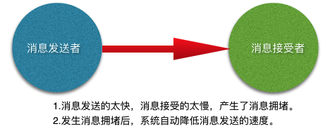

##《flink中的背压的处理原理》
####什么是背压问题
流系统中消息的处理速度跟不上消息的发送速度，导致消息的堆积。如果系统能感知消息堆积，并调整消息发送的速度。
使消息的处理速度和发送速度相协调就是有背压感知的系统。背压如果不能得到正确地处理，可能会导致资源被耗尽或者
甚至出现更糟的情况导致数据丢失。flink就是一个有背压感知的基于流的分布式消息处理系统。
 

举例说明：
1.正常情况：消息处理速度>=消息的发送速度，不发生消息拥堵，系统运行流畅
 
2.异常情况：消息处理速度< 消息的发送速度，发生了消息拥堵，系统运行不畅。
 
消息拥堵可以采取两种方案
a.将拥堵的消息直接删除，将会导致数据丢失，在精确到要求高的场景非常不合适
b.将拥堵的消息缓存起来，并告知消息发送者减缓消息发送的速度。
3.处理方法：将缓冲区持久化，以方便在处理失败的情况下进行数据重放。
有些source本身提供持久化保证，可以优先考虑。例如： Apache Kafka是一个很不错的选择，可以背压从sink到source
的整个pipeline,同时对source进行限流来适配整个pipeline中最慢组件的速度，从而获得系统的稳定状态。
 