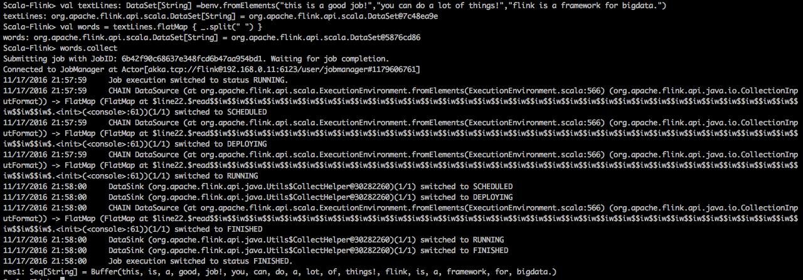
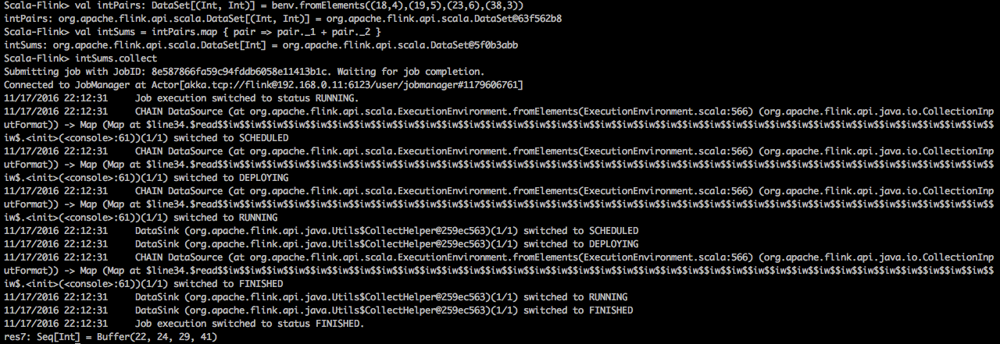
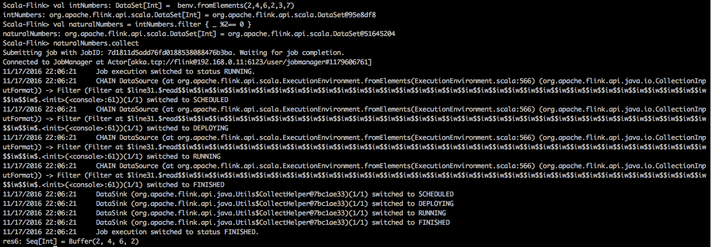
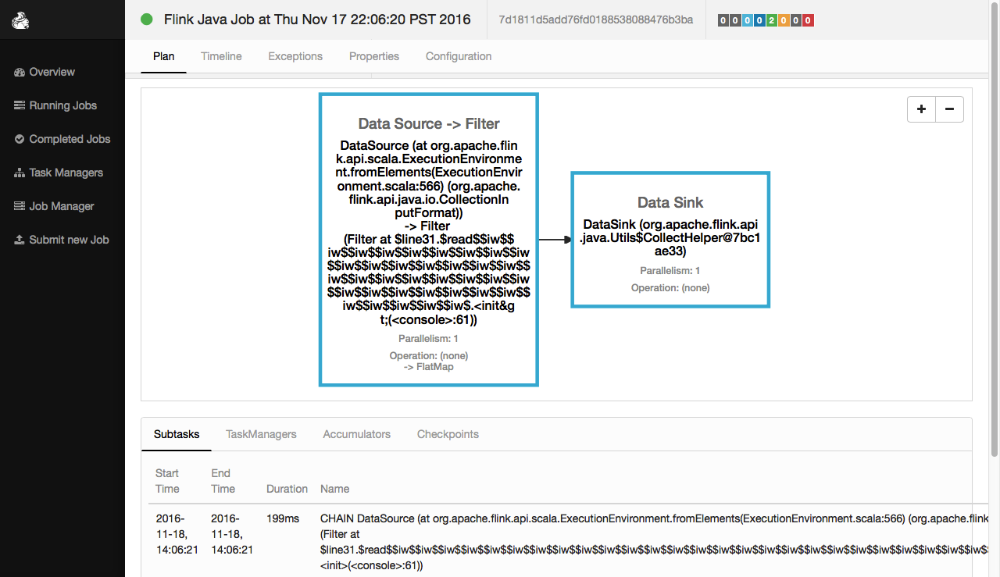
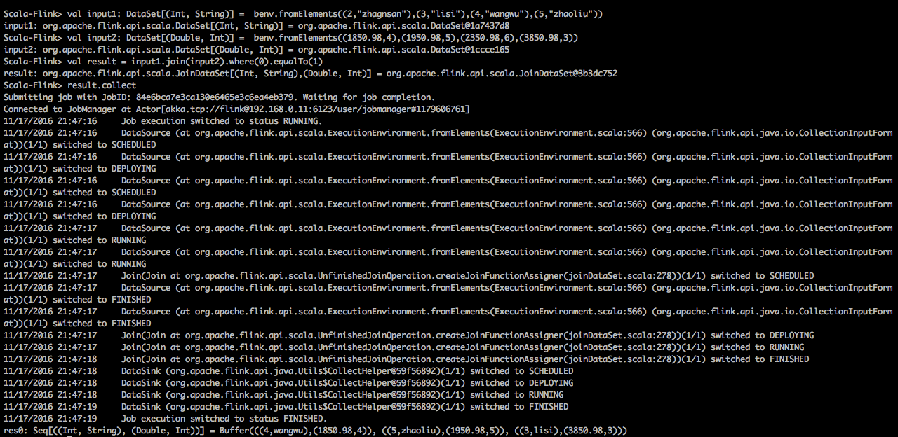
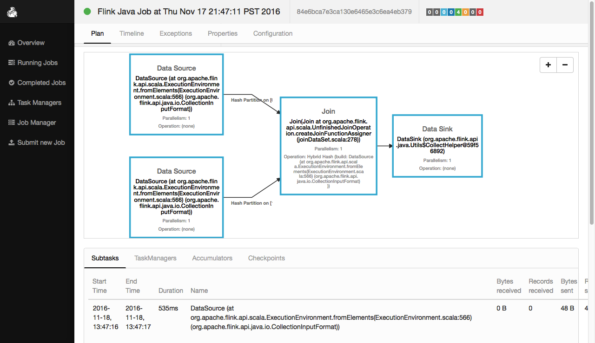

---
##print()方法    
执行程序：
```scale
val input: DataSet[String] = benv.fromElements("A", "B", "C", "D", "E", "F", "G", "H")
input.print()
```

程序解析：
```scale
//1.创建一个 DataSet其元素为String类型
val input: DataSet[String] = benv.fromElements("A", "B", "C", "D", "E", "F", "G", "H")

//2.将DataSet的内容打印出来
input.print()
```

shell中的执行效果：
 

web ui中的执行效果：
 

---
##map
```
The Map transformation applies a user-defined map function on each element of a DataSet. 
It implements a one-to-one mapping, that is, exactly one element must be returned by the function.
```

###map示例一  
执行程序：
```scale
val input: DataSet[Int] = benv.fromElements(23, 67, 18, 29, 32, 56, 4, 27)
val result=input.map(_*2)
result.print()
```
程序解析：
```scale
//1.创建一个DataSet其元素为Int类型
val input: DataSet[Int] = benv.fromElements(23, 67, 18, 29, 32, 56, 4, 27)

//2.将DataSet中的每个元素乘以2
val result=input.map(_*2)

//3.将DataSet中的每个元素输出出来
result.print()
```
shell中的执行效果：
 
web ui中的执行效果：
    
    
###map示例二  
执行程序：
```scale
val textLines: DataSet[String] =benv.fromElements(
"this is a good job!",
"you can do a lot of things!",
"flink is a framework for bigdata.")

val words = textLines.flatMap { _.split(" ") }
words.collect
    
```
程序解析：
```scale
//1.创建一个DataSet其元素为String类型
Scala-Flink> val textLines: DataSet[String] =benv.fromElements(
"this is a good job!",
"you can do a lot of things!",
"flink is a framework for bigdata.")
textLines: org.apache.flink.api.scala.DataSet[String] = org.apache.flink.api.scala.DataSet@7c48ea9e

//2.对每句话进行单词切分
Scala-Flink> val words = textLines.flatMap { _.split(" ") }
words: org.apache.flink.api.scala.DataSet[String] = org.apache.flink.api.scala.DataSet@5876cd86

//3.显示结果内容
Scala-Flink> words.collect
res1: Seq[String] = Buffer(
this, is, a, good, job!, 
you, can, do, a, lot, of, things!, 
flink, is, a, framework, for, bigdata.)
```
shell中的执行效果：
 
web ui中的执行效果：
    


###map示例三
执行程序：
```scale
val intPairs: DataSet[(Int, Int)] = benv.fromElements((18,4),(19,5),(23,6),(38,3))
val intSums = intPairs.map { pair => pair._1 + pair._2 }
intSums.collect
```
程序解析：
```scale
//1.创建一个DataSet[(Int, Int)] 
Scala-Flink> val intPairs: DataSet[(Int, Int)] = benv.fromElements((18,4),(19,5),(23,6),(38,3))
intPairs: org.apache.flink.api.scala.DataSet[(Int, Int)] = org.apache.flink.api.scala.DataSet@63f562b8

//2.键值对的key+value之和生成新的dataset
Scala-Flink> val intSums = intPairs.map { pair => pair._1 + pair._2 }
intSums: org.apache.flink.api.scala.DataSet[Int] = org.apache.flink.api.scala.DataSet@5f0b3abb

//3.显示结果
Scala-Flink> intSums.collect
res7: Seq[Int] = Buffer(22, 24, 29, 41)

```
shell中的执行效果：
 
web ui中的执行效果：
      

---
##flatMap  
```
The FlatMap transformation applies a user-defined flat-map function on each 
element of a DataSet. This variant of a map function can return arbitrary 
many result elements(including none) for each input element.
```
执行程序：
```scale
val input: DataSet[String] = benv.fromElements("zhangsan boy", "lisi girl")
val result=input.flatMap { _.split(" ") }
result.print()
```
程序解析：
```scale
//1.创建一个 DataSet其元素为String类型
val input: DataSet[String] = benv.fromElements("zhangsan boy", "lisi girl")

//2.将DataSet中的每个元素用空格切割成一组单词
val result=input.flatMap { _.split(" ") }

//3.将这组单词显示出来
result.print()
```
shell中的执行效果：
 
web ui中的执行效果：
 

---
##mapPartition 
```
MapPartition transforms a parallel partition in a single function call. The map-partition
function gets the partition as Iterable and can produce an arbitrary number of result values.
The number of elements in each partition depends on the degree-of-parallelism and previous 
operations.
```
执行程序：
```scale
val input: DataSet[String] = benv.fromElements("zhangsan boy", "lisi is a girl so sex")
val result=input.mapPartition{in => Some(in.size)}
result.print()
```
程序解析：
```scale
//1.创建一个 DataSet其元素为String类型
val input: DataSet[String] = benv.fromElements("zhangsan boy", "lisi is a girl so sex")

//2.??????????????
val result=input.mapPartition{in => Some(in.size)}

//3.将结果显示出来
result.print()
```
shell中的执行效果：
 
web ui中的执行效果：
 


---
##filter
```
The Filter transformation applies a user-defined filter function on each element of 
a DataSet and retains only those elements for which the function returns true.
```
###filter示例一
执行程序：
```scale
val input: DataSet[String] = benv.fromElements("zhangsan boy", "lisi is a girl so sex","wangwu boy")
val result=input.filter{_.contains("boy")}
result.print()
```
程序解析：
```scale
//1.创建一个 DataSet其元素为String类型
val input: DataSet[String] = benv.fromElements("zhangsan boy", "lisi is a girl so sex","wangwu boy")

//2.过滤出包含'boy'字样的元素
val result=input.filter{_.contains("boy")}

//3.将结果显示出来
result.print()
```
shell中的执行效果：
 
web ui中的执行效果：
 

###filter示例二
执行程序：
```scale
val intNumbers: DataSet[Int] =  benv.fromElements(2,4,6,2,3,7)
val naturalNumbers = intNumbers.filter { _ %2== 0 }
naturalNumbers.collect
```
程序解析：
```scale
//1.创建一个DataSet[Int]
Scala-Flink> val intNumbers: DataSet[Int] =  benv.fromElements(2,4,6,2,3,7)
intNumbers: org.apache.flink.api.scala.DataSet[Int] = org.apache.flink.api.scala.DataSet@95e8df8

//2.过滤偶数
Scala-Flink> val naturalNumbers = intNumbers.filter { _ %2== 0 }
naturalNumbers: org.apache.flink.api.scala.DataSet[Int] = org.apache.flink.api.scala.DataSet@51645204

//3.显示结果
Scala-Flink> naturalNumbers.collect
res6: Seq[Int] = Buffer(2, 4, 6, 2)

```
shell中的执行效果：
 
web ui中的执行效果：
 

---
##reduce
```
Combines a group of elements into a single element by repeatedly combining two elements into one. 
Reduce may be applied on a full data set, or on a grouped data set.
```
执行程序：
```scale
//Int类型的DataSet做reduce
val a: DataSet[Int] = benv.fromElements(2,5,9,8,7,3)
val b: DataSet[Int] = a.reduce { _ + _ }
b.collect

//String类型的DataSet做reduce
val a: DataSet[String] = benv.fromElements("zhangsan boy", " lisi girl")
val b:DataSet[String] = a.reduce { _ + _ }
b.collect
```
程序解析：
```scale
//1.创建一个 DataSet其元素为Int类型
Scala-Flink> val a: DataSet[Int] = benv.fromElements(2,5,9,8,7,3)
a: org.apache.flink.api.scala.DataSet[Int] = org.apache.flink.api.scala.DataSet@c7ac49c

//2.将DataSet中的元素，reduce起来
Scala-Flink> val b: DataSet[Int] = a.reduce { _ + _ }
b: org.apache.flink.api.scala.DataSet[Int] = org.apache.flink.api.scala.DataSet@487bc869

//3.显示计算结果
Scala-Flink> b.collect
res6: Seq[Int] = Buffer(34)


//1.创建一个 DataSet其元素为String类型
Scala-Flink> val a: DataSet[String] = benv.fromElements("zhangsan boy", " lisi girl")
a: org.apache.flink.api.scala.DataSet[String] = org.apache.flink.api.scala.DataSet@67426220

//2.将DataSet中的元素，reduce起来
Scala-Flink> val b:DataSet[String] = a.reduce { _ + _ }
b: org.apache.flink.api.scala.DataSet[String] = org.apache.flink.api.scala.DataSet@762d65de

//3.显示计算结果
Scala-Flink> b.collect
res8: Seq[String] = Buffer(zhangsan boy lisi girl)
```
shell中的执行效果：
 
web ui中的执行效果：
 


---
##ReduceGroup???

---
##Aggregate??

---
##distinct
```
Returns the distinct elements of a data set. It removes the duplicate entries from the input DataSet,
with respect to all fields of the elements, or a subset of fields.
```
执行程序：
```scale
val input: DataSet[String] = benv.fromElements("lisi","zhangsan", "lisi","wangwu")
val result=input.distinct()
result.collect
```
程序解析：
```scale
//1.创建一个 DataSet其元素为String类型
Scala-Flink> val input: DataSet[String] = benv.fromElements("lisi","zhangsan", "lisi","wangwu")
input: org.apache.flink.api.scala.DataSet[String] = org.apache.flink.api.scala.DataSet@5e76aabc

//2.元素去重
Scala-Flink> val result=input.distinct()
result: org.apache.flink.api.scala.DataSet[String] = org.apache.flink.api.scala.DataSet@1f8e30a6

//3.显示结果
Scala-Flink> result.collect
res15: Seq[String] = Buffer(lisi, wangwu, zhangsan)
```
shell中的执行效果：
 
web ui中的执行效果：
 


---
##join
```
Joins two data sets by creating all pairs of elements that are equal on their keys. Optionally uses
a JoinFunction to turn the pair of elements into a single element, or a FlatJoinFunction to turn the
pair of elements into arbitrarily many (including none) elements. 
```

执行程序：
```scale
val input1: DataSet[(Int, String)] =  benv.fromElements((2,"zhagnsan"),(3,"lisi"),(4,"wangwu"),(5,"zhaoliu"))
val input2: DataSet[(Double, Int)] =  benv.fromElements((1850.98,4),(1950.98,5),(2350.98,6),(3850.98,3))
val result = input1.join(input2).where(0).equalTo(1)
result.collect
```
程序解析：
```scale
//1.创建一个 DataSet其元素为[(Int,String)]类型
Scala-Flink>val input1:DataSet[(Int,String)]=benv.fromElements((2,"zhagnsan"),(3,"lisi"),(4,"wangwu"),(5,"zhaoliu"))
input1: org.apache.flink.api.scala.DataSet[(Int, String)] = org.apache.flink.api.scala.DataSet@1a7437d8

//2.创建一个 DataSet其元素为[(Double, Int)]类型
Scala-Flink> val input2: DataSet[(Double, Int)] =  benv.fromElements((1850.98,4),(1950.98,5),(2350.98,6),(3850.98,3))
input2: org.apache.flink.api.scala.DataSet[(Double, Int)] = org.apache.flink.api.scala.DataSet@1ccce165

//3.两个DataSet进行join操作，条件是input1(0)==input2(1)
Scala-Flink> val result = input1.join(input2).where(0).equalTo(1)
result: org.apache.flink.api.scala.JoinDataSet[(Int,String),(Double,Int)]=org.apache.flink.api.scala.JoinDataSet@3b3dc752

//4.显示结果
Scala-Flink> result.collect
res0: Seq[((Int, String), (Double, Int))] = Buffer(
((4,wangwu),(1850.98,4)),
((5,zhaoliu),(1950.98,5)), 
((3,lisi),(3850.98,3)))
```
shell中的执行效果：
 
web ui中的执行效果：
 


参考链接：  
https://ci.apache.org/projects/flink/flink-docs-release-1.1/apis/batch/index.html
https://ci.apache.org/projects/flink/flink-docs-release-1.1/apis/batch/dataset_transformations.html#join