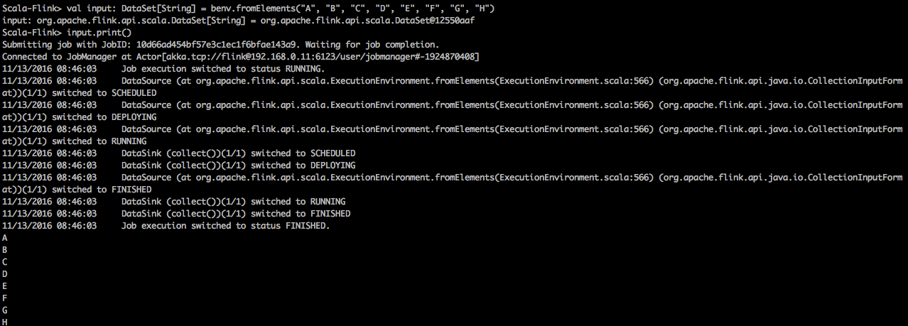
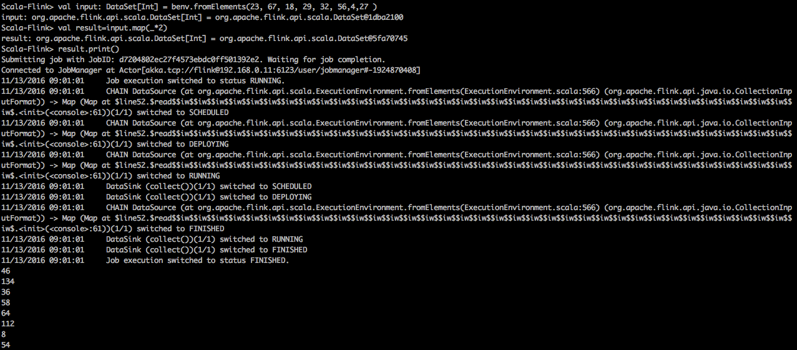
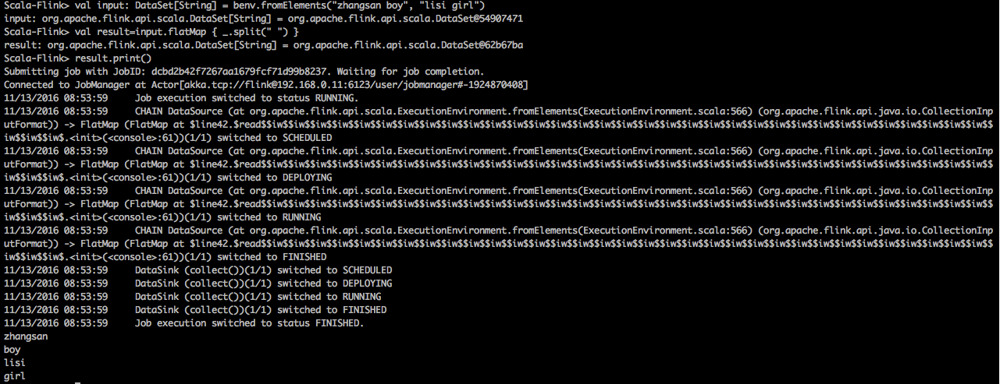
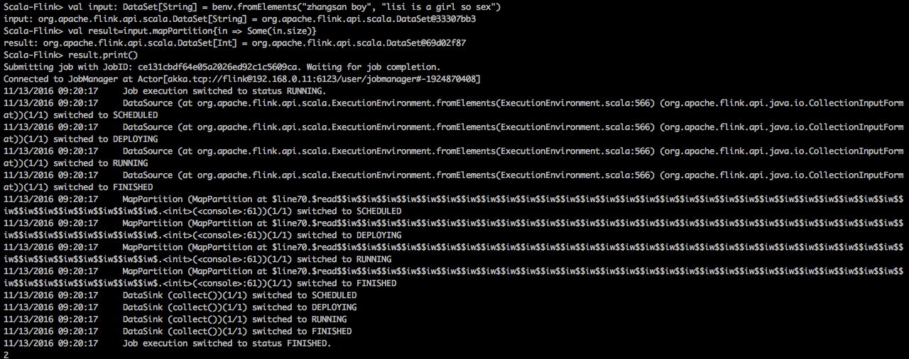
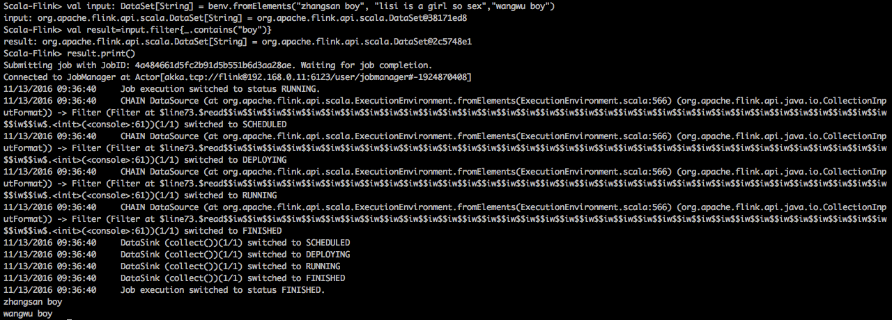
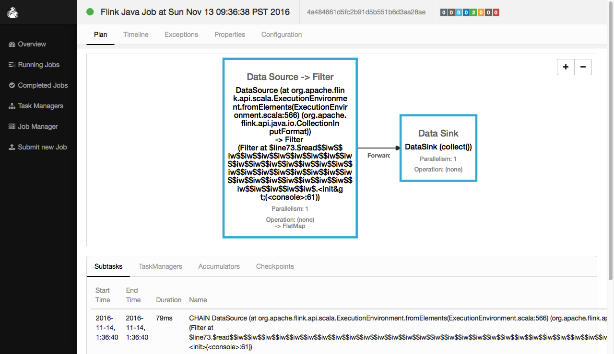
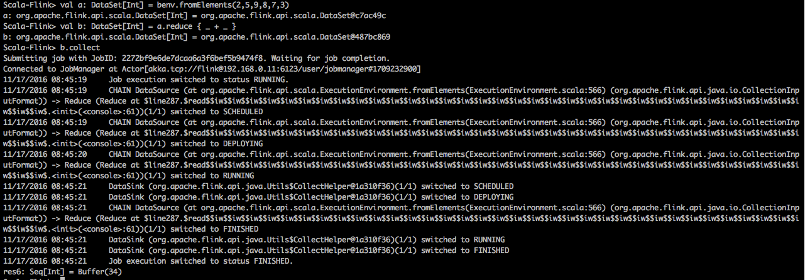
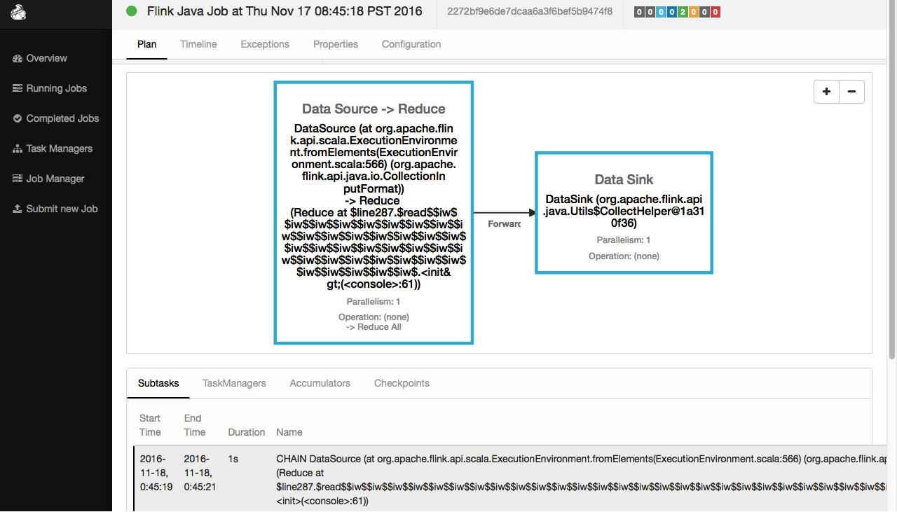
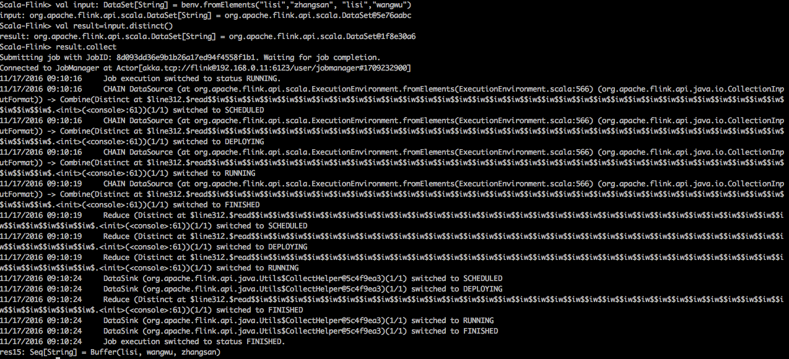

#####1.print()方法    
执行程序：
```scale
val input: DataSet[String] = benv.fromElements("A", "B", "C", "D", "E", "F", "G", "H")
input.print()
```

程序解析：
```scale
//1.创建一个 DataSet其元素为String类型
val input: DataSet[String] = benv.fromElements("A", "B", "C", "D", "E", "F", "G", "H")

//2.将DataSet的内容打印出来
input.print()
```

shell中的执行效果：
 

web ui中的执行效果：
 

#####2.map()方法    
```
The Map transformation applies a user-defined map function on each element of a DataSet. 
It implements a one-to-one mapping, that is, exactly one element must be returned by the function.
```
执行程序：
```scale
val input: DataSet[Int] = benv.fromElements(23, 67, 18, 29, 32, 56, 4, 27)
val result=input.map(_*2)
result.print()
```
程序解析：
```scale
//1.创建一个DataSet其元素为Int类型
val input: DataSet[Int] = benv.fromElements(23, 67, 18, 29, 32, 56, 4, 27)

//2.将DataSet中的每个元素乘以2
val result=input.map(_*2)

//3.将DataSet中的每个元素输出出来
result.print()
```

shell中的执行效果：
 
web ui中的执行效果：
    
    
#####flatMap  
```
The FlatMap transformation applies a user-defined flat-map function on each 
element of a DataSet. This variant of a map function can return arbitrary 
many result elements(including none) for each input element.
```
执行程序：
```scale
val input: DataSet[String] = benv.fromElements("zhangsan boy", "lisi girl")
val result=input.flatMap { _.split(" ") }
result.print()
```
程序解析：
```scale
//1.创建一个 DataSet其元素为String类型
val input: DataSet[String] = benv.fromElements("zhangsan boy", "lisi girl")

//2.将DataSet中的每个元素用空格切割成一组单词
val result=input.flatMap { _.split(" ") }

//3.将这组单词显示出来
result.print()
```
shell中的执行效果：
 
web ui中的执行效果：
 


#####mapPartition 
```
MapPartition transforms a parallel partition in a single function call. The map-partition
function gets the partition as Iterable and can produce an arbitrary number of result values.
The number of elements in each partition depends on the degree-of-parallelism and previous 
operations.
```
执行程序：
```scale
val input: DataSet[String] = benv.fromElements("zhangsan boy", "lisi is a girl so sex")
val result=input.mapPartition{in => Some(in.size)}
result.print()
```
程序解析：
```scale
//1.创建一个 DataSet其元素为String类型
val input: DataSet[String] = benv.fromElements("zhangsan boy", "lisi is a girl so sex")

//2.??????????????
val result=input.mapPartition{in => Some(in.size)}

//3.将结果显示出来
result.print()
```
shell中的执行效果：
 
web ui中的执行效果：
 


---
#####filter()方法    
```
The Filter transformation applies a user-defined filter function on each element of 
a DataSet and retains only those elements for which the function returns true.
```
执行程序：
```scale
val input: DataSet[String] = benv.fromElements("zhangsan boy", "lisi is a girl so sex","wangwu boy")
val result=input.filter{_.contains("boy")}
result.print()
```
程序解析：
```scale
//1.创建一个 DataSet其元素为String类型
val input: DataSet[String] = benv.fromElements("zhangsan boy", "lisi is a girl so sex","wangwu boy")

//2.过滤出包含'boy'字样的元素
val result=input.filter{_.contains("boy")}

//3.将结果显示出来
result.print()
```
shell中的执行效果：
 
web ui中的执行效果：
 

---
#####reduce
```
Combines a group of elements into a single element by repeatedly combining two elements into one. 
Reduce may be applied on a full data set, or on a grouped data set.
```
执行程序：
```scale
//Int类型的DataSet做reduce
val a: DataSet[Int] = benv.fromElements(2,5,9,8,7,3)
val b: DataSet[Int] = a.reduce { _ + _ }
b.collect

//String类型的DataSet做reduce
val a: DataSet[String] = benv.fromElements("zhangsan boy", " lisi girl")
val b:DataSet[String] = a.reduce { _ + _ }
b.collect
```
程序解析：
```scale
//1.创建一个 DataSet其元素为Int类型
Scala-Flink> val a: DataSet[Int] = benv.fromElements(2,5,9,8,7,3)
a: org.apache.flink.api.scala.DataSet[Int] = org.apache.flink.api.scala.DataSet@c7ac49c

//2.将DataSet中的元素，reduce起来
Scala-Flink> val b: DataSet[Int] = a.reduce { _ + _ }
b: org.apache.flink.api.scala.DataSet[Int] = org.apache.flink.api.scala.DataSet@487bc869

//3.显示计算结果
Scala-Flink> b.collect
res6: Seq[Int] = Buffer(34)


//1.创建一个 DataSet其元素为String类型
Scala-Flink> val a: DataSet[String] = benv.fromElements("zhangsan boy", " lisi girl")
a: org.apache.flink.api.scala.DataSet[String] = org.apache.flink.api.scala.DataSet@67426220

//2.将DataSet中的元素，reduce起来
Scala-Flink> val b:DataSet[String] = a.reduce { _ + _ }
b: org.apache.flink.api.scala.DataSet[String] = org.apache.flink.api.scala.DataSet@762d65de

//3.显示计算结果
Scala-Flink> b.collect
res8: Seq[String] = Buffer(zhangsan boy lisi girl)
```
shell中的执行效果：
 
web ui中的执行效果：
 


---
#####ReduceGroup???

---
#####Aggregate??

---
#####distinct
```
Returns the distinct elements of a data set. It removes the duplicate entries from the input DataSet,
with respect to all fields of the elements, or a subset of fields.
```
执行程序：
```scale
val input: DataSet[String] = benv.fromElements("lisi","zhangsan", "lisi","wangwu")
val result=input.distinct()
result.collect
```
程序解析：
```scale
//1.创建一个 DataSet其元素为String类型
Scala-Flink> val input: DataSet[String] = benv.fromElements("lisi","zhangsan", "lisi","wangwu")
input: org.apache.flink.api.scala.DataSet[String] = org.apache.flink.api.scala.DataSet@5e76aabc

//2.元素去重
Scala-Flink> val result=input.distinct()
result: org.apache.flink.api.scala.DataSet[String] = org.apache.flink.api.scala.DataSet@1f8e30a6

//3.显示结果
Scala-Flink> result.collect
res15: Seq[String] = Buffer(lisi, wangwu, zhangsan)
```
shell中的执行效果：
 
web ui中的执行效果：
 
