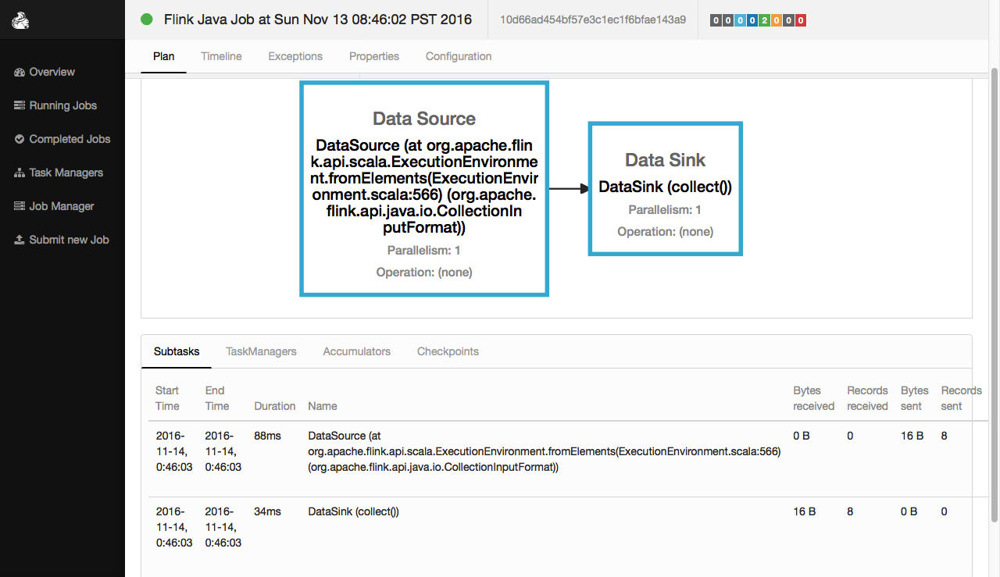
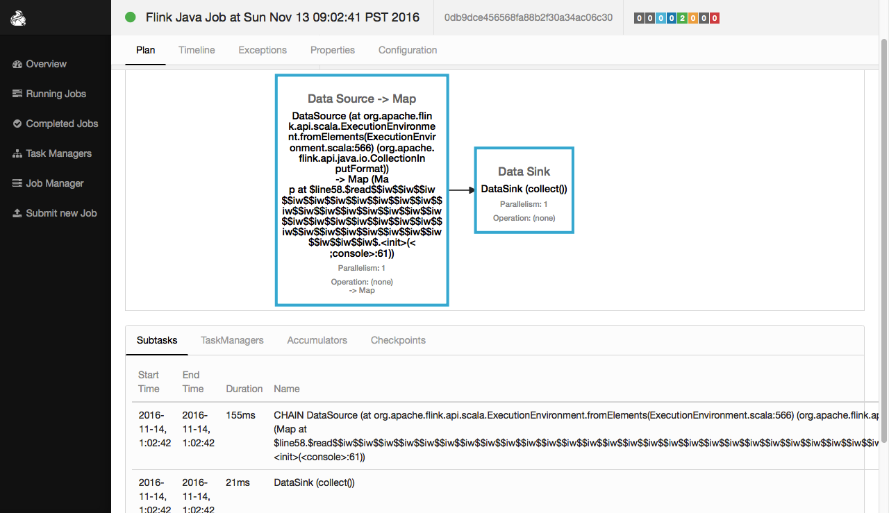
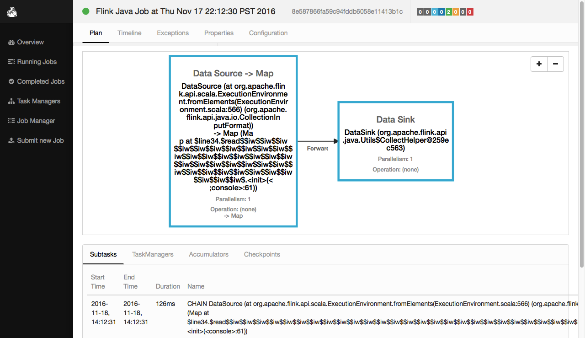
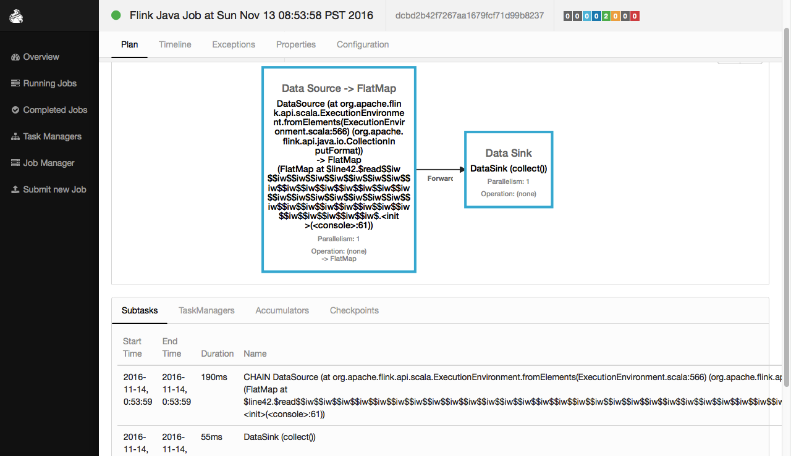
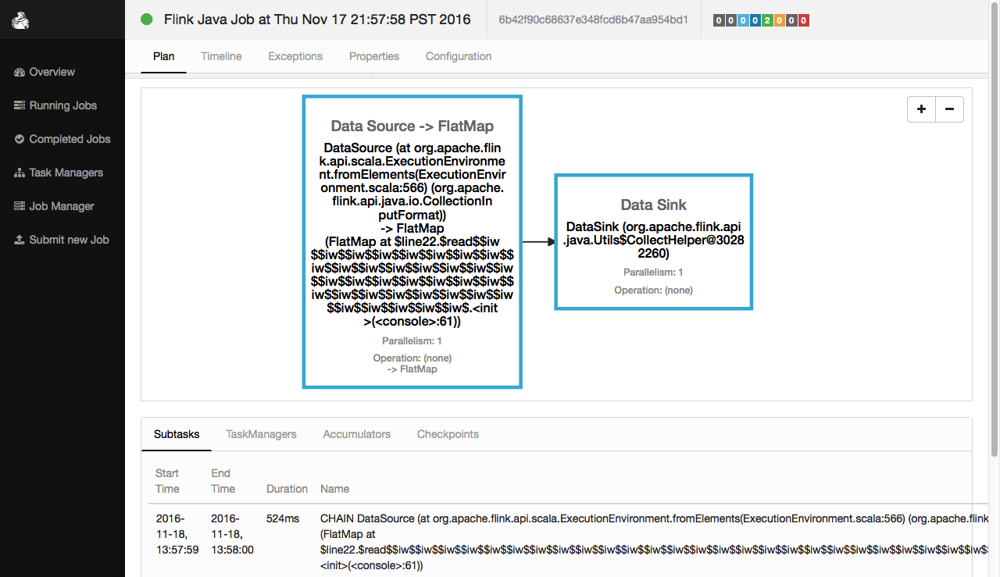
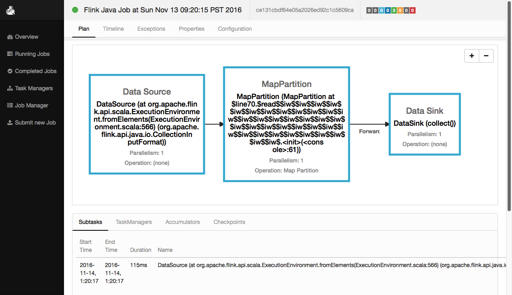

#DateSet的API详解一
##print
```
def print(): Unit

Prints the elements in a DataSet to the standard output stream System.

将信息输出到标准输出设备。
```

执行程序：
```scale
//1.创建一个 DataSet其元素为String类型
val input: DataSet[String] = benv.fromElements("A", "B", "C")

//2.将DataSet的内容打印出来
input.print()
```
执行结果：
```scale
A
B
C
```
web ui中的执行效果：
 


##printToErr 
```
def printToErr(): Unit

Prints the elements in a DataSet to the standard error stream System.

将信息输出到标准错误输出。
```

执行程序：
```scale
//1.创建一个 DataSet其元素为String类型
val input: DataSet[String] = benv.fromElements("A", "B", "C")

//2.将DataSet的内容打印出来
input.printToErr()
```
执行结果：
```scale
A
B
C
```


##count
```
def count(): Long

Convenience method to get the count (number of elements) of a DataSet

计算DataSet中元素的个数。
```

执行程序：
```scale
//1.创建一个 DataSet其元素为String类型
val input: DataSet[String] = benv.fromElements("A", "B", "C")

//2.计算DataSet中元素的个数。
input.count
```
执行结果：
```scale
res83: Long = 3
```


##min
```
def min(field: Int): AggregateDataSet[T]
def min(field: String): AggregateDataSet[T]

Syntactic sugar for aggregate with MIN

获取最小的元素
```
执行程序：
```scale
//1.创建DataSet[Student]
case class Student(age: Int, name: String,height:Double)
val input: DataSet[Student] = benv.fromElements(
Student(16,"zhangasn",194.5),
Student(17,"zhangasn",184.5),
Student(18,"zhangasn",174.5),
Student(16,"lisi",194.5),
Student(17,"lisi",184.5),
Student(18,"lisi",174.5))

//2.获取age最小的元素
val output0: DataSet[Student] = input.min(0)
output0.collect

//3.获取age最小的元素
val output1: DataSet[Student] = input.min("age")
output1.collect

```
执行结果：
```
Scala-Flink> output0.collect
res78: Seq[Student] = Buffer(Student(16,lisi,174.5))

Scala-Flink> output1.collect
res79: Seq[Student] = Buffer(Student(16,lisi,174.5))
```

##max
```
def max(field: String): AggregateDataSet[T]
def max(field: Int): AggregateDataSet[T]

Syntactic sugar for aggregate with MAX

获取最大的元素
```
执行程序：
```scale
//1.创建DataSet[Student]
case class Student(age: Int, name: String,height:Double)
val input: DataSet[Student] = benv.fromElements(
Student(16,"zhangasn",194.5),
Student(17,"zhangasn",184.5),
Student(18,"zhangasn",174.5),
Student(16,"lisi",194.5),
Student(17,"lisi",184.5),
Student(18,"lisi",174.5))

//2.获取age最小的元素
val output0: DataSet[Student] = input.max(0)
output0.collect

//3.获取age最小的元素
val output1: DataSet[Student] = input.max("age")
output1.collect
```
执行结果：
```
Scala-Flink> output0.collect
res79: Seq[Student] = Buffer(Student(18,lisi,174.5))

Scala-Flink> output1.collect
res79: Seq[Student] = Buffer(Student(18,lisi,174.5))
```


##sum
```
def sum(field: String): AggregateDataSet[T]
def sum(field: Int): AggregateDataSet[T]

Syntactic sugar for aggregate with SUM

获取元素的累加和，只能作用于数值类型
```
执行程序：
```scale
//1.创建 DataSet[Student]
case class Student(age: Int, name: String,height:Double)
val input: DataSet[Student] = benv.fromElements(
Student(16,"zhangasn",194.5),
Student(17,"zhangasn",184.5),
Student(18,"zhangasn",174.5),
Student(16,"lisi",194.5),
Student(17,"lisi",184.5),
Student(18,"lisi",174.5))

//2.fieldIndex=0的列进行sum
val s0=input.sum(0)
s0.collect

//3.fieldName="age"的列进行sum
val s1=input.sum("age")
s1.collect

//4.fieldName="height"的列进行sum
val s2=input.sum("height")
s2.collect

```
执行结果：
```
Scala-Flink> s0.collect
res111: Seq[Student] = Buffer(Student(102,lisi,174.5))

Scala-Flink> s1.collect
res112: Seq[Student] = Buffer(Student(102,lisi,174.5))

Scala-Flink> s2.collect
res113: Seq[Student] = Buffer(Student(18,lisi,1107.0))
```


##getType
```
def getType(): TypeInformation[T]

Returns the TypeInformation for the elements of this DataSet.

获取DataSet的元素的类型信息
```
执行程序：
```scale
//1.创建一个 DataSet其元素为String类型
val input: DataSet[String] = benv.fromElements("A", "B", "C")

//2.获取DataSet的元素的类型信息
input.getType
```
执行结果：
```
res89: org.apache.flink.api.common.typeinfo.TypeInformation[String] = String
```


##map
```
def map[R](fun: (T) ⇒ R)(implicit arg0: TypeInformation[R], arg1: ClassTag[R]): DataSet[R]
def map[R](mapper:MapFunction[T,R])(implicit arg0:TypeInformation[R],arg1:ClassTag[R]):DataSet[R]

Creates a new DataSet by applying the given function to every element of this DataSet.

将一个DataSet转化成另一个DataSet。转化操作对每一个元素执行一次。
```

###map示例一  
执行程序：
```scale
//1.创建一个DataSet其元素为Int类型
val input: DataSet[Int] = benv.fromElements(23, 67, 18, 29, 32, 56, 4, 27)

//2.将DataSet中的每个元素乘以2
val result=input.map(_*2)

//3.将DataSet中的每个元素输出出来
result.collect
```
执行结果：
```scale
res47: Seq[Int] = Buffer(46, 134, 36, 58, 64, 112, 8, 54)
```
web ui中的执行效果：
    

###map示例二
执行程序：
```scale
//1.创建一个DataSet[(Int, Int)] 
val intPairs: DataSet[(Int, Int)] = benv.fromElements((18,4),(19,5),(23,6),(38,3))

//2.键值对的key+value之和生成新的dataset
val intSums = intPairs.map { pair => pair._1 + pair._2 }

//3.显示结果
intSums.collect
```
执行结果：
```scale
res44: Seq[Int] = Buffer(22, 24, 29, 41)
```
web ui中的执行效果：
      


##flatMap  
```
def flatMap[R](fun:(T)⇒
TraversableOnce[R])(implicit arg0:TypeInformation[R],arg1:ClassTag[R]):DataSet[R]

def flatMap[R](fun:(T, Collector[R])⇒
Unit)(implicit arg0:TypeInformation[R],arg1:ClassTag[R]):DataSet[R]

def flatMap[R](flatMapper:FlatMapFunction[T,R])
(implicit arg0:TypeInformation[R],arg1:ClassTag[R]):DataSet[R]

Creates a new DataSet by applying the given function to every element and flattening the results.
```

###flatMap示例一
执行程序：
```scale
//1.创建一个 DataSet其元素为String类型
val input: DataSet[String] = benv.fromElements("zhangsan boy", "lisi girl")

//2.将DataSet中的每个元素用空格切割成一组单词
val result=input.flatMap { _.split(" ") }

//3.将这组单词显示出来
result.collect
```
执行结果：
```scale
res46: Seq[String] = Buffer(zhangsan, boy, lisi, girl)
```
web ui中的执行效果：
 

    
###flatMap示例二  
执行程序：
```scale
//1.创建一个DataSet其元素为String类型
val textLines: DataSet[String] =benv.fromElements(
"this is a good job!",
"you can do a lot of things!",
"flink is a framework for bigdata.")

//2.对每句话进行单词切分
val words = textLines.flatMap { _.split(" ") }

//3.显示结果内容
words.collect 
```
执行结果：
```scale
res48: Seq[String] = Buffer
(this, is, a, good, job!, 
you, can, do, a, lot, of, things!,
flink, is, a, framework, for, bigdata.)
```
web ui中的执行效果：
    


##mapPartition 
```
def mapPartition[R](fun: (Iterator[T]) ⇒ 
TraversableOnce[R])(implicit arg0: TypeInformation[R], arg1: ClassTag[R]): DataSet[R]

def mapPartition[R](fun: (Iterator[T], Collector[R]) ⇒ 
Unit)(implicit arg0: TypeInformation[R], arg1: ClassTag[R]): DataSet[R]

def mapPartition[R](partitionMapper: MapPartitionFunction[T, R])
(implicit arg0: TypeInformation[R], arg1: ClassTag[R]): DataSet[R]

Creates a new DataSet by applying the given function to each parallel partition of the DataSet.

和map类似，不同它的处理单位是partition，而非element。
```
执行程序：
```scale
//1.创建一个 DataSet其元素为String类型
val input: DataSet[String] = benv.fromElements("zhangsan boy", "lisi is a girl so sex")

//2.获取partition的个数
val result=input.mapPartition{in => Some(in.size)}

//3.将结果显示出来
result.collect
```
执行结果：
```scale
res49: Seq[Int] = Buffer(2)
```
web ui中的执行效果：
 


##filter
```
def filter(fun: (T) ⇒ Boolean): DataSet[T]
def filter(filter: FilterFunction[T]): DataSet[T]

Creates a new DataSet that contains only the elements satisfying the given filter predicate.

过滤满足添加的元素，不满足条件的元素将被丢弃！
```
###filter示例一
执行程序：
```scale
//1.创建一个 DataSet其元素为String类型
val input: DataSet[String] = benv.fromElements("zhangsan boy", "lisi is a girl so sex","wangwu boy")

//2.过滤出包含'boy'字样的元素
val result=input.filter{_.contains("boy")} //也可以写成filter(_.contains("boy"))

//3.将结果显示出来
result.collect
```
执行结果：
```scale
res50: Seq[String] = Buffer(zhangsan boy, wangwu boy)
``` 
web ui中的执行效果：
 

###filter示例二
执行程序：
```scale
//1.创建一个DataSet[Int]
val intNumbers: DataSet[Int] =  benv.fromElements(2,4,6,2,3,7)

//2.过滤偶数
val naturalNumbers = intNumbers.filter { _ %2== 0 }

//3.显示结果
naturalNumbers.collect
```
程序解析：
```scale
res51: Seq[Int] = Buffer(2, 4, 6, 2)
```
web ui中的执行效果：
 


##reduce
```
def reduce(fun: (T, T) ⇒ T): DataSet[T]
def reduce(reducer: ReduceFunction[T]): DataSet[T]

Creates a new DataSet by merging the elements of this DataSet using an associative reduce function.

根据一定的条件和方式来合并DataSet。
```
执行程序：
```scale
//Int类型的DataSet做reduce
val a: DataSet[Int] = benv.fromElements(2,5,9,8,7,3)
val b: DataSet[Int] = a.reduce { _ + _ }
b.collect

//String类型的DataSet做reduce
val a: DataSet[String] = benv.fromElements("zhangsan boy", " lisi girl")
val b:DataSet[String] = a.reduce { _ + _ }
b.collect
```
程序解析：
```scale
//1.创建一个 DataSet其元素为Int类型
Scala-Flink> val a: DataSet[Int] = benv.fromElements(2,5,9,8,7,3)
a: org.apache.flink.api.scala.DataSet[Int] = org.apache.flink.api.scala.DataSet@c7ac49c

//2.将DataSet中的元素，reduce起来
Scala-Flink> val b: DataSet[Int] = a.reduce { _ + _ }
b: org.apache.flink.api.scala.DataSet[Int] = org.apache.flink.api.scala.DataSet@487bc869

//3.显示计算结果
Scala-Flink> b.collect
res6: Seq[Int] = Buffer(34)


//1.创建一个 DataSet其元素为String类型
Scala-Flink> val a: DataSet[String] = benv.fromElements("zhangsan boy", " lisi girl")
a: org.apache.flink.api.scala.DataSet[String] = org.apache.flink.api.scala.DataSet@67426220

//2.将DataSet中的元素，reduce起来
Scala-Flink> val b:DataSet[String] = a.reduce { _ + _ }
b: org.apache.flink.api.scala.DataSet[String] = org.apache.flink.api.scala.DataSet@762d65de

//3.显示计算结果
Scala-Flink> b.collect
res8: Seq[String] = Buffer(zhangsan boy lisi girl)
```
web ui中的执行效果：
 


