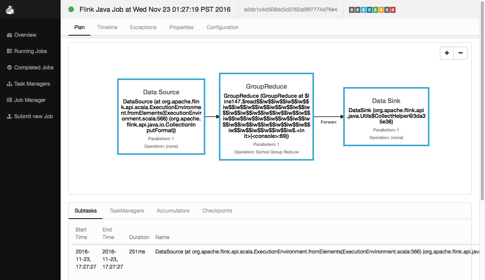
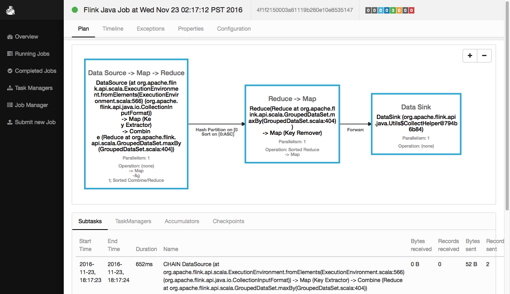

#DateSet的API详解二
##groupBy
```
def groupBy(firstField: String, otherFields: String*): GroupedDataSet[T]
def groupBy(fields: Int*): GroupedDataSet[T]
def groupBy[K](fun: (T) ⇒ K)(implicit arg0: TypeInformation[K]): GroupedDataSet[T]

Creates a GroupedDataSet which provides operations on groups of elements.

暗示第二个输入较小的交叉。
拿第一个输入的每一个元素和第二个输入的每一个元素进行交叉操作。
```

###groupBy示例一：使用一个Case Class Fields
执行程序：
```scale
//1.定义 class
case class WC(val word: String, val salary: Int) 

//2.定义DataSet[WC]
val words: DataSet[WC] = benv.fromElements(
WC("LISI",600),WC("LISI",400),WC("WANGWU",300),WC("ZHAOLIU",700))

//3.使用自定义的reduce方法,使用key-expressions 
val wordCounts1 = words.groupBy("word").reduce {
    (w1, w2) => new WC(w1.word, w1.salary + w2.salary)
}


//4.使用自定义的reduce方法,使用key-selector
val wordCounts2 = words.groupBy { _.word } reduce {
     (w1, w2) => new WC(w1.word, w1.salary + w2.salary)
}

//5.显示结果
wordCounts1.collect
wordCounts2.collect
```
执行结果：
```
Scala-Flink> wordCounts1.collect
res5: Seq[WC] = Buffer(WC(LISI,1000), WC(WANGWU,300), WC(ZHAOLIU,700))


Scala-Flink> wordCounts1.collec2
res6: Seq[WC] = Buffer(WC(LISI,1000), WC(WANGWU,300), WC(ZHAOLIU,700))

```
web ui中的执行效果：
 

###groupBy示例二：使用多个Case Class Fields
执行程序：
```scale
//1.定义 case class
case class Student(val name: String, addr: String, salary: Double)

//2.定义DataSet[Student]
val tuples:DataSet[Student] = benv.fromElements(
Student("lisi","shandong",2400.00),Student("zhangsan","henan",2600.00),
Student("lisi","shandong",2700.00),Student("lisi","guangdong",2800.00))

//3.使用自定义的reduce方法,使用多个Case Class Fields name
val reducedTuples1 = tuples.groupBy("name", "addr").reduce {
  (s1, s2) => Student(s1.name+"-"+s2.name,s1.addr+"-"+s2.addr,s1.salary+s2.salary)
}

//4.使用自定义的reduce方法,使用多个Case Class Fields index
val reducedTuples2 = tuples.groupBy(0, 1).reduce {
  (s1, s2) => Student(s1.name+"-"+s2.name,s1.addr+"-"+s2.addr,s1.salary+s2.salary)
}

//5.使用自定义的reduce方法,name和index混用
val reducedTuples3 = tuples.groupBy(0, 1).reduce {
  (s1, s2) => Student(s1.name+"-"+s2.name,s1.addr+"-"+s2.addr,s1.salary+s2.salary)
}


//6.显示结果
reducedTuples1.collect
reducedTuples2.collect
reducedTuples3.collect
```
执行结果：
```
Scala-Flink> reducedTuples1.collect
res96: Seq[Student] = Buffer(
Student(lisi,guangdong,2800.0),
Student(lisi-lisi,shandong-shandong,5100.0), 
Student(zhangsan,henan,2600.0))

Scala-Flink> reducedTuples2.collect
res97: Seq[Student] = Buffer(
Student(lisi,guangdong,2800.0),
Student(lisi-lisi,shandong-shandong,5100.0), 
Student(zhangsan,henan,2600.0))

Scala-Flink> reducedTuples3.collect
res98: Seq[Student] = Buffer(
Student(lisi,guangdong,2800.0),
Student(lisi-lisi,shandong-shandong,5100.0), 
Student(zhangsan,henan,2600.0))
```
web ui中的执行效果：
 


##ReduceGroup
```
def reduceGroup[R](fun:(Iterator[T])⇒R)(implicit arg0:TypeInformation[R],arg1:ClassTag[R]):DataSet[R]

def reduceGroup[R](fun: (Iterator[T], Collector[R]) ⇒ 
Unit(implicit arg0: TypeInformation[R], arg1: ClassTag[R]): DataSet[R]

def reduceGroup[R](reducer: GroupReduceFunction[T, R])
(implicit arg0: TypeInformation[R], arg1: ClassTag[R]): DataSet[R]

Creates a new DataSet by passing all elements in this DataSet to the group reduce function.

此函数和reduce函数类似，不过它每次处理一个grop而非一个元素。
```
###ReduceGroup示例一，操作tuple
执行程序：
```scale
//1.定义 DataSet[(Int, String)]
val input: DataSet[(Int, String)] = benv.fromElements(
(20,"zhangsan"),(22,"zhangsan"),
(22,"lisi"),(20,"zhangsan"))

//2.先用string分组，然后对分组进行reduceGroup
val output = input.groupBy(1).reduceGroup {
     //将相同的元素用set去重
     (in, out: Collector[(Int, String)]) =>
        in.toSet foreach (out.collect)
}

//3.显示结果
output.collect
```
执行结果：
```scala
res14: Seq[(Int, String)] = Buffer((22,lisi), (20,zhangsan), (22,zhangsan))
```
web ui中的执行效果：
 

###ReduceGroup示例二，操作case class
```scala
//1.定义case class
case class Student(age: Int, name: String)

//2.创建DataSet[Student]
val input: DataSet[Student] = benv.fromElements(
Student(20,"zhangsan"),
Student(22,"zhangsan"),
Student(22,"lisi"),
Student(20,"zhangsan"))
//3.以age进行分组，然后对分组进行reduceGroup
val output = input.groupBy(_.age).reduceGroup {
      //将相同的元素用set去重
      (in, out: Collector[Student]) =>
        in.toSet foreach (out.collect)
 }
 
//4.显示结果
output.collect
```
执行结果：
```scala
res16: Seq[Student] = Buffer(Student(20,zhangsan), Student(22,zhangsan), Student(22,lisi))
```


##sortGroup
```
Adds a secondary sort key to this GroupedDataSet. This will only have an effect if you use one
of the group-at-a-time, i.e. reduceGroup.
```
执行程序：
```scale
//1.创建 DataSet[(Int, String)]
val input: DataSet[(Int, String)] = benv.fromElements(
(20,"zhangsan"),
(22,"zhangsan"),
(22,"lisi"),
(22,"lisi"),
(22,"lisi"),
(18,"zhangsan"),
(18,"zhangsan"))

//2.用int分组，用int对分组进行排序
val sortdata = input.groupBy(0).sortGroup(0, Order.ASCENDING)

//3.对排序好的分组进行reduceGroup
val outputdata =sortdata.reduceGroup {
      //将相同的元素用set去重
      (in, out: Collector[(Int, String)]) =>
        in.toSet foreach (out.collect)
}
//4.显示结果
outputdata.collect
```
执行结果：
```scale
res25: Seq[(Int, String)] = Buffer((18,zhangsan), (20,zhangsan), (22,zhangsan), (22,lisi))
```
web ui中的执行效果：
 


##minBy
```
def minBy(fields: Int*): DataSet[T]

Applies a special case of a reduce transformation minBy on a grouped DataSet. 

在分组后的数据中，获取每组最小的元素。
```
执行程序：
```scale
//1.定义case class
case class Student(age: Int, name: String,height:Double)

//2.创建DataSet[Student]
val input: DataSet[Student] = benv.fromElements(
Student(16,"zhangasn",194.5),
Student(17,"zhangasn",184.5),
Student(18,"zhangasn",174.5),
Student(16,"lisi",194.5),
Student(17,"lisi",184.5),
Student(18,"lisi",174.5))

//3.以name进行分组，获取age最小的元素
val output0: DataSet[Student] = input.groupBy(_.name).minBy(0)
output0.collect

//4.以name进行分组，获取height和age最小的元素
val output1: DataSet[Student] = input.groupBy(_.name).minBy(2,0)
output1.collect

```
执行结果：
```scale
Scala-Flink> output0.collect
res73: Seq[Student] = Buffer(Student(16,lisi,194.5), Student(16,zhangasn,194.5))

Scala-Flink> output1.collect
res74: Seq[Student] = Buffer(Student(18,lisi,174.5), Student(18,zhangasn,174.5))
```
web ui中的执行效果：
 


##maxBy
```
def maxBy(fields: Int*): DataSet[T]
def max(field: Int): AggregateDataSet[T]

Applies a special case of a reduce transformation maxBy on a grouped DataSet 

在分组后的数据中，获取每组最大的元素。
```
执行程序：
```scale
//1.定义case class
case class Student(age: Int, name: String,height:Double)

//2.创建DataSet[Student]
val input: DataSet[Student] = benv.fromElements(
Student(16,"zhangasn",194.5),
Student(17,"zhangasn",184.5),
Student(18,"zhangasn",174.5),
Student(16,"lisi",194.5),
Student(17,"lisi",184.5),
Student(18,"lisi",174.5))

//3.以name进行分组，获取age最大的元素
val output0: DataSet[Student] = input.groupBy(_.name).maxBy(0)
output0.collect

//4.以name进行分组，获取height和age最大的元素
val output1: DataSet[Student] = input.groupBy(_.name).maxBy(2,0)
output1.collect
```
执行结果：
```scale
Scala-Flink> output0.collect
res75: Seq[Student] = Buffer(Student(18,lisi,174.5), Student(18,zhangasn,174.5))

Scala-Flink> output1.collect
res76: Seq[Student] = Buffer(Student(16,lisi,194.5), Student(16,zhangasn,194.5))
```
web ui中的执行效果：
 


##distinct
```

def distinct(firstField: String, otherFields: String*): DataSet[T]
def distinct(fields: Int*): DataSet[T]
def distinct(): DataSet[T]
def distinct[K](fun: (T) ⇒ K)(implicit arg0: TypeInformation[K]): DataSet[T]

Creates a new DataSet containing the distinct elements of this DataSet.

对DataSet中的元素进行去重。
```
###distinct示例一，单一项目的去重
执行程序：
```scale
//1.创建一个 DataSet其元素为String类型
val input: DataSet[String] = benv.fromElements("lisi","zhangsan", "lisi","wangwu")

//2.元素去重
val result=input.distinct()

//3.显示结果
result.collect
```
执行结果：
```scale
res52: Seq[String] = Buffer(lisi, wangwu, zhangsan)
```
web ui中的执行效果：
 

###distinct示例二，多项目的去重，不指定比较项目，默认是全部比较

执行程序：
```scale
//1.创建DataSet[(Int, String, Double)] 
val input: DataSet[(Int, String, Double)] =  benv.fromElements(
(2,"zhagnsan",1654.5),(3,"lisi",2347.8),(2,"zhagnsan",1654.5),
(4,"wangwu",1478.9),(5,"zhaoliu",987.3),(2,"zhagnsan",1654.0))

//2.元素去重
val output = input.distinct()

//3.显示结果
output.collect
```
执行结果：
```scale
res53: Seq[(Int, String, Double)] = Buffer(
(2,zhagnsan,1654.0), 
(2,zhagnsan,1654.5), 
(3,lisi,2347.8), 
(4,wangwu,1478.9), 
(5,zhaoliu,987.3))
```

###distinct示例三，多项目的去重，指定比较项目

执行程序：
```scale
//1.创建DataSet[(Int, String, Double)] 
val input: DataSet[(Int, String, Double)] =  benv.fromElements(
(2,"zhagnsan",1654.5),(3,"lisi",2347.8),(2,"zhagnsan",1654.5),
(4,"wangwu",1478.9),(5,"zhaoliu",987.3),(2,"zhagnsan",1654.0))

//2.元素去重:指定比较第0和第1号元素
val output = input.distinct(0,1)

//3.显示结果
output.collect
```
执行结果：
```scale
res54: Seq[(Int, String, Double)] = Buffer(
(2,zhagnsan,1654.5),
(3,lisi,2347.8), 
(4,wangwu,1478.9), 
(5,zhaoliu,987.3))
```

###distinct示例四，case class的去重，指定比较项目

执行程序：
```scale
//1.创建case class Student
case class Student(name : String, age : Int) 

//2.创建DataSet[Student]
val input: DataSet[Student] =  benv.fromElements(
Student("zhangsan",24),Student("zhangsan",24),Student("zhangsan",25),
Student("lisi",24),Student("wangwu",24),Student("lisi",25))

//3.去掉age重复的元素
val age_r = input.distinct("age")
age_r.collect

//4.去掉name重复的元素
val name_r = input.distinct("name")
name_r.collect

//5.去掉name和age重复的元素
val all_r = input.distinct("age","name")
all_r.collect

//6.去掉name和age重复的元素
val all = input.distinct()
all.collect

//7.去掉name和age重复的元素
val all0 = input.distinct("_")
all0.collect
```
程序解析：
```scale
Scala-Flink> age_r.collect
res38: Seq[Student] = Buffer(Student(zhangsan,24), Student(zhangsan,25))

Scala-Flink> name_r.collect
res39: Seq[Student] = Buffer(Student(lisi,24),Student(wangwu,24),Student(zhangsan,24))

Scala-Flink> all_r.collect
res40: Seq[Student] = Buffer(Student(lisi,24), Student(lisi,25), Student(wangwu,24),
Student(zhangsan,24), Student(zhangsan,25))

Scala-Flink> all.collect
res41: Seq[Student] = Buffer(Student(lisi,24), Student(lisi,25), Student(wangwu,24), 
Student(zhangsan,24), Student(zhangsan,25))

Scala-Flink> all0.collect
res47: Seq[Student] = Buffer(Student(lisi,24), Student(lisi,25), Student(wangwu,24),
Student(zhangsan,24), Student(zhangsan,25))
```
web ui中的执行效果：
 


###distinct示例五，根据表达式进行去重

执行程序：
```scale
//1.创建DataSet[Int]
val input: DataSet[Int] = benv.fromElements(3,-3,4,-4,6,-5,7)

//2.根据表达式，本例中是根据元素的绝对值进行元素去重
val output = input.distinct {x => Math.abs(x)}

//3.显示结果
output.collect
```
执行结果：
```scale
res55: Seq[Int] = Buffer(3, 4, -5, 6, 7)
```

