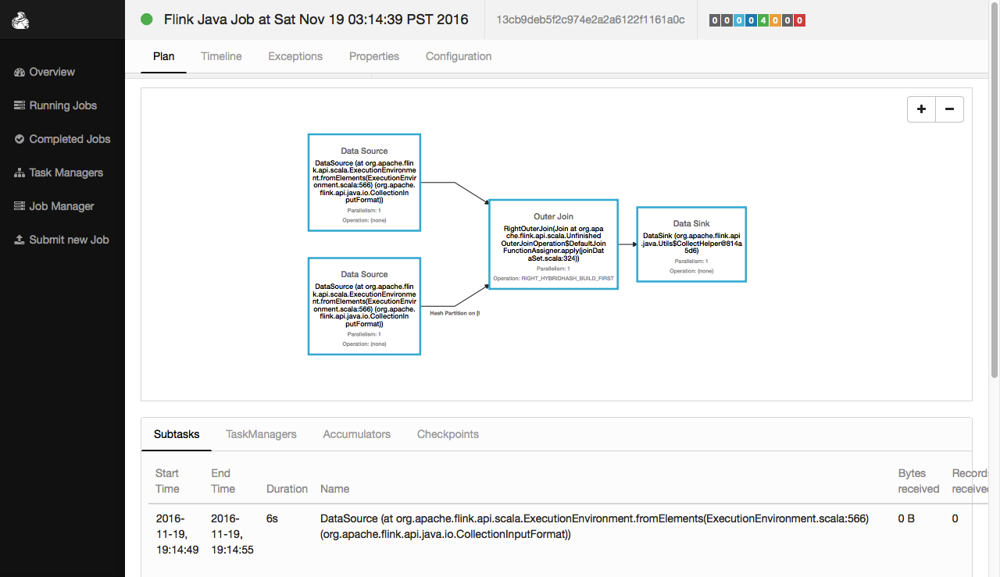
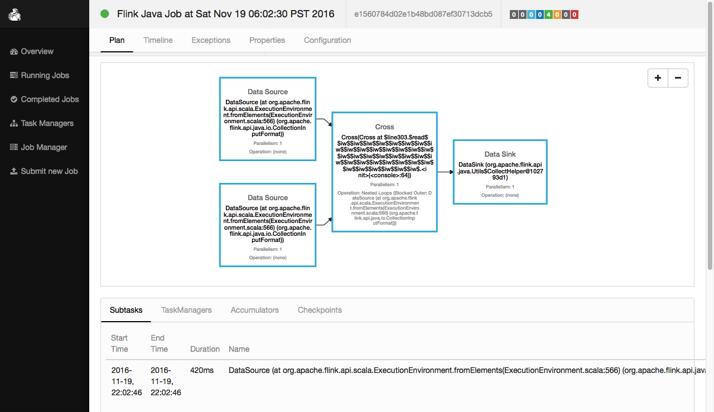
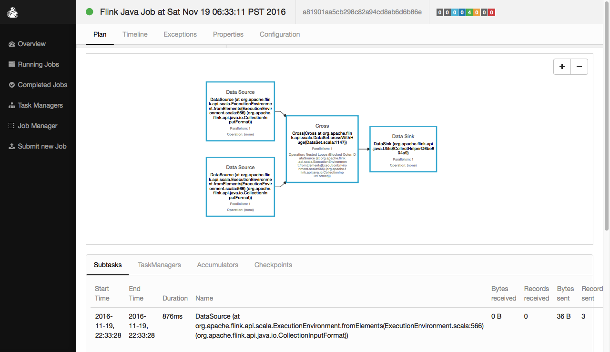
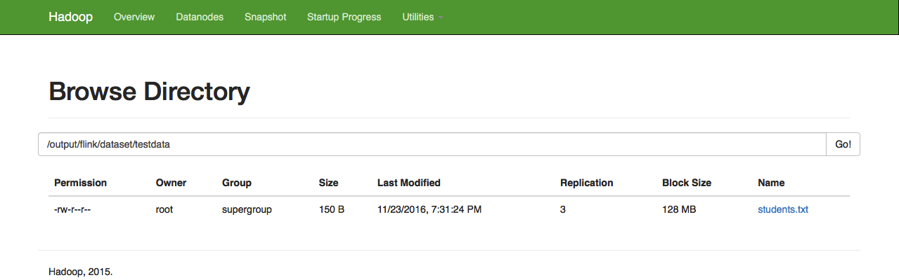
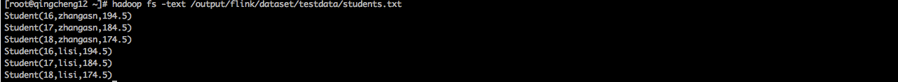
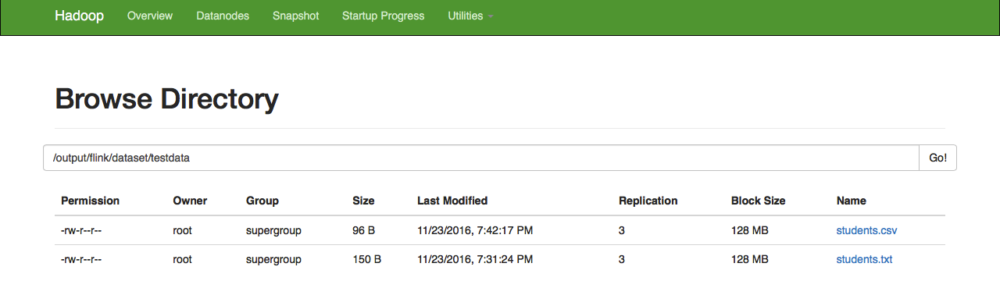
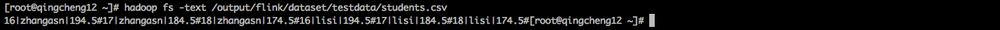

#DateSet的API详解三
##join
```
def join[O](other: DataSet[O], strategy: JoinHint): UnfinishedJoinOperation[T, O]
def join[O](other: DataSet[O]): UnfinishedJoinOperation[T, O]

Creates a new DataSet by joining this DataSet with the other DataSet.

将两个DataSet进行join操作
```
###join示例一：
执行程序：
```scale
//1.创建一个 DataSet其元素为[(Int,String)]类型
val input1: DataSet[(Int, String)] =  benv.fromElements(
(2,"zhagnsan"),(3,"lisi"),(4,"wangwu"),(5,"zhaoliu"))

//2.创建一个 DataSet其元素为[(Double, Int)]类型
val input2: DataSet[(Double, Int)] =  benv.fromElements(
(1850.98,4),(1950.98,5),(2350.98,6),(3850.98,3))

//3.两个DataSet进行join操作，条件是input1(0)==input2(1)
val result = input1.join(input2).where(0).equalTo(1)

//4.显示结果
result.collect
```
执行结果：
```scale
res56: Seq[((Int, String), (Double, Int))] = Buffer(
((4,wangwu),(1850.98,4)), 
((5,zhaoliu),(1950.98,5)), 
((3,lisi),(3850.98,3)))
```
web ui中的执行效果：
 


###join示例二：
```
A Join transformation can also call a user-defined join function to process joining tuples. 
A join function receives one element of the first input DataSet and one element of the second 
input DataSet and returns exactly one element.

The following code performs a join of DataSet with custom java objects and a Tuple DataSet using 
key-selector functions and shows how to use a user-defined join function:
```


执行程序：
```scale
//1.定义case class
case class Rating(name: String, category: String, points: Int)

//2.定义DataSet[Rating]
val ratings: DataSet[Rating] = benv.fromElements(
Rating("moon","youny1",3),Rating("sun","youny2",4),
Rating("cat","youny3",1),Rating("dog","youny4",5))

//3.创建DataSet[(String, Double)] 
val weights: DataSet[(String, Double)] = benv.fromElements(
("youny1",4.3),("youny2",7.2),
("youny3",9.0),("youny4",1.5))

//4.使用方法进行join
val weightedRatings = ratings.join(weights).where("category").equalTo(0) {
  (rating, weight) => (rating.name, rating.points + weight._2)
}

//5.显示结果
weightedRatings.collect
```
程序解析：
```scale
res57: Seq[(String, Double)] = Buffer((moon,7.3), (sun,11.2), (cat,10.0), (dog,6.5))
```
web ui中的执行效果：
 


###join示例三：？？？
```
A Join transformation can also call a user-defined join function to process joining tuples. 
A join function receives one element of the first input DataSet and one element of the second 
input DataSet and returns exactly one element.

The following code performs a join of DataSet with custom java objects and a Tuple DataSet using 
key-selector functions and shows how to use a user-defined join function:
```


执行程序：
```scale

case class Rating(name: String, category: String, points: Int)
val ratings: DataSet[Rating] = benv.fromElements(
Rating("moon","youny1",3),Rating("sun","youny2",4),
Rating("cat","youny3",1),Rating("dog","youny4",5))

val weights: DataSet[(String, Double)] = benv.fromElements(
("youny1",4.3),("youny2",7.2),
("youny3",9.0),("youny4",1.5))

val weightedRatings = ratings.join(weights).where("category").equalTo(0) {
  (rating, weight, out: Collector[(String, Double)]) =>
    if (weight._2 > 0.1) out.collect(rating.name, rating.points * weight._2)
}

weightedRatings.collect
```


###join示例四：执行join操作时暗示数据大小
```
在执行join操作时暗示数据大小，可以帮助flink优化它的执行策略，提高执行效率。
```
执行程序：
```scale
//1.定义DataSet[(Int, String)]
val input1: DataSet[(Int, String)] = 
benv.fromElements((3,"zhangsan"),(2,"lisi"),(4,"wangwu"),(6,"zhaoliu"))

//2.定义 DataSet[(Int, String)]
val input2: DataSet[(Int, String)] = 
benv.fromElements((4000,"zhangsan"),(70000,"lisi"),(4600,"wangwu"),(53000,"zhaoliu"))

// 3.暗示第二个输入很小
val result1 = input1.joinWithTiny(input2).where(1).equalTo(1)
result1.collect

// 4.暗示第二个输入很大
val result2 = input1.joinWithHuge(input2).where(1).equalTo(1)
result2.collect
```
执行结果：
```
Scala-Flink> result1.collect
res12: Seq[((Int, String), (Int, String))] = Buffer(
((3,zhangsan),(4000,zhangsan)), ((2,lisi),(70000,lisi)), 
((4,wangwu),(4600,wangwu)), ((6,zhaoliu),(53000,zhaoliu)))


Scala-Flink> result2.collect
res13: Seq[((Int, String), (Int, String))] = Buffer(
((3,zhangsan),(4000,zhangsan)), ((2,lisi),(70000,lisi)), 
((4,wangwu),(4600,wangwu)), ((6,zhaoliu),(53000,zhaoliu)))
```
web ui中的执行效果：
 


###join示例五：执行join操作时暗示数据大小
```
flink有很多种执行join的策略，你可以指定一个执行策略，以便提高执行效率。
```
执行程序：
```scale
//1.定义两个 DataSet
val input1: DataSet[(Int, String)] = 
benv.fromElements((3,"zhangsan"),(2,"lisi"),(4,"wangwu"),(6,"zhaoliu"))
val input2: DataSet[(Int, String)] = 
benv.fromElements((4000,"zhangsan"),(70000,"lisi"),(4600,"wangwu"),(53000,"zhaoliu"))

//2.暗示input2很小
val result1 = input1.join(input2, JoinHint.BROADCAST_HASH_FIRST).where(1).equalTo(1)

//3.显示结果
result1.collect
```
执行结果：
```
res15: Seq[((Int, String), (Int, String))] = Buffer(
((3,zhangsan),(4000,zhangsan)),
((2,lisi),(70000,lisi)), 
((4,wangwu),(4600,wangwu)),
((6,zhaoliu),(53000,zhaoliu)))
```
暗示项说明：
```
暗示有如下选项：
1.JoinHint.OPTIMIZER_CHOOSES:
    没有明确暗示，让系统自行选择。
2.JoinHint.BROADCAST_HASH_FIRST
    把第一个输入转化成一个哈希表，并广播出去。适用于第一个输入数据较小的情况。
3.JoinHint.BROADCAST_HASH_SECOND:
    把第二个输入转化成一个哈希表，并广播出去。适用于第二个输入数据较小的情况。
4.JoinHint.REPARTITION_HASH_FIRST:（defalut）
    1.如果输入没有分区，系统将把输入重分区。
    2.系统将把第一个输入转化成一个哈希表广播出去。
    3.两个输入依然比较大。
    4.适用于第一个输入小于第二个输入的情况。
5.JoinHint.REPARTITION_HASH_SECOND:
    1.如果输入没有分区，系统将把输入重分区。
    2.系统将把第二个输入转化成一个哈希表广播出去。
    3.两个输入依然比较大。
    4.适用于第二个输入小于第一个输入的情况。
6.JoinHint.REPARTITION_SORT_MERGE:
    1.如果输入没有分区，系统将把输入重分区。
    2.如果输入没有排序，系统将吧输入重排序。
    3.系统将合并两个排序好的输入。
    4.适用于一个或两个分区已经排序好的情况。
```


##leftOuterJoin

```
def leftOuterJoin[O](other: DataSet[O], strategy: JoinHint): UnfinishedOuterJoinOperation[T, O]
def leftOuterJoin[O](other: DataSet[O]): UnfinishedOuterJoinOperation[T, O]

An outer join on the left side.

左外连接。
```
###leftOuterJoin示例一
执行程序：
```scale
//1.定义case class
case class Rating(name: String, category: String, points: Int)

//2.定义 DataSet[Rating]
val ratings: DataSet[Rating] = benv.fromElements(
Rating("moon","youny1",3),Rating("sun","youny2",4),
Rating("cat","youny3",1),Rating("dog","youny4",5),Rating("tiger","youny4",5))

//3.定义DataSet[(String, String)] 
val movies: DataSet[(String, String)]  = benv.fromElements(
("moon","ok"),("dog","good"),
("cat","notbad"),("sun","nice"),("water","nice"))

//4.两个dataset进行左外连接，指定方法
val result1 = movies.leftOuterJoin(ratings).where(0).equalTo("name"){
	(m, r) => (m._1, if (r == null) -1 else r.points)
}

//5.显示结果
result1.collect
```
执行结果：
```
res26: Seq[(String, Int)] = Buffer((moon,3), (dog,5), (cat,1), (sun,4), (water,-1))
```
web ui中的执行效果：
 

###leftOuterJoin示例二
执行程序：
```scale
//1.定义case class
case class Rating(name: String, category: String, points: Int)

//2.定义 DataSet[Rating]
val ratings: DataSet[Rating] = benv.fromElements(
Rating("moon","youny1",3),Rating("sun","youny2",4),
Rating("cat","youny3",1),Rating("dog","youny4",5),Rating("tiger","youny4",5))

//3.定义DataSet[(String, String)] 
val movies: DataSet[(String, String)]  = benv.fromElements(
("moon","ok"),("dog","good"),
("cat","notbad"),("sun","nice"),("water","nice"))

//4.两个dataset进行左外连接，指定连接暗示，并指定连接方法
val result1 = movies.leftOuterJoin(ratings, JoinHint.REPARTITION_SORT_MERGE)
.where(0).equalTo("name"){
    (m, r) => (m._1, if (r == null) -1 else r.points)
}

//5.显示结果
result1 .collect
```
执行结果：
```
res26: Seq[(String, Int)] = Buffer((cat,1), (dog,5), (moon,3), (sun,4), (water,-1))
```
暗示项目说明：
```
左外连接支持以下项目：
    JoinHint.OPTIMIZER_CHOOSES
    JoinHint.BROADCAST_HASH_SECOND
    JoinHint.REPARTITION_HASH_SECOND
    JoinHint.REPARTITION_SORT_MERGE
```

##rightOuterJoin

```
def rightOuterJoin[O](other: DataSet[O], strategy: JoinHint): UnfinishedOuterJoinOperation[T, O]
def rightOuterJoin[O](other: DataSet[O]): UnfinishedOuterJoinOperation[T, O]

An outer join on the right side.

右外连接
```
###rightOuterJoin示例一
执行程序：
```scale
//1.定义DataSet[(String, String)] 
val movies: DataSet[(String, String)]  = benv.fromElements(
("moon","ok"),("dog","good"),
("cat","notbad"),("sun","nice"))

//2.定义 DataSet[Rating]
case class Rating(name: String, category: String, points: Int)
val ratings: DataSet[Rating] = benv.fromElements(
Rating("moon","youny1",3),Rating("sun","youny2",4),
Rating("cat","youny3",1),Rating("dog","youny4",5))

//3.两个dataset进行左外连接，指定连接方法
val result1 = movies.rightOuterJoin(ratings).where(0).equalTo("name"){
	(m, r) => (m._1, if (r == null) -1 else r.points)
}

//5.显示结果
result1.collect
```
执行结果：
```
res33: Seq[(String, Int)] = Buffer((moon,3), (sun,4), (cat,1), (dog,5))
```
web ui中的执行效果：
 
###rightOuterJoin示例二

执行程序：
```scale
//1.定义DataSet[(String, String)] 
val movies: DataSet[(String, String)]  = benv.fromElements(
("moon","ok"),("dog","good"),
("cat","notbad"),("sun","nice"))

//2.定义 DataSet[Rating]
case class Rating(name: String, category: String, points: Int)
val ratings: DataSet[Rating] = benv.fromElements(
Rating("moon","youny1",3),Rating("sun","youny2",4),
Rating("cat","youny3",1),Rating("dog","youny4",5))

//3.两个dataset进行左外连接，暗示连接方式，指定连接方法
val result1 = movies.rightOuterJoin(ratings,JoinHint.BROADCAST_HASH_FIRST).where(0).equalTo("name"){
	(m, r) => (m._1, if (r == null) -1 else r.points)
}

//5.显示结果
result1.collect
```
执行结果：
```
res34: Seq[(String, Int)] = Buffer((moon,3), (sun,4), (cat,1), (dog,5))
```
暗示项目说明：
```
左外连接支持以下项目：
    JoinHint.OPTIMIZER_CHOOSES
    JoinHint.BROADCAST_HASH_FIRST
    JoinHint.REPARTITION_HASH_FIRST
    JoinHint.REPARTITION_SORT_MERGE
```

##fullOuterJoin

```
def fullOuterJoin[O](other: DataSet[O], strategy: JoinHint): UnfinishedOuterJoinOperation[T, O]
deffullOuterJoin[O](other: DataSet[O]): UnfinishedOuterJoinOperation[T, O]

Special fullOuterJoin operation for explicitly telling the system what join strategy to use.

全外连接
```
###fullOuterJoin示例一
执行程序：
```scale
//1.定义DataSet[(String, String)] 
val movies: DataSet[(String, String)]  = benv.fromElements(
("moon","ok"),("dog","good"),
("cat","notbad"),("sun","nice"))

//2.定义 DataSet[Rating]
case class Rating(name: String, category: String, points: Int)
val ratings: DataSet[Rating] = benv.fromElements(
Rating("moon","youny1",3),Rating("sun","youny2",4),
Rating("cat","youny3",1),Rating("dog","youny4",5))

//3.两个dataset进行全外连接，指定连接方法
val result1 = movies.fullOuterJoin(ratings).where(0).equalTo("name"){
	(m, r) => (m._1, if (r == null) -1 else r.points)
}

//5.显示结果
result1.collect
```
执行结果：
```
res33: Seq[(String, Int)] = Buffer((moon,3), (sun,4), (cat,1), (dog,5))
```
web ui中的执行效果：
 

###rightOuterJoin示例二
执行程序：
```scale
//1.定义DataSet[(String, String)] 
val movies: DataSet[(String, String)]  = benv.fromElements(
("moon","ok"),("dog","good"),
("cat","notbad"),("sun","nice"))

//2.定义 DataSet[Rating]
case class Rating(name: String, category: String, points: Int)
val ratings: DataSet[Rating] = benv.fromElements(
Rating("moon","youny1",3),Rating("sun","youny2",4),
Rating("cat","youny3",1),Rating("dog","youny4",5))

//3.两个dataset进行全外连接，指定连接方法
val result1 = movies.fullOuterJoin(ratings,JoinHint.REPARTITION_SORT_MERGE).where(0).equalTo("name"){
	(m, r) => (m._1, if (r == null) -1 else r.points)
}

//5.显示结果
result1.collect
```
执行结果：
```
res41: Seq[(String, Int)] = Buffer((cat,1), (dog,5), (moon,3), (sun,4))
```
暗示项目说明：
```
左外连接支持以下项目：
    JoinHint.OPTIMIZER_CHOOSES
    JoinHint.BROADCAST_HASH_FIRST
    JoinHint.REPARTITION_HASH_FIRST
    JoinHint.REPARTITION_SORT_MERGE
```


##cross
```
def cross[O](other: DataSet[O]): CrossDataSet[T, O]

Creates a new DataSet by forming the cartesian product of this DataSet and the other DataSet.

交叉。拿第一个输入的每一个元素和第二个输入的每一个元素进行交叉操作。
```
###cross实例一：基本tuple
执行程序：
```scale
//1.定义两个DataSet
val coords1 = benv.fromElements((1,4,7),(2,5,8),(3,6,9))
val coords2 = benv.fromElements((10,40,70),(20,50,80),(30,60,90))

//2.交叉两个DataSet[Coord]
val result1 = coords1.cross(coords2)

//3.显示结果
result1.collect
```
执行结果：
```
res71: Seq[((Int, Int, Int), (Int, Int, Int))] = Buffer(
((1,4,7),(10,40,70)), ((2,5,8),(10,40,70)), ((3,6,9),(10,40,70)), 
((1,4,7),(20,50,80)), ((2,5,8),(20,50,80)), ((3,6,9),(20,50,80)), 
((1,4,7),(30,60,90)), ((2,5,8),(30,60,90)), ((3,6,9),(30,60,90)))
```
web ui中的执行效果：


###cross实例二：case class
执行程序：
```scale
//1.定义 case class
case class Coord(id: Int, x: Int, y: Int)

//2.定义两个DataSet[Coord]
val coords1: DataSet[Coord] = benv.fromElements(Coord(1,4,7),Coord(2,5,8),Coord(3,6,9))
val coords2: DataSet[Coord] = benv.fromElements(Coord(10,40,70),Coord(20,50,80),Coord(30,60,90))

//3.交叉两个DataSet[Coord]
val result1 = coords1.cross(coords2)

//4.显示结果
result1.collect
```
执行结果：
```
res69: Seq[(Coord, Coord)] = Buffer(
(Coord(1,4,7),Coord(10,40,70)), (Coord(2,5,8),Coord(10,40,70)), (Coord(3,6,9),Coord(10,40,70)), 
(Coord(1,4,7),Coord(20,50,80)), (Coord(2,5,8),Coord(20,50,80)), (Coord(3,6,9),Coord(20,50,80)), 
(Coord(1,4,7),Coord(30,60,90)), (Coord(2,5,8),Coord(30,60,90)), (Coord(3,6,9),Coord(30,60,90)))
```


###cross实例三：自定义操作
执行程序：
```scale
//1.定义 case class
case class Coord(id: Int, x: Int, y: Int)

//2.定义两个DataSet[Coord]
val coords1: DataSet[Coord] = benv.fromElements(Coord(1,4,7),Coord(2,5,8),Coord(3,6,9))
val coords2: DataSet[Coord] = benv.fromElements(Coord(1,4,7),Coord(2,5,8),Coord(3,6,9))

//3.交叉两个DataSet[Coord]，使用自定义方法
val r = coords1.cross(coords2) {
  (c1, c2) =>{
        val dist =(c1.x + c2.x) +(c1.y + c2.y)
        (c1.id, c2.id, dist)
    }
}
//4.显示结果
r.collect
```
执行结果：
```
res65: Seq[(Int, Int, Int)] = Buffer(
(1,1,22), (2,1,24), (3,1,26),
(1,2,24), (2,2,26), (3,2,28), 
(1,3,26), (2,3,28), (3,3,30))
```


##crossWithTiny
```
def crossWithTiny[O](other: DataSet[O]): CrossDataSet[T, O]

Special cross operation for explicitly telling the system that the right side 
is assumed to be a lot smaller than the left side of the cartesian product.

暗示第二个输入较小的交叉。
拿第一个输入的每一个元素和第二个输入的每一个元素进行交叉操作。
```
执行程序：
```scale
//1.定义 case class
case class Coord(id: Int, x: Int, y: Int)

//2.定义两个DataSet[Coord]
val coords1: DataSet[Coord] = benv.fromElements(Coord(1,4,7),Coord(2,5,8),Coord(3,6,9))
val coords2: DataSet[Coord] = benv.fromElements(Coord(10,40,70),Coord(20,50,80),Coord(30,60,90))

//3.交叉两个DataSet[Coord]，暗示第二个输入较小
val result1 = coords1.crossWithTiny(coords2)

//4.显示结果
result1.collect
```
执行结果：
```
res67: Seq[(Coord, Coord)] = Buffer(
(Coord(1,4,7),Coord(10,40,70)), (Coord(1,4,7),Coord(20,50,80)), (Coord(1,4,7),Coord(30,60,90)),
(Coord(2,5,8),Coord(10,40,70)), (Coord(2,5,8),Coord(20,50,80)), (Coord(2,5,8),Coord(30,60,90)), 
(Coord(3,6,9),Coord(10,40,70)), (Coord(3,6,9),Coord(20,50,80)), (Coord(3,6,9),Coord(30,60,90)))
```
web ui中的执行效果：
 


##crossWithHuge
```
def crossWithHuge[O](other: DataSet[O]): CrossDataSet[T, O]

Special cross operation for explicitly telling the system that the left side 
is assumed to be a lot smaller than the right side of the cartesian product.

暗示第二个输入较大的交叉。
拿第一个输入的每一个元素和第二个输入的每一个元素进行交叉操作。
```
执行程序：
```scale
//1.定义 case class
case class Coord(id: Int, x: Int, y: Int)

//2.定义两个DataSet[Coord]
val coords1: DataSet[Coord] = benv.fromElements(Coord(1,4,7),Coord(2,5,8),Coord(3,6,9))
val coords2: DataSet[Coord] = benv.fromElements(Coord(10,40,70),Coord(20,50,80),Coord(30,60,90))

//3.交叉两个DataSet[Coord]，暗示第二个输入较大
val result1 = coords1.crossWithHuge(coords2)

//4.显示结果
result1.collect
```
执行结果：
```
res68: Seq[(Coord, Coord)] = Buffer(
(Coord(1,4,7),Coord(10,40,70)), (Coord(2,5,8),Coord(10,40,70)), (Coord(3,6,9),Coord(10,40,70)), 
(Coord(1,4,7),Coord(20,50,80)), (Coord(2,5,8),Coord(20,50,80)), (Coord(3,6,9),Coord(20,50,80)), 
(Coord(1,4,7),Coord(30,60,90)), (Coord(2,5,8),Coord(30,60,90)), (Coord(3,6,9),Coord(30,60,90)))
```
web ui中的执行效果：
 


##Union
```
def union(other: DataSet[T]): DataSet[T]

Creates a new DataSet containing the elements from both this DataSet and the other DataSet.

合并多个DataSet。
```
执行程序：
```scale
//1.定义 case class
case class Student(val name: String, addr: String, salary: Double)

//2.定义三个DataSet[Student]
val tuples1 = benv.fromElements(
Student("lisi-1","shandong",2400.00),Student("zhangsan-1","henan",2600.00))

val tuples2 = benv.fromElements(
Student("lisi-2","shandong",2400.00),Student("zhangsan-2","henan",2600.00))

val tuples3 = benv.fromElements(
Student("lisi-3","shandong",2400.00),Student("zhangsan-3","henan",2600.00))

//3.将三个DataSet合并起来
val unioned = tuples1.union(tuples2).union(tuples3)

//4.显示结果
unioned.collect

```
执行结果：
```
res113: Seq[Student] = Buffer(
Student(lisi-1,shandong,2400.0), Student(zhangsan-1,henan,2600.0), 
Student(lisi-2,shandong,2400.0), Student(zhangsan-2,henan,2600.0), 
Student(lisi-3,shandong,2400.0), Student(zhangsan-3,henan,2600.0))
```
web ui中的执行效果：
 


##first

```
def first(n: Int): DataSet[T]

Creates a new DataSet containing the first n elements of this DataSet

取前n个元素
```
执行程序：
```scale
//1.定义 case class
case class Student(val name: String, addr: String, salary: Double)

//2.定义DataSet[Student]
val in: DataSet[Student] = benv.fromElements(
Student("lisi","shandong",2400.00),Student("zhangsan","hainan",2600.00),
Student("wangwu","shandong",2400.00),Student("zhaoliu","hainan",2600.00),
Student("xiaoqi","guangdong",2400.00),Student("xiaoba","henan",2600.00))

//3.取前2个元素
val out1 = in.first(2)
out1.collect

//3.取前2个元素 ???
val out2 = in.groupBy(0).first(2)
out2.collect

//3.取前3个元素 ???
val out3 = in.groupBy(0).sortGroup(1, Order.ASCENDING).first(3)
out3.collect
```
执行结果：
```
Scala-Flink> out1.collect
res126: Seq[Student] = Buffer(
Student(lisi,shandong,2400.0), Student(zhangsan,hainan,2600.0))

Scala-Flink> out2.collect
res127: Seq[Student] = Buffer(
Student(lisi,shandong,2400.0), Student(wangwu,shandong,2400.0), Student(xiaoba,henan,2600.0),
Student(xiaoqi,guangdong,2400.0), Student(zhangsan,hainan,2600.0), Student(zhaoliu,hainan,2600.0))

Scala-Flink> out3.collect
res128: Seq[Student] = Buffer(
Student(lisi,shandong,2400.0), Student(wangwu,shandong,2400.0), Student(xiaoba,henan,2600.0),
Student(xiaoqi,guangdong,2400.0), Student(zhangsan,hainan,2600.0), Student(zhaoliu,hainan,2600.0))

```


##getParallelism
```
def getParallelism: Int

Returns the parallelism of this operation.

获取DataSet的并行度。
```
执行程序：
```scale
//1.创建一个 DataSet其元素为String类型
val input0: DataSet[String] = benv.fromElements("A", "B", "C")

//2.获取DataSet的并行度。
input0.getParallelism
```
执行结果：
```
res98: Int = 1
```


##setParallelism
```
def setParallelism(parallelism: Int): DataSet[T]

Sets the parallelism of this operation. This must be greater than 1.

设置DataSet的并行度，设置的并行度必须大于1
```
执行程序：
```scale
//1.创建一个 DataSet其元素为String类型
val input0: DataSet[String] = benv.fromElements("A", "B", "C")

//2.设置DataSet的并行度。
input0.setParallelism(2)

//3.获取DataSet的并行度。
input0.getParallelism
```
执行结果：
```
res102: Int = 2
```


##writeAsText
```
def writeAsText(filePath: String, writeMode: WriteMode = null): DataSink[T]

Writes this DataSet to the specified location.

将DataSet写出到存储系统。不同的存储系统写法不一样。

hdfs文件路径：
    hdfs:///path/to/data
本地文件路径：
    file:///path/to/data
```
执行程序：
```scale
//1.创建 DataSet[Student]
case class Student(age: Int, name: String,height:Double)
val input: DataSet[Student] = benv.fromElements(
Student(16,"zhangasn",194.5),
Student(17,"zhangasn",184.5),
Student(18,"zhangasn",174.5),
Student(16,"lisi",194.5),
Student(17,"lisi",184.5),
Student(18,"lisi",174.5))

//2.将DataSet写出到存储系统
input.writeAsText("hdfs:///output/flink/dataset/testdata/students.txt")

//3.执行程序
benv.execute()
```

hadoop web ui中的执行效果：
 
terminal中查看文件效果：
 


##writeAsCsv
```
def writeAsCsv(filePath: String, rowDelimiter: String = ..., 
fieldDelimiter: String = ..., writeMode: WriteMode = null): DataSink[T]
参数说明：
rowDelimiter：行分隔符
fieldDelimiter：列分隔符

Writes this DataSet to the specified location as CSV file(s).

将DataSet以CSV格式写出到存储系统。路径写法参考writeAsText。


```
执行程序：
```scale
//1.创建 DataSet[Student]
case class Student(age: Int, name: String,height:Double)
val input: DataSet[Student] = benv.fromElements(
Student(16,"zhangasn",194.5),
Student(17,"zhangasn",184.5),
Student(18,"zhangasn",174.5),
Student(16,"lisi",194.5),
Student(17,"lisi",184.5),
Student(18,"lisi",174.5))

//2.将DataSet写出到存储系统
input. writeAsCsv("hdfs:///output/flink/dataset/testdata/students.csv","#","|")

//3.执行程序
benv.execute()
```

hadoop web ui中的执行效果：
 
terminal中查看文件效果：
 


##getExecutionEnvironment
```
def getExecutionEnvironment: ExecutionEnvironment

Returns the execution environment associated with the current DataSet.

获取DataSet的执行环境上下文,这个歌上下文和当前的DataSet有关，不是全局的。
```
执行程序：
```scale
//1.创建一个 DataSet其元素为String类型
val input0: DataSet[String] = benv.fromElements("A", "B", "C")
val input1: DataSet[String] = benv.fromElements("A", "B")

//2.获取DataSet的执行环境上下文。
benv 

val env0=input0.getExecutionEnvironment

val env1=input1.getExecutionEnvironment

env0==env1
```
执行结果：
```
Scala-Flink> benv
res96: org.apache.flink.api.scala.ExecutionEnvironment = 
org.apache.flink.api.scala.ExecutionEnvironment@2efd2f21

Scala-Flink> val env0=input0.getExecutionEnvironment
env0: org.apache.flink.api.scala.ExecutionEnvironment = 
org.apache.flink.api.scala.ExecutionEnvironment@4f87dfc6

Scala-Flink> val env1=input1.getExecutionEnvironment
env1: org.apache.flink.api.scala.ExecutionEnvironment =
 org.apache.flink.api.scala.ExecutionEnvironment@1a46d614

Scala-Flink> env0==env1
res97: Boolean = false
```


##Aggregate???
```
def aggregate(agg: Aggregations, field: String): AggregateDataSet[T]
def aggregate(agg: Aggregations, field: Int): AggregateDataSet[T]

Creates a new DataSet by aggregating the specified tuple field using the given aggregation function.
```


##CoGroup？？？
```
def
coGroup[O](other: DataSet[O])(implicit arg0: ClassTag[O]): UnfinishedCoGroupOperation[T, O]

For each key in this DataSet and the other DataSet, create a tuple 
containing a list of elements for that key from both DataSets.
```


##combineGroup???

```
def combineGroup[R](fun: (Iterator[T], Collector[R]) ⇒ 
Unit)(implicit arg0: TypeInformation[R], arg1: ClassTag[R]): DataSet[R]
def combineGroup[R](combiner: GroupCombineFunction[T, R])
(implicit arg0: TypeInformation[R], arg1: ClassTag[R]): DataSet[R]

Applies a GroupCombineFunction on a grouped DataSet.
```

