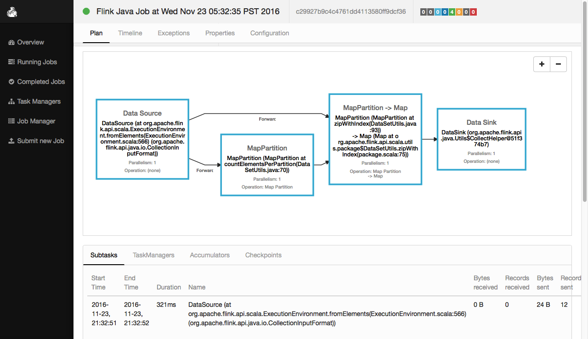
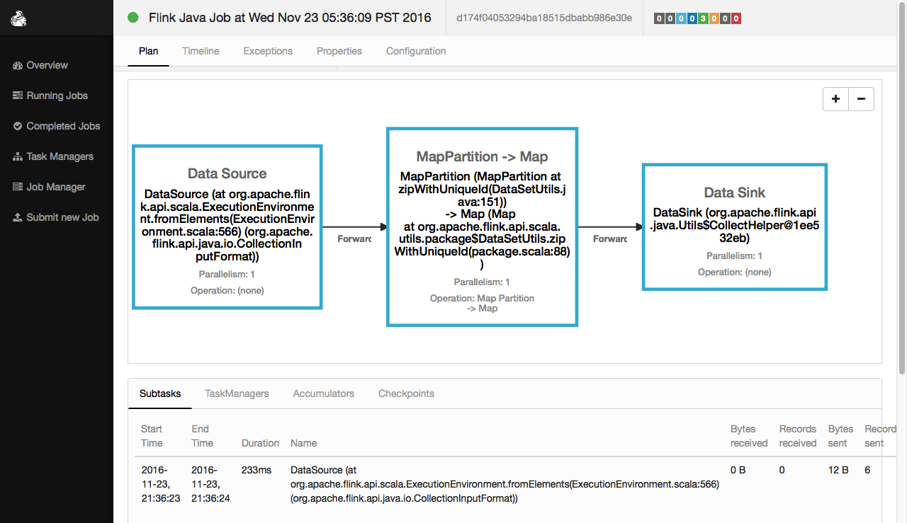
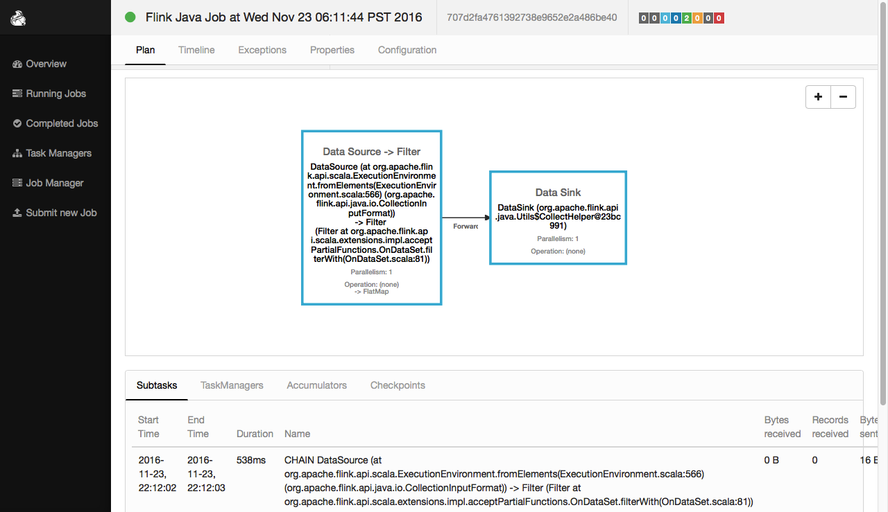

#DateSet的API详解四
#一、Flink DataSetUtils常用API
##self
```
val self: DataSet[T]

Data Set

获取DataSet本身。
```
执行程序：
```scale
//1.创建一个 DataSet其元素为String类型
val input: DataSet[String] = benv.fromElements("A", "B", "C", "D", "E", "F")

//2.获取input本身
val s=input.self

//3.比较对象引用
s==input
```
执行结果：
```
res133: Boolean = true
```


##countElementsPerPartition
```
def countElementsPerPartition: DataSet[(Int, Long)]

Method that goes over all the elements in each partition in order to 
retrieve the total number of elements.

获取DataSet的每个分片中元素的个数。
```
执行程序：
```scale
//1.创建一个 DataSet其元素为String类型
val input: DataSet[String] = benv.fromElements("A", "B", "C", "D", "E", "F")

//2.设置分片前
val p0=input.getParallelism
val c0=input.countElementsPerPartition
c0.collect

//2.设置分片后
//设置并行度为3，实际上是将数据分片为3
input.setParallelism(3)
val p1=input.getParallelism
val c1=input.countElementsPerPartition
c1.collect
```
执行结果：
```
//设置分片前
p0: Int = 1
c0: Seq[(Int, Long)] = Buffer((0,6))

//设置分片后
p1: Int = 3
c1: Seq[(Int, Long)] = Buffer((0,2), (1,2), (2,2))
```


##checksumHashCode
```
def checksumHashCode(): ChecksumHashCode

Convenience method to get the count (number of elements) of a DataSet
as well as the checksum (sum over element hashes).

获取DataSet的hashcode和元素的个数
```
执行程序：
```scale
//1.创建一个 DataSet其元素为String类型
val input: DataSet[String] = benv.fromElements("A", "B", "C", "D", "E", "F")

//2.获取DataSet的hashcode和元素的个数
input.checksumHashCode
```
执行结果：
```
res140: org.apache.flink.api.java.Utils.ChecksumHashCode = 
ChecksumHashCode 0x0000000000000195, count 6
```

##zipWithIndex
```
defzipWithIndex: DataSet[(Long, T)]

Method that takes a set of subtask index, total number of elements mappings
and assigns ids to all the elements from the input data set.

元素和元素的下标进行zip操作。
```
执行程序：
```scale
//1.创建一个 DataSet其元素为String类型
val input: DataSet[String] = benv.fromElements("A", "B", "C", "D", "E", "F")

//2.元素和元素的下标进行zip操作。
val result: DataSet[(Long, String)] = input.zipWithIndex

//3.显示结果
result.collect
```
执行结果：
```
res134: Seq[(Long, String)] = Buffer((0,A), (1,B), (2,C), (3,D), (4,E), (5,F))
```
flink web ui中的执行效果：
 


##zipWithIndex
```
def zipWithUniqueId: DataSet[(Long, T)]

Method that assigns a unique id to all the elements of the input data set.

元素和随机唯一的ID进行zip操作。
```
执行程序：
```scale
//1.创建一个 DataSet其元素为String类型
val input: DataSet[String] = benv.fromElements("A", "B", "C", "D", "E", "F")

//2.元素和随机唯一的ID进行zip操作。
val result: DataSet[(Long, String)] = input.zipWithUniqueId

//3.显示结果
result.collect
```
执行结果：
```
res137: Seq[(Long, String)] = Buffer((0,A), (1,B), (2,C), (3,D), (4,E), (5,F))
```
flink web ui中的执行效果：
 


#二、Flink DataSet 扩展API
##注意：必须引入

```
import org.apache.flink.api.scala.extensions._
```

##mapWith
```
def mapWith[R](fun: (T) ⇒ R)(implicit arg0: TypeInformation[R], arg1: ClassTag[R]):DataSet[R]

Applies a function fun to each item of the data set

可以使用偏函数进行map操作。
```
##mapWith示例一：全函数
执行程序：
```
//1.引入增强依赖
import org.apache.flink.api.scala.extensions._

//2.创建DataSet[Point]
case class Point(x: Double, y: Double)
val ds = benv.fromElements(Point(1, 2), Point(3, 4), Point(5, 6))

//3.使用mapWith进行元素转化
val r=ds.mapWith {
	case Point(x, y) => Point( x*2,y+1)
}

//4.显示结果
r.collect
```
执行结果：
```
res156: Seq[Point] = Buffer(Point(2.0,3.0), Point(6.0,5.0), Point(10.0,7.0))
```

##mapWith示例二：偏函数
执行程序：
```
//1.引入增强依赖
import org.apache.flink.api.scala.extensions._

//2.创建DataSet[Point]
case class Point(x: Double, y: Double)
val ds = benv.fromElements(Point(1, 2), Point(3, 4), Point(5, 6))

//3.使用mapWith进行元素转化
val r=ds.mapWith {
	case Point(x, _) => x*2
}

//4.显示结果
r.collect
```
执行结果：
```
res155: Seq[Double] = Buffer(2.0, 6.0, 10.0)
```


##filterWith
```
def filterWith(fun: (T) ⇒ Boolean): DataSet[T]
Applies a predicate fun to each item of the data set,
keeping only those for which the predicate holds

可以使用片函数进行filter操作。
```

###filterWith示例一：全函数
执行程序：
```
//1.引入增强依赖
import org.apache.flink.api.scala.extensions._

//2.创建DataSet[Point]
case class Point(x: Double, y: Double)
val ds = benv.fromElements(Point(1, 2), Point(3, 4), Point(5, 6))

//3.使用filterWith进行元素过滤
val r=ds.filterWith {
	case Point(x, y) => x > 1 && y <5
}

//4.显示结果
r.collect
```
执行结果：
```
res153: Seq[Point] = Buffer(Point(3.0,4.0))
```
flink web ui中的执行效果：
 

###filterWith示例二：全函数
执行程序：
```
//1.引入增强依赖
import org.apache.flink.api.scala.extensions._

//2.创建DataSet[Point]
case class Point(x: Double, y: Double)
val ds = benv.fromElements(Point(1, 2), Point(3, 4), Point(5, 6))

//3.使用filterWith进行元素过滤
val r=ds.filterWith {
	case Point(x, _) => x > 1
}

//4.显示结果
r.collect
```
执行结果：
```
res154: Seq[Point] = Buffer(Point(3.0,4.0), Point(5.0,6.0))
```


##reduceWith
```
def reduceWith(fun: (T, T) ⇒ T): DataSet[T]
Applies a reducer fun to the data set

可以使用偏函数进行reduce操作。
```
执行程序：
```
//1.引入增强依赖
import org.apache.flink.api.scala.extensions._

//2.创建DataSet[Point]
case class Point(x: Double, y: Double)
val ds = benv.fromElements(Point(1, 2), Point(3, 4), Point(5, 6))


//3.使用reduceWith进行元素的merger
val r=ds.reduceWith {
    case (Point(x1, y1), (Point(x2, y2))) => Point(x1 + x2, y1 + y2)
}

//4.显示结果
r.collect
```
执行结果：
```
res159: Seq[Point] = Buffer(Point(9.0,12.0))
```

##flatMapWith
```
def flatMapWith[R](fun: (T) ⇒ 
TraversableOnce[R])(implicit arg0: TypeInformation[R], arg1: ClassTag[R]): DataSet[R]

Applies a function fun to each item of the dataset, producing a 
collection of items that will be flattened in the resulting data set

可以使用偏函数进行flatMap操作。
```
执行程序：
```
//1.引入增强依赖
import org.apache.flink.api.scala.extensions._

//2.创建DataSet[Point]
case class Point(x: Double, y: Double)
val ds = benv.fromElements(Point(1, 2), Point(3, 4), Point(5, 6))

//3.使用reduceWith进行元素的merger
val r0=ds.flatMapWith {
  case Point(x, y) => Seq("x" -> x, "y" -> y)
}

//4.显示结果
r0.collect
```
执行结果：
```
res1: Seq[(String, Double)] = Buffer((x,1.0), (y,2.0), (x,3.0), (y,4.0), (x,5.0), (y,6.0))
```


