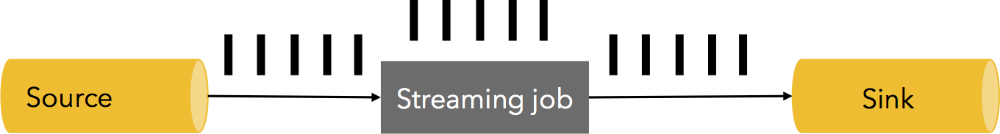
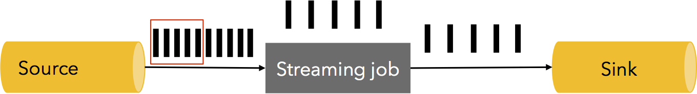
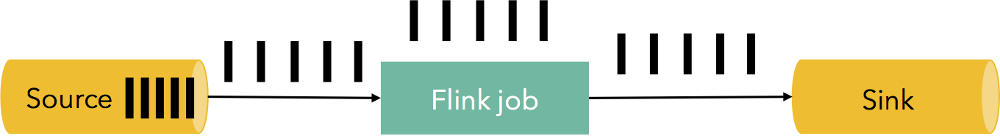
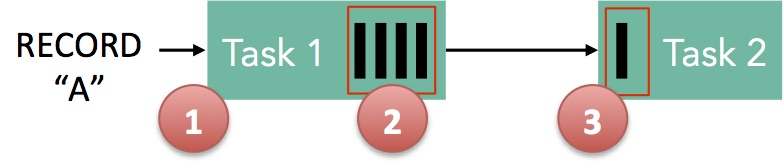

##《flink中的背压的处理原理》
####什么是背压问题
流系统中消息的处理速度跟不上消息的发送速度，导致消息的堆积。如果系统能感知消息堆积，并调整消息发送的速度。
使消息的处理速度和发送速度相协调就是有背压感知的系统。背压如果不能得到正确地处理，可能会导致资源被耗尽或者
甚至出现更糟的情况导致数据丢失。flink就是一个有背压感知的基于流的分布式消息处理系统。
 
举例说明：
1.正常情况：消息处理速度>=消息的发送速度，不发生消息拥堵，系统运行流畅
 
2.异常情况：消息处理速度< 消息的发送速度，发生了消息拥堵，系统运行不畅。
 
消息拥堵可以采取两种方案
a.将拥堵的消息直接删除，将会导致数据丢失，在精确到要求高的场景非常不合适
b.将拥堵的消息缓存起来，并告知消息发送者减缓消息发送的速度。
3.处理方法：将缓冲区持久化，以方便在处理失败的情况下进行数据重放。
有些source本身提供持久化保证，可以优先考虑。例如： Apache Kafka是一个很不错的选择，可以背压从sink到source
的整个pipeline,同时对source进行限流来适配整个pipeline中最慢组件的速度，从而获得系统的稳定状态。
 
####flink中的背压
Flink使用分布式阻塞队列来作为有界缓冲区。如同Java里通用的阻塞队列跟处理线程进行连接一样，一旦队列达到容量上限，
一个相对较慢的接受者将拖慢发送者。
举例说明:
图中有一个简单的flow，它由两个task组成
 
1、记录“A”进入Flink，然后被Task 1处理 
2、Task 1处理后的结果被序列化进缓冲区 
3、task 2从缓冲区内读取一些数据，缓冲区内将有更多的空间。
4、如果task 2处理的较慢，task1的缓存区将很快填满。发送速度随之下降。
注意：为了记录能被Flink处理，缓冲区必须是可用的

####flink背压的两种场景
1.本地传输
 
如果task1和task2都运行在同一个工作节点（TaskManager），缓冲区可以被直接共享给下一个task，一旦task 2消费了数据它会
被回收。如果task 2比task 1慢，buffer会以比task 1填充的速度更慢的速度进行回收从而迫使task 1降速。
2.网络传输
 
如果task 1和task 2运行在不同的工作节点上。一旦缓冲区内的数据被发送出去(TCP Channel)，它就会被回收。在接收端，数据被
拷贝到输入缓冲池的缓冲区中，如果没有缓冲区可用，从TCP连接中的数据读取动作将会被中断。输出端通常以watermark机制来保证不
会有太多的数据在传输途中。如果有足够的数据已经进入可发送状态，会等到情况稳定到阈值以下才会进行发送。这可以保证没有太多的
数据在路上。如果新的数据在消费端没有被消费（因为没有可用的缓冲区），这种情况会降低发送者发送数据的速度。
####flink背压的性能测试
下面这张图显示了：随着时间的改变，生产者（黄色线）和消费者（绿色线）基于所达到的最大吞吐（在单一JVM中每秒达到8百万条记录）
的平均吞吐百分比。我们通过衡量task每5秒钟处理的记录数来衡量平均吞吐。

首先，我们运行生产者task到它最大生产速度的60%（我们通过Thread.sleep()来模拟降速）。消费者以同样的速度处理数据。
然后，我们将消费task的速度降至其最高速度的30%。你就会看到背压问题产生了，正如我们所见，生产者的速度也自然降至其最高速度的30%。
接着，我们对消费者停止人为降速，之后生产者和消费者task都达到了其最大的吞吐。接下来，我们再次将消费者的速度降至30%，pipeline给出了立即响应：生产者的速度也被自动降至30%。
最后，我们再次停止限速，两个task也再次恢复100%的速度。这所有的迹象表明：生产者和消费者在pipeline中的处理都在跟随彼此的吞吐而进行适当的调整，这就是我们在流pipeline中描述的行为。
####flink背压的总结
Flink与持久化的source（例如kafka），能够为你提供即时的背压处理，而无需担心数据丢失。Flink不需要一个特殊的机制来处理背压，
因为Flink中的数据传输相当于已经提供了应对背压的机制。因此，Flink所获得的最大吞吐量由其pipeline中最慢的部件决定。
####参考链接：
http://blog.csdn.net/yanghua_kobe/article/details/51214097
http://data-artisans.com/how-flink-handles-backpressure/