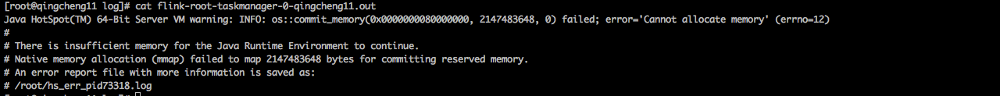

###1.服务器内存不足
####1.1问题描述
```
在qingcheng11上启动不了taskmanager,其他机器都能正常启动。
```
####1.2排除方法

#####S1.进入日志目录
```
cd $FLINK_HOME/log/
```
#####S2.查看日志列表
 
```
ll
```
#####S3.查看日志内容
```
cat flink-root-taskmanager-0-qingcheng11.out
```
 
####1.3修改方法
```
1.闭不必要进程释放内存。
2.重新调整机器内存大小。
```
