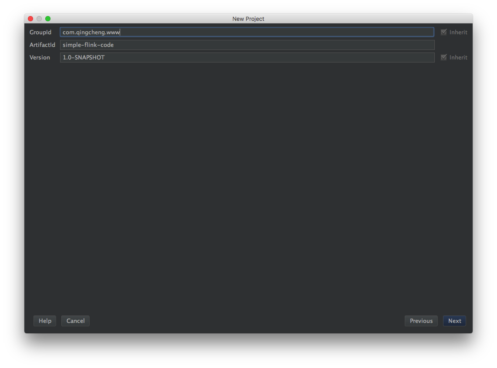
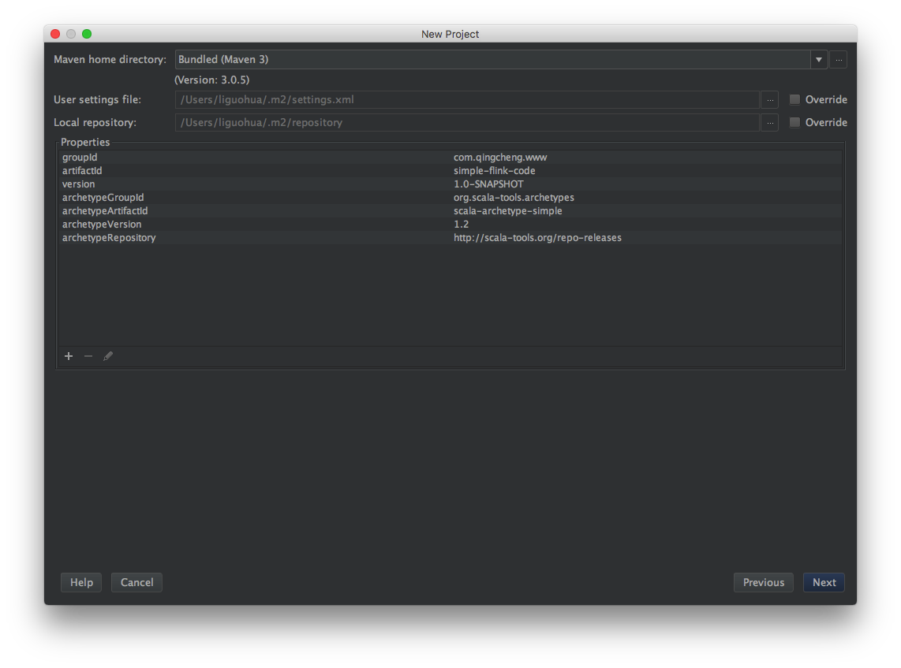
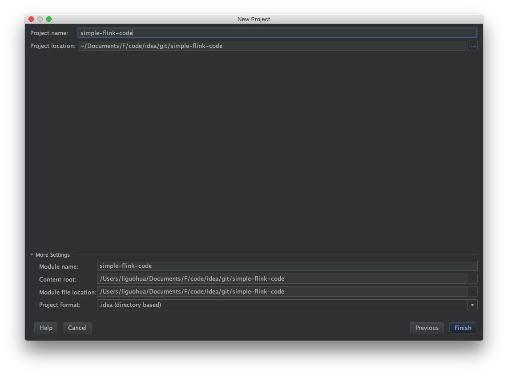
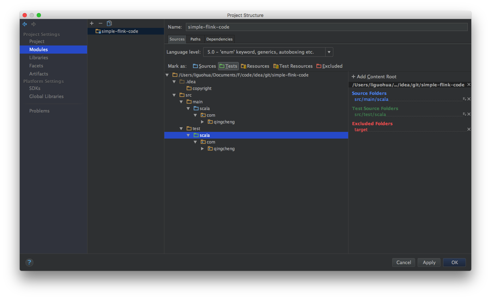
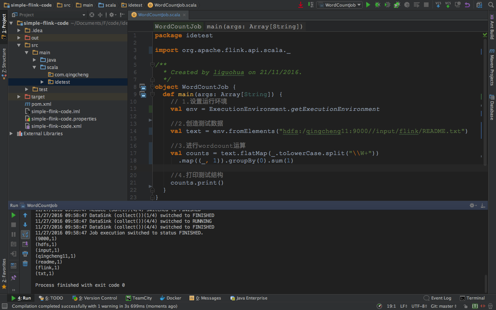

##一、准备flink的开发环境
###1.创建scala的maven项目
 
###2.输入项目的基本信息
 
###3.验证项目的基本信息
 
###4.输入项目名称
 
###5.生成的目录结构
 
###6.设置src和test目录
 
###7.寻找项目依赖
```
https://ci.apache.org/projects/flink/flink-docs-release-1.1/apis/common/index.html
```
###8.添加到pom.xml中的内容
```
<!-- Use this dependency if you are using the DataStream API -->
<dependency>
  <groupId>org.apache.flink</groupId>
  <artifactId>flink-streaming-java_2.10</artifactId>
  <version>1.1.3</version>
</dependency>
<!-- Use this dependency if you are using the DataSet API -->
<dependency>
  <groupId>org.apache.flink</groupId>
  <artifactId>flink-java</artifactId>
  <version>1.1.3</version>
</dependency>
<dependency>
  <groupId>org.apache.flink</groupId>
  <artifactId>flink-clients_2.10</artifactId>
  <version>1.1.3</version>
</dependency>
```
##二、开发并运行flink程序
###1.创建package和object（略）
###2.编写程序
```scala
package idetest

import org.apache.flink.api.scala._

/**
  * Created by liguohua on 21/11/2016.
  */
object WordCountJob {
  def main(args: Array[String]) {
    // 1.设置运行环境
    val env = ExecutionEnvironment.getExecutionEnvironment

    //2.创造测试数据
    val text = env.fromElements("hdfs:/qingcheng11:9000//input/flink/README.txt")

    //3.进行wordcount运算
    val counts = text.flatMap(_.toLowerCase.split("\\W+"))
      .map((_, 1)).groupBy(0).sum(1)

    //4.打印测试结构
    counts.print()
  }
}
```
3.运行效果
 