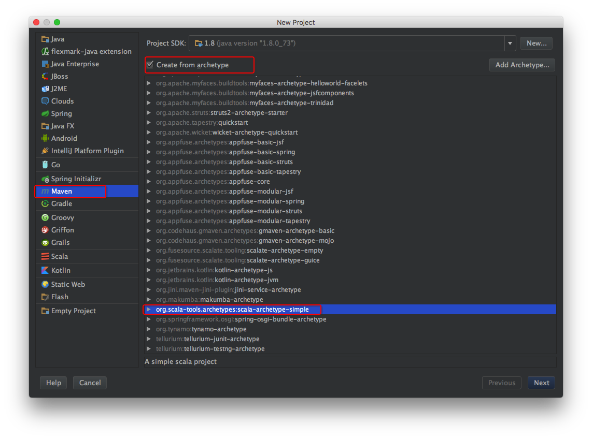
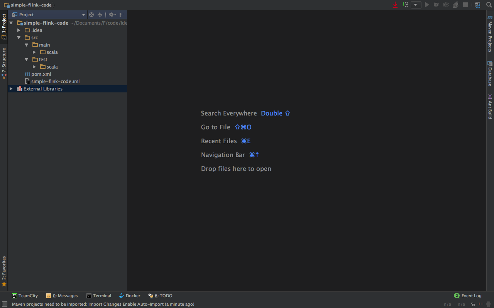

1.创建scala的maven项目
 
2.输入项目的基本信息
 
3.验证项目的基本信息
 
4.输入项目名称
 
5.生成的目录结构
 
6.设置src和test目录
 
7.寻找项目依赖
```
https://ci.apache.org/projects/flink/flink-docs-release-1.2/dev/api_concepts.html
```
8.添加到pom.xml中的内容
```
<!-- Use this dependency if you are using the DataStream API -->
<dependency>
  <groupId>org.apache.flink</groupId>
  <artifactId>flink-streaming-scala_2.10</artifactId>
  <version>1.2-SNAPSHOT</version>
</dependency>
<!-- Use this dependency if you are using the DataSet API -->
<dependency>
  <groupId>org.apache.flink</groupId>
  <artifactId>flink-scala_2.10</artifactId>
  <version>1.2-SNAPSHOT</version>
</dependency>
<dependency>
  <groupId>org.apache.flink</groupId>
  <artifactId>flink-clients_2.10</artifactId>
  <version>1.2-SNAPSHOT</version>
</dependency>
```

9.编写程序
 idetest.WordCountJob.scala
```scala
package idetest
/**
  * Created by liguohua on 21/11/2016.
  */
object WordCountJob {
  def main(args: Array[String]) {
    // 1.设置运行环境
    val env = ExecutionEnvironment.getExecutionEnvironment

    //2.创造测试数据
    val text = env.fromElements(
      "To be, or not to be,--that is the question:--",
      "Whether 'tis nobler in the mind to suffer",
      "The slings and arrows of outrageous fortune",
      "Or to take arms against a sea of troubles,")

    //3.进行测试运算
    val counts = text.flatMap { _.toLowerCase.split("\\W+") }
      .map { (_, 1) }
      .groupBy(0)
      .sum(1)

    //4.打印测试结构
    counts.print()
  }
}
```
