##一、准备flink的开发环境
###1.创建project
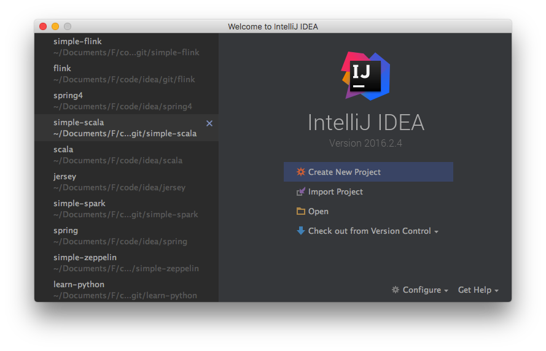 
###2.选择Scala project
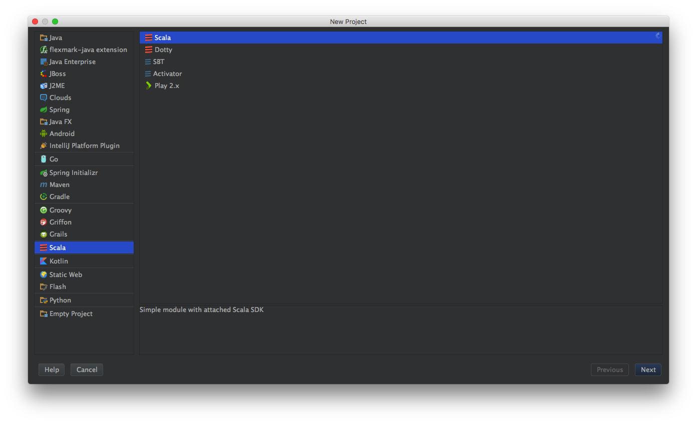 
###3.输入project基本信息
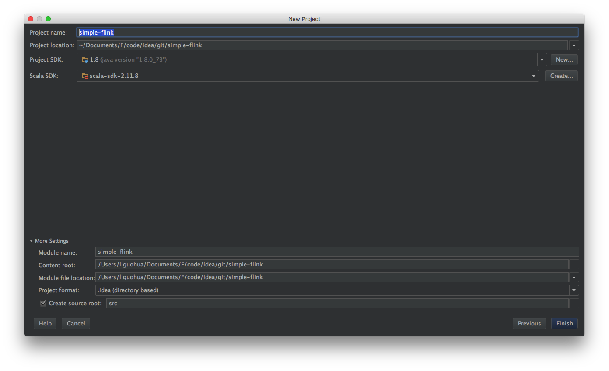 
```
1.填写项目的名称信息
2.填写项目的位置信息
```
###4.project创建成功后的效果
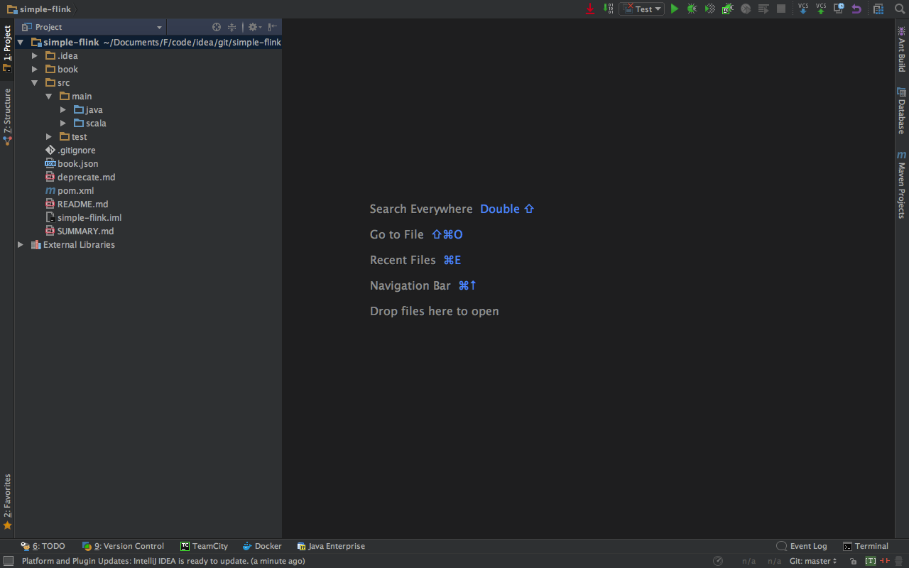 
###5.配置project's SDK
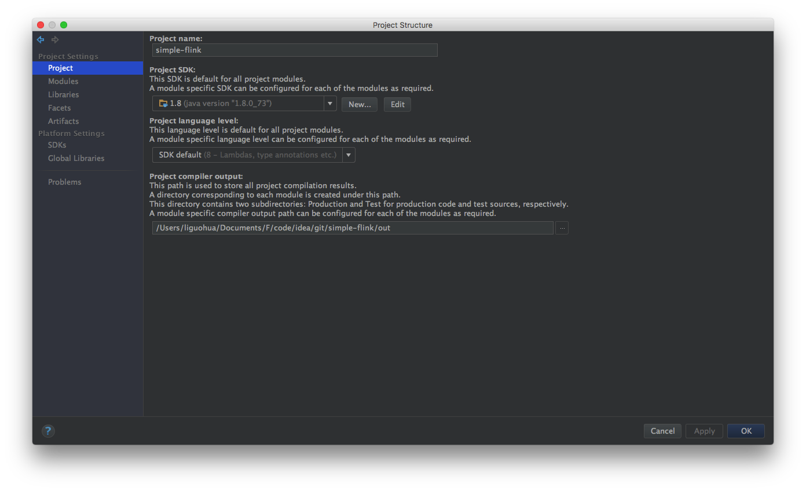 
```
选择Java的本地安装目录，也就是$JAVA_HOME
```
###6.配置modules的目录属性
 
```
1.配置java的source目录，以便进行flink的Java开发
2.配置scala的source目录，以便进行flink的scala开发
3.其他目录，以后用到再进行配置
```

###7.配置libraries
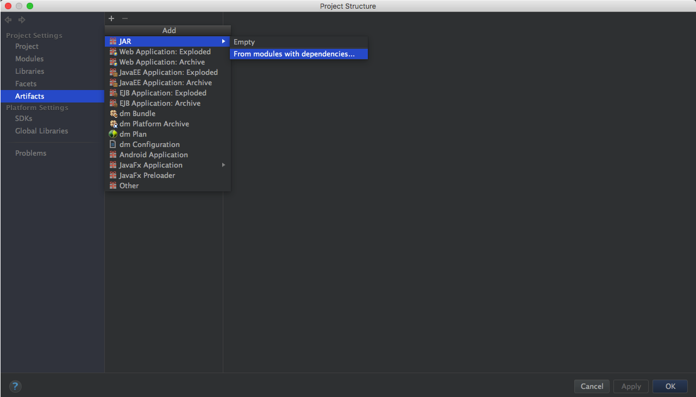 
```
1.选择scala的本地安装目录，也就是$SCALA_HOME
2.选择flink的本地安装目录，也就是$FLINK_HOME
```
##二、开发并运行flink程序
###1.创建package
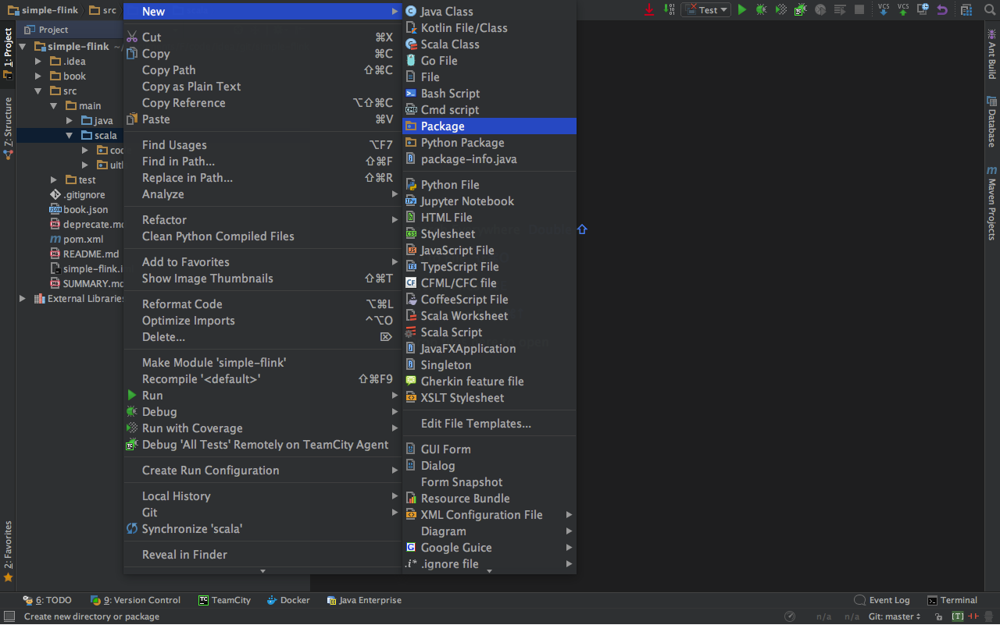 
###2.输入package名称
 
###3.创建object
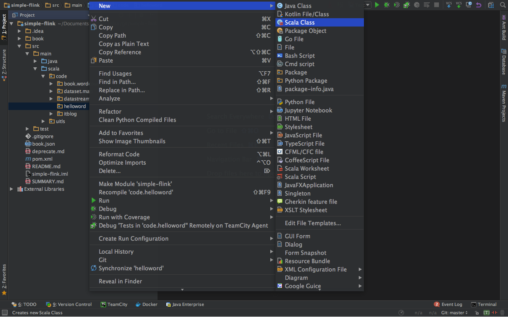 
```
注意：为了简单起见，要选择object，不要选择class.不然在代码里面还要改动。
```

###4.输入object名称
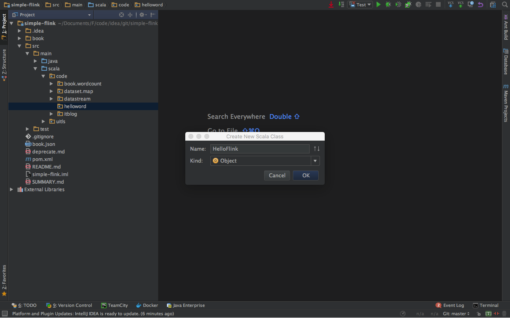 
###5.创建后的默认代码
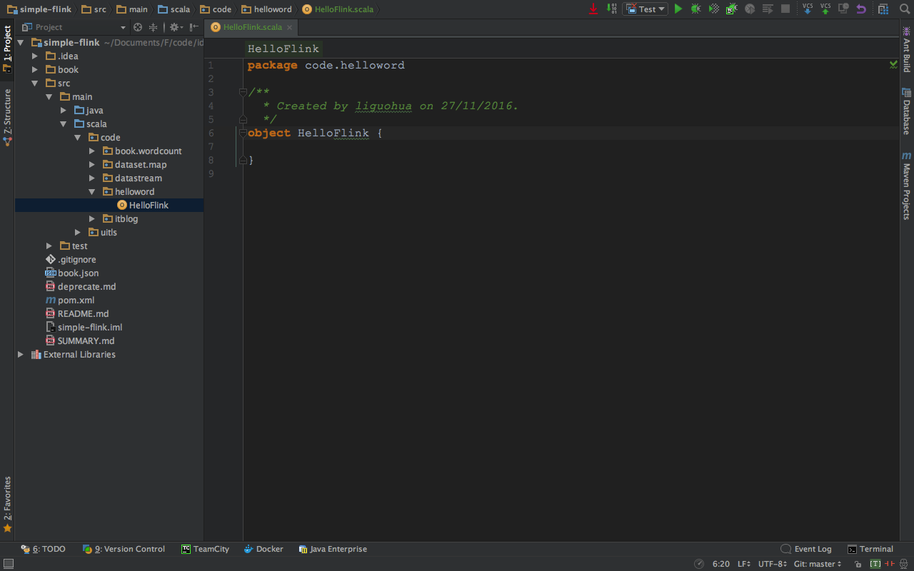 
###6.编写程序
```scala
package code.helloword

//0.引入必要的程序元素
import org.apache.flink.api.scala._

object HelloFlink {
  def main(args: Array[String]): Unit = {
    // 1.设置运行环境
    val env = ExecutionEnvironment.getExecutionEnvironment

    //2.创造测试数据
    val text = env.fromElements(
      "To be, or not to be,--that is the question:--",
      "Whether 'tis nobler in the mind to suffer",
      "The slings and arrows of outrageous fortune",
      "Or to take arms against a sea of troubles,")

    //3.进行wordcount运算
    val counts = text.flatMap(_.toLowerCase.split("\\W+"))
      .map((_, 1)).groupBy(0).sum(1)
    //4.打印测试结构
    counts.print()
  }
}
```
###7.运行程序
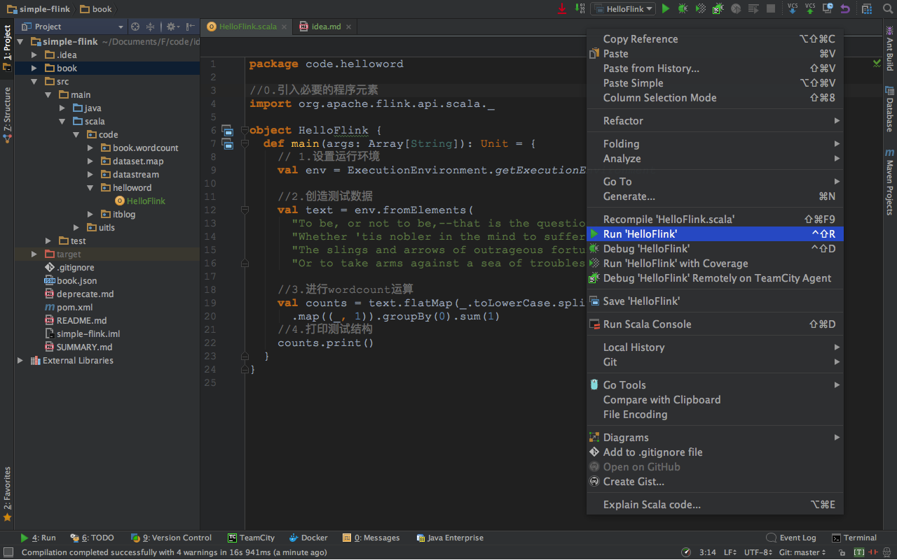 

###8.运行效果
 