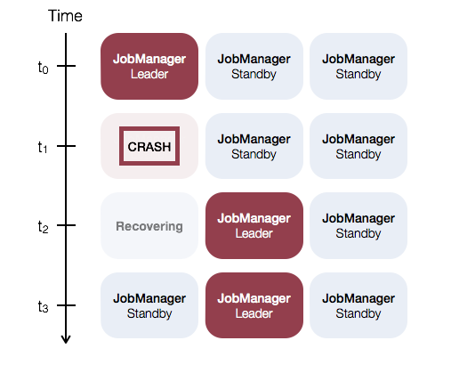
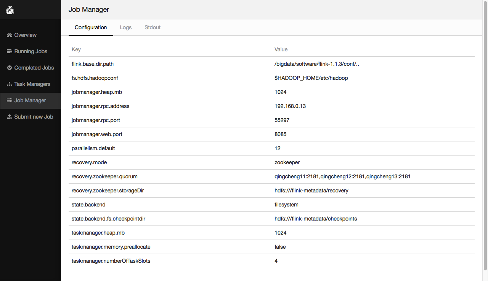
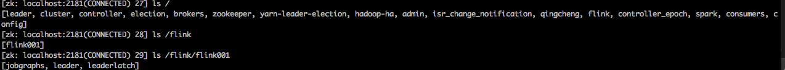
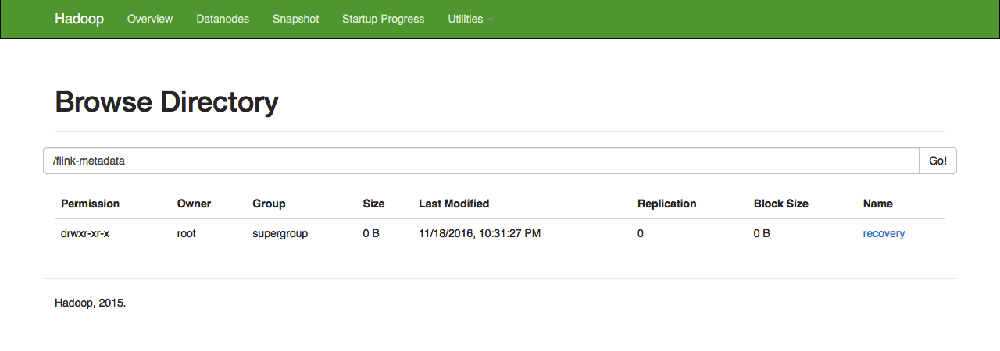
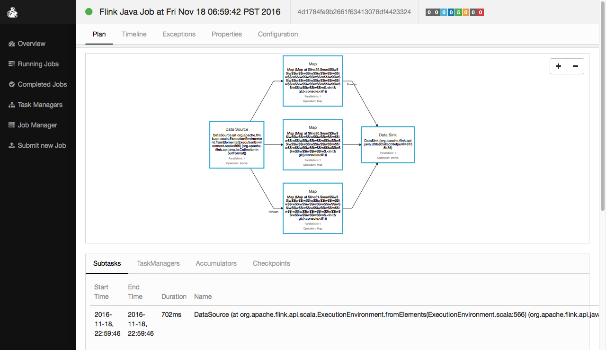

##五、flink在standalone模式主节点下有HA的部署实战 
###1.HA配置说明
```
当Flink程序运行时，如果jobmanager崩溃，那么整个程序都会失败。为了防止jobmanager的单点故障，
借助于zookeeper的协调机制，可以实现jobmanager的HA配置—-1主（leader）多从（standby）。
这里的HA配置只涉及standalone模式，yarn模式暂不考虑。 
```
>注意：
>1.由于flink jobmanager的HA配置依赖 zookeeper，因此要先配置并启动zookeeper集群   
>2.由于flink的HA模式下的state backend在要依赖hdfs，因此要先配置并启动Hadoop集群    
    
       
###2.配置flink-conf.yaml文件  
执行命令：
```
vim ${FLINK_HOME}/conf/flink-conf.yaml
```
配置内容：
```
在flink-conf.yaml文件中进行一些基本的配置，本此要修改的内容如下。  

1.jobmanager端口
    jobmanager.web.port: 8085
    spark有个端口已经占用了8081，如果要和spark部署到同一个集群中，应当防止端口冲突
1.jobmanager地址
    注释jobmanager.rpc.address:flink配置项
    HA模式下，jobmanager不需要指定，在master file中配置，由zookeeper选出leader与standby。

2.checkpoints目录
    检查点生成的分布式快照的保存地点，默认是jobmanager的memory，但是HA模式必须配置在hdfs上，
    且保存路径需要在hdfs上创建并指定路径
    state.backend: filesystem
    state.backend.fs.checkpointdir: hdfs:///flink-metadata/checkpoints

3.hadoopconf路径：
    指定hadoop conf路径，这里需要告诉Flink，hadoop配置的路径，否则会报错
    fs.hdfs.hadoopconf: $HADOOP_HOME/etc/hadoop

4.zookeeper信息
    recovery.mode: zookeeper
    recovery.zookeeper.quorum: qingcheng11:2181,qingcheng12:2181,qingcheng13:2181
    recovery.zookeeper.storageDir: hdfs:///flink-metadata/recovery
    recovery.zookeeper.path.root: /flink001
    recovery.zookeeper.path.namespace: /flink001
    
    配置项说明：
    storageDir存储jobmanager的元数据信息，包括用于恢复的信息；
    recovery.zookeeper.path.root代表zookeeper中节点信息；
    recovery.zookeeper.path.namespace，如果Flink集群有不止一个，那么这个值需要指定，不能用默认的名字。
```
###3.配置masters文件  
执行命令：
```
vim ${FLINK_HOME}/conf/masters
```
配置内容：  
```
qingcheng11:8085
qingcheng12:8085
qingcheng13:8085

注意：
spark有个端口已经占用了8081，如果要和spark部署到同一个集群中，应当防止端口冲突
```

###4.分发配置文件
```
scp -r ${FLINK_HOME}/conf/*  qingcheng12:${FLINK_HOME}/conf/
scp -r ${FLINK_HOME}/conf/*  qingcheng13:${FLINK_HOME}/conf/
```
###5.重启flink集群

执行命令：
```
1.关闭集群
    ${FLINK_HOME}/bin/stop-cluster.sh    
2.启动集群
    ${FLINK_HOME}/bin/start-cluster.sh 
3.启动web客户端
    ${FLINK_HOME}/bin/webclient.sh start
```
   
执行效果：
  
```
http://192.168.0.11:8085
```

选举过程效果：
```
Service temporarily unavailable due to an ongoing leader election. Please refresh.
```
选举成功后的效果：
   
重启后的flink集群会进行主节点选举，本次使用选举结果是qingcheng13作为active jobmanager

###6.验证重启成功
6.1zookeeper客户端验证
```
 ls /
 ls /flink
 ls /flink/flink001
```
   
6.2hadoop hdfs上验证
```
http://192.168.0.12:50070/explorer.html#/flink-metadata
```
   

###7.测试jobmanager的HA

```
1.关闭jobmanager
    ${FLINK_HOME}/bin/jobmanager.sh stop
2.开启jobmanager   
    ${FLINK_HOME}/bin/jobmanager.sh start
```
停止qingcheng13上的jobmanager，来模拟jobmanager的crash。一会的时间，系统就选举出了另外的一个  
active jobmanager，本次实验选举的是qingcheng12.
   

###8.使用jobmanager的HA的flink集群
8.1打开scala-shell  
因为此时集群是HA,remote可以填写任意一个jobmanager，它都会被自动转发到active jobmanager上，
本次使用的remote参数时qingcheng11,它就能被qingcheng13这个active jobmanager监控到。
```
   ${FLINK_HOME}/bin/start-scala-shell.sh remote qingcheng11 6123
```
8.2执行一个小程序
```
val a= benv.fromElements(1, 2, 3, 4)
val b= a.map(_*2)
val c= a.map(_+5)
val d= a.map(_-1)
val e=b.union(c).union(d)
e.collect
```
   

