##一、flink架构
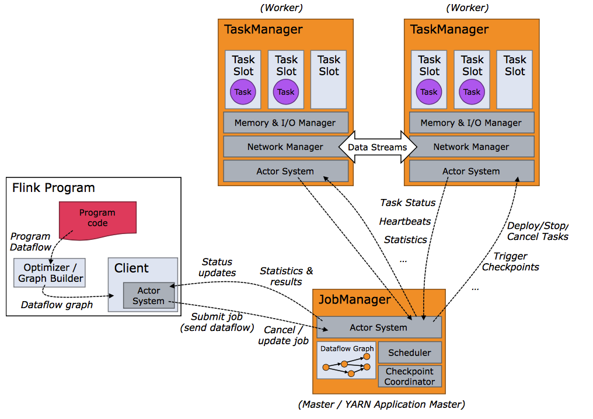 
```
1.flink是一个主从结构的分布式程序，它由client和cluster两部分组成。

2.cluster由主节点JobManager（JM）和从节点TaskManager组成(TM)。
    a.JM负责协调分布式执行：调度Task、协调检查点、协调失效恢复等工作。
      JM至少要有一个，也可有多个。多个JM可基于zookeeper做HA,一个active，其余standby。
    b.TM负责执行一个具体的Dataflow的Task，缓存并交换streams等工作。
      TM至少要有一个，也可有多个，多个TM组成worker集群，并发执行任务。
    c.JM和TM有多种部署方式，可以选择使用裸机部署，使用container部署，使用yarn部署。
      只要JM和TM能通信即可，这样JM就能下发任务到TM,TM也能执行任务并上报TM.
      
3.client属于flink架构的一部分，但不属于flink集群。它的工作是连接user和cluster.
    a.client能够将user提交的application分析成Dataflow提交给JM.JM会分配给TM做具体的执行工作。
      在提交完Dataflow可以关闭，也可以不关闭.
    b.client不关闭的话还可以接受cluster处理进度报告，以便user能跟着任务的运行情况。
```

##二、程序（Progrram）和数据流（Dataflows）
###1.程序（Progrram）
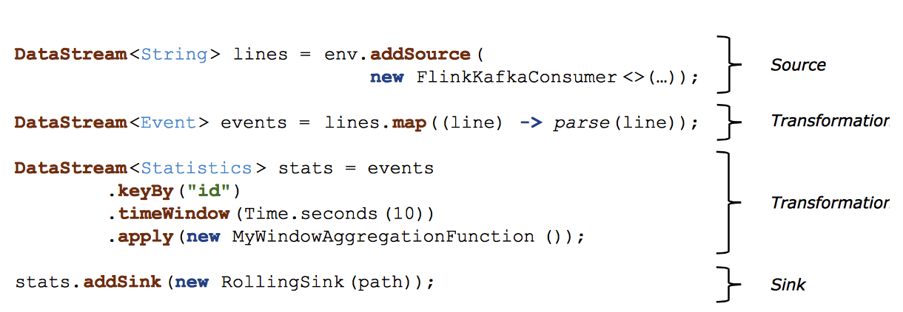 
```
1.Progrram是user通过java,scala，python等编程语言调用flink相应的api编写而成。
2.在Program中用户将data从source通过一系列的Transformation处理成期望的结果，然后sink到外部系统。
3.一般来说Transformation中都有一个Operator，但有时一个Transformation也可包括了多个Operator。
```
###2.数据流（Dataflows）
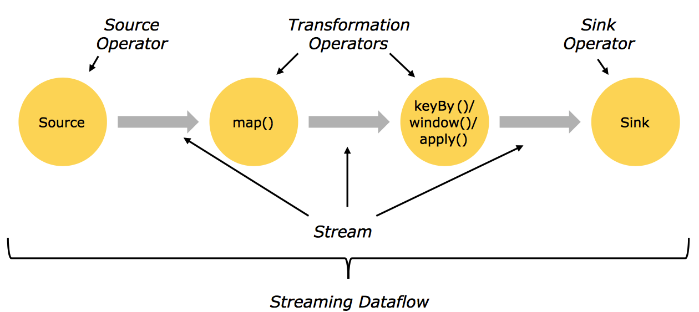 
```
1.program经过client解析形成Dataflow
2.在Dataflow中主要包括Streams和Transformations两个概念。
  a.Transformations是指对数据的转化操作。
  a.Stream是指数据转化过程中的中间结果。
3.将Transformation做点，Stream做边可把Dataflow映射成一个有向无环图(DAG)。
  在执行程序的过程中可以根据程序的DAG做计算优化，可以合并或省略一些中间步骤。
```

###3.并行度（parallelism）和数据传输模式

####3.1并行度
```
1.flink架构是分布式的，也就决定了程序（Progrram）和数据流（Dataflows）也是分别式的。
2.Dataflow也是一个分布式概念，它的Stream被查分成Stream-Partition,Operator被查分成subtask.
  Stream-Partition本质就是data-partition,subtask本质是thread.
3.这些subtask(thread)相互独立，被分配到不同的机器上并行执行，甚至是不同的container中并行执行。
  一个Operator被查分成subtask的数量就是并行度（parallelism），它决定这程序并发执行的线程个数。
  设置合适的并行度，能够使任务在不同的机器上并行执行，能提高程序的运行效率。
4.Stream-Partition就是data-partition，subtask就是thread，也就是说在每一个数据分片上运行一个线程
  这些独立的线程能够并行的处理数据。所以，Stream的分区数和Operator的并行度是一致的。只不过Stream-Partition
  是描述数据被分片的情况，Operator-subtask是描述线程的并行情况。
```
 
####3.2数据传输模式
```
1.Stream在transform过程中有两种传输模式,Forwarding模式和Redistributing模式。
2.Forwarding模式是指Stream-Partition之间一对一(One-to-One)传输。子stream保留父stream的分区个数和元素的顺序。
  Source向map传输stream-partition就在这种情况，分区个数，元素顺序都能保持不变，这里可以进行优化。可以把source和
  map做成一个TaskChain,用一个thread去执行一个source-subtask和map-subtask.原本4个thread处理的任务，
  优化后2个thread就能完成了，因为减少了不必要的thread开销，效率还能提升。
3.Redistributing模式是指Stream-Partition之间是多对多的传输。stream转化过程中partition之间进行了shuffer操作,
  这会把分区个数和元素顺序全部打乱，可能会牵涉到数据的夸节点传输。因为数据可能夸节点传输，无法确定应该在哪个节点上启动
  一个thread去处理在两个节点上的数据，因此无法将Redistributing模式下的task做成一个task-chain。
  Map-KeyBy/Window和KeyBy/Window-sink直接就是Redistributing模式。
```

###4.任务以及操作链(Task & Operator Chains)
```
1.为了减少不必要的thread通信和缓冲等开销，可以将Forwarding模式下的多个subtask做成一个subtask-chain
2.将一个thread对应一个subtask优化为一个thread对应一个subtask-chain中的多个subtask。
  可提高总体吞吐量（throughput）并降低延迟（latency）。
3.如果说stream-partition对数据分区是为了通过提高并发度，来提高程序的运行效率。那么subtask-chain就是在程序的运行
  过程中合并不必要的thread来提高程序的运行效率。
```
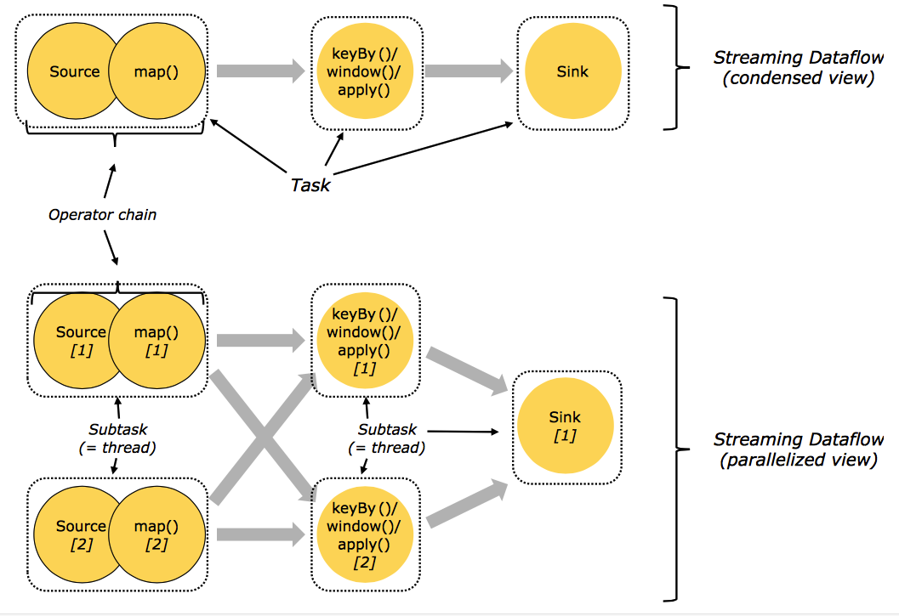 
```
原来需要7个thread的任务在进行chain优化后，5个thread就能更好的完成。
```
###5.任务槽（Task slot）
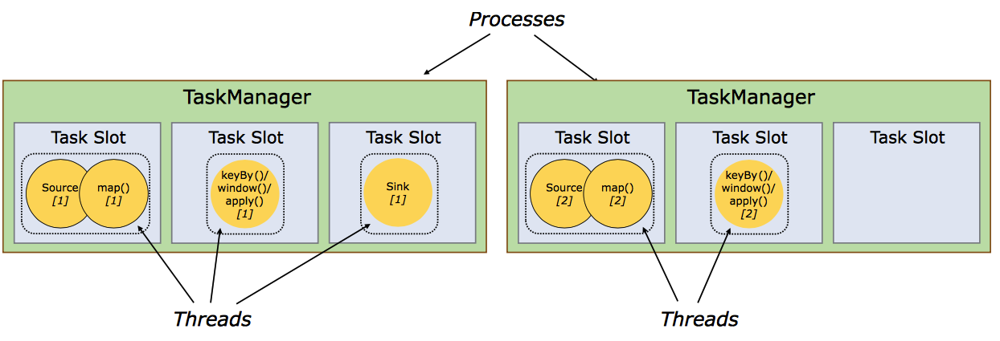 
```
1.flink的TM就是运行在不同节点上的JVM进程（process）,这个进程会拥有一定量的资源。比如内存，cpu，网络，磁盘等。
  flink将进程的内存进行了划分到多个slot中.图中有2个TaskManager，每个TM有3个slot的，每个slot占有1/3的内存。
  
2.内存被划分到不同的slot之后可以获得如下好处。
  a.TaskManager最多能同时并发执行的任务是可以控制的，那就是3个,因为不能超过slot的数量。
  b.slot有独占的内存空间，这样在一个TaskManager中可以运行多个不同的作业，作业之间不受影响。
  c.slot之间可以共享JVM资源, 可以共享Dataset和数据结构，也可以通过多路复用（Multiplexing）
    共享TCP连接和心跳消息（Heatbeat Message）。
```

###6.槽共享（Slot Sharing）
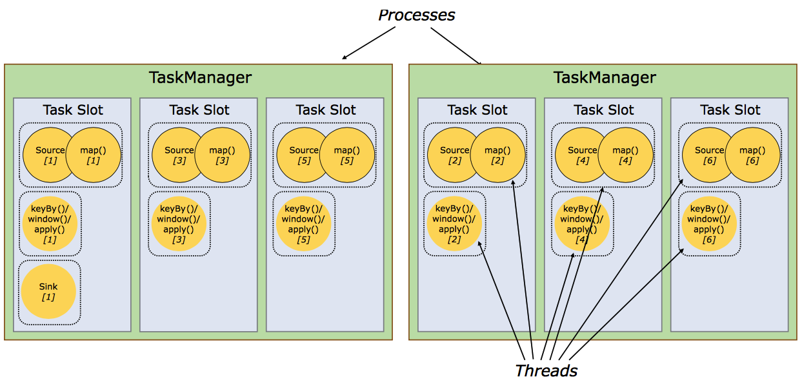 

```
1.flink默认允许同一个job下的subtask可以共享slot.
2.这样可以使得同一个slot运行整个job的流水线（pipleline）
3.槽共享可以获得如下好处：
  a.只需计算Job中最高并行度（parallelism）的task slot,只要这个满足，其他的job也都能满足。
  b.资源分配更加公平，如果有比较空闲的slot可以将更多的任务分配给它。图中若没有任务槽共享，负载
    不高的Source/Map等subtask将会占据许多资源，而负载较高的窗口subtask则会缺乏资源。
  c.有了任务槽共享，可以将基本并行度（base parallelism）从2提升到6.提高了分槽资源的利用率。
    同时它还可以保障TaskManager给subtask的分配的slot方案更加公平。
    
4.经验上讲Slot的数量与CPU-core的数量一致为好。但考虑到超线程计算，可以让slotNumber=2*cpuCore.
```


##一、slot和parallelism的关系
###1.slot是指taskmanager的并发执行能力
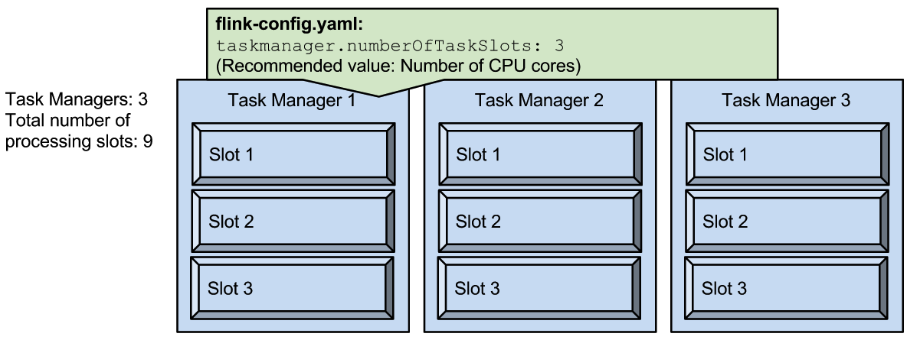 
```
taskmanager.numberOfTaskSlots:3
每一个taskmanager中的分配3个TaskSlot,3个taskmanager一共有9个TaskSlot
```

###2.parallelism是指taskmanager实际使用的并发能力
 
```
parallelism.default:1 
运行程序默认的并行度为1，9个TaskSlot只用了1个，有8个空闲。设置合适的并行度才能提高效率。
```

###3.parallelism是可配置、可指定的
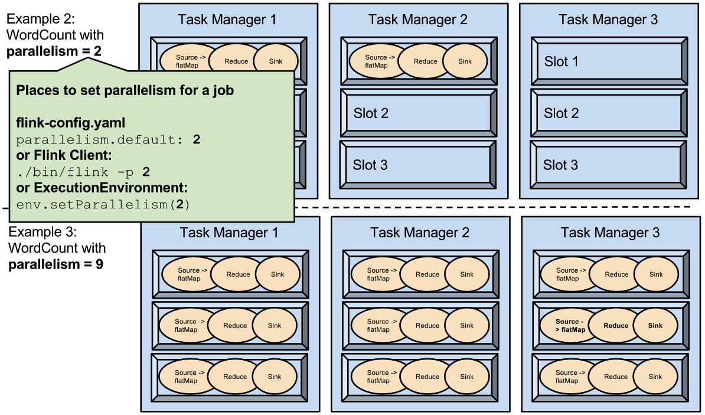 
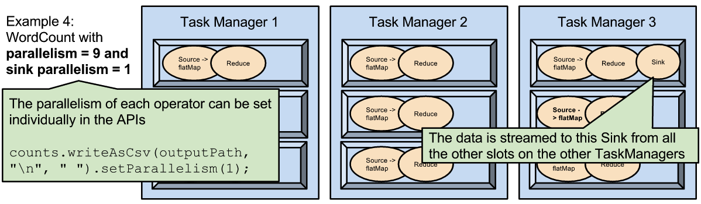 
```
1.可以通过修改$FLINK_HOME/conf/flink-conf.yaml文件的方式更改并行度。
2.可以通过设置$FLINK_HOME/bin/flink 的-p参数修改并行度
3.可以通过设置executionEnvironmentk的方法修改并行度
4.可以通过设置flink的编程API修改过并行度
5.这些并行度设置优先级从低到高排序，排序为api>env>p>file.
6.设置合适的并行度，能提高运算效率
7.parallelism不能多与slot个数。
```
###4.slot和parallelism总结
```
1.slot是静态的概念，是指taskmanager具有的并发执行能力
2.parallelism是动态的概念，是指程序运行时实际使用的并发能力
3.设置合适的parallelism能提高运算效率，太多了和太少了都不行
4.设置parallelism有多中方式，优先级为api>env>p>file
```


##二、设置parallelism的方法
###1.在操作符级别上设置parallelism
```scala
val env = StreamExecutionEnvironment.getExecutionEnvironment
val text = [...]
val wordCounts = text
    .flatMap{ _.split(" ") map { (_, 1) } }
    .keyBy(0)
    .timeWindow(Time.seconds(5))
    
    //设置parallelism为5
    .sum(1).setParallelism(5)
wordCounts.print()
env.execute("Word Count Example")
```

###2.在运行环境级别上设置parallelism
```scala
val env = StreamExecutionEnvironment.getExecutionEnvironment

//设置parallelism为5
env.setParallelism(3)

val text = [...]
val wordCounts = text
    .flatMap{ _.split(" ") map { (_, 1) } }
    .keyBy(0)
    .timeWindow(Time.seconds(5))
    .sum(1)
wordCounts.print()

env.execute("Word Count Example")
```

###3.在客户端级别上设置parallelism
####3.1通过p参数设置parallelism
```scala
//设置parallelism为10
./bin/flink run -p 10 ../examples/*WordCount-java*.jar
```
####3.1通过ClientAPI设置parallelism
```scala
try {
    PackagedProgram program = new PackagedProgram(file, args)
    InetSocketAddress jobManagerAddress =RemoteExecutor.getInetFromHostport("localhost:6123")
    Configuration config = new Configuration()
    
    Client client=new Client(jobManagerAddress,new Configuration(),program.getUserCodeClassLoader())
    
    //设置parallelism为10
    client.run(program, 10, true)

} catch {
    case e: Exception => e.printStackTrace
}
```

###4.在系统级别上设置parallelism
```scala
1.配置文件
    $FLINK_HOME/conf/flink-conf.yaml
2.配置属性
    parallelism.default
```

###5.实战总结
```
1.系统级别的设置是全局的，对所有的job有效。
2.其他级别的设置是局部的，对当前的job有效。
3.多个级别上混合设置，高优先级的设置会覆盖低优先级的设置。
```
##三、在webUI上分析parallelism
###1.集群情况
```
3个taskManager,每个taskmanager有4个slot,共12slot,完全被占用，0个Available。
```
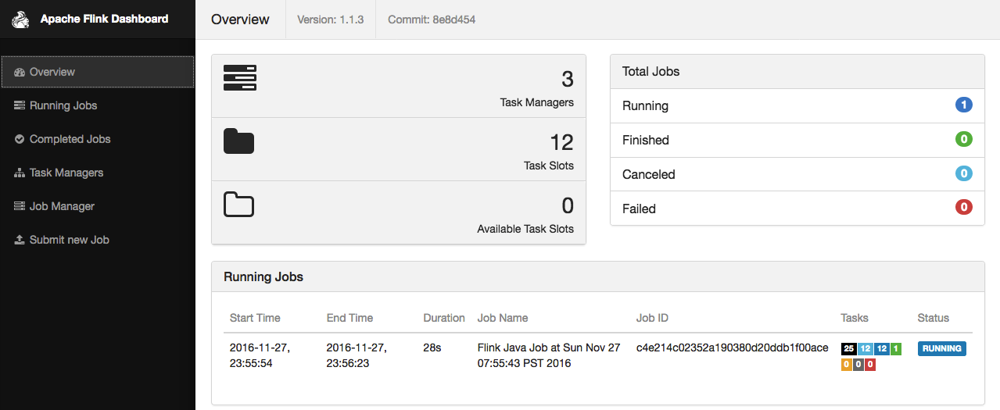 

###2.job使用parallelism情况
```
Reduce操作和DataSink操作都是12个parallelism，正好占完所有的slot.
```
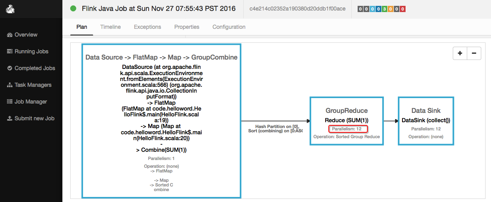 
###3.查看具体的操作执行情况
```
不难看出，每个机器上有4个subtask在执行，实际上就是thread。
```
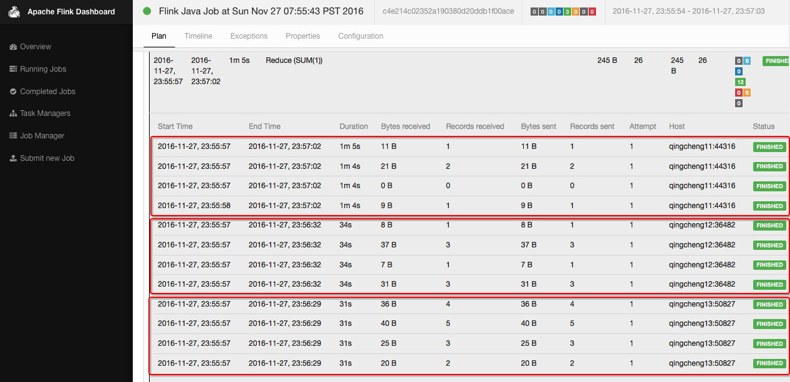 
###4.查看具体的操作调度情况
```
可以分析出，各个subtask在相应的机器上的调度时间。
```
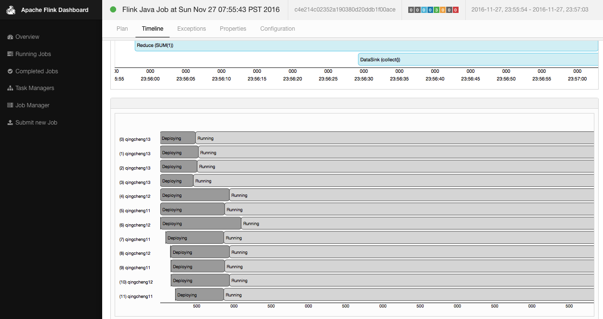 
###5.job在terminal中的执行情况
```
从terminal输出的日志不难看出各个操作符号的subtask的执行情况
```
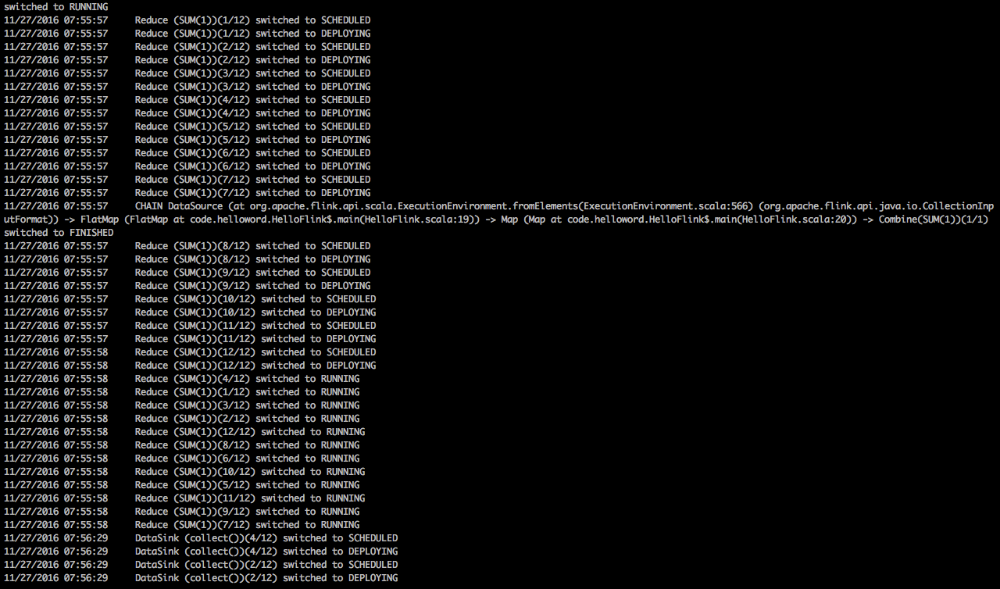 


##四、parallelism超过slot错误分析
###1.集群slot情况
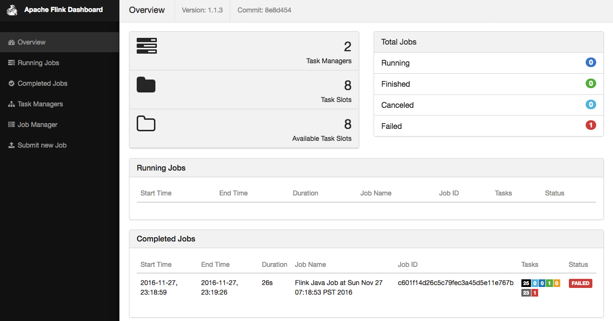 
```
1.集群中有两个TaskManager
2.每个TaskManager有4个slot，一共8个slot
```

###2.申请parallelism情况
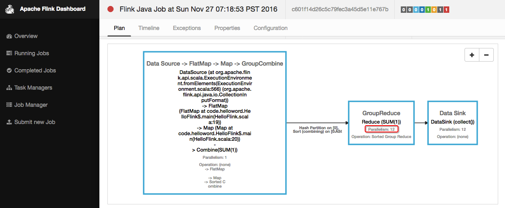 
```
操作符上申请12个parallelism，已经超过slot的总数8
```

###3.错误日志分析
```
日志中显示没有足够的资源进行分配
```
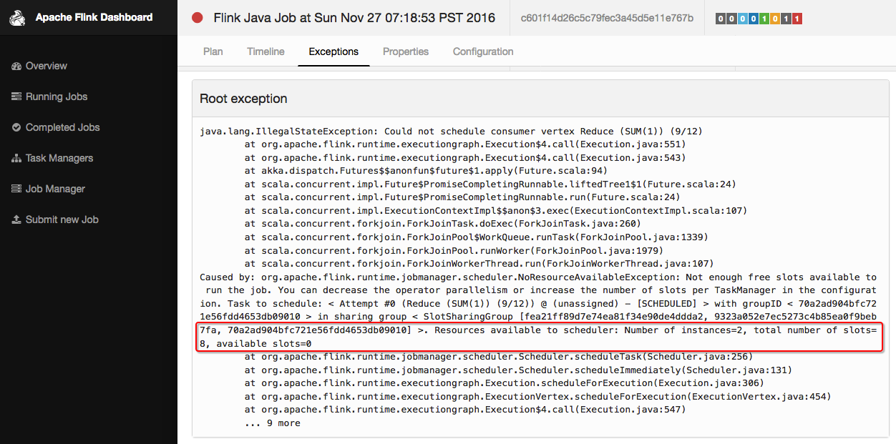 

