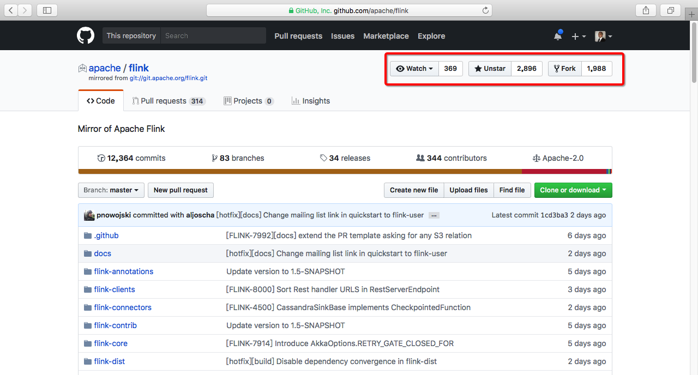
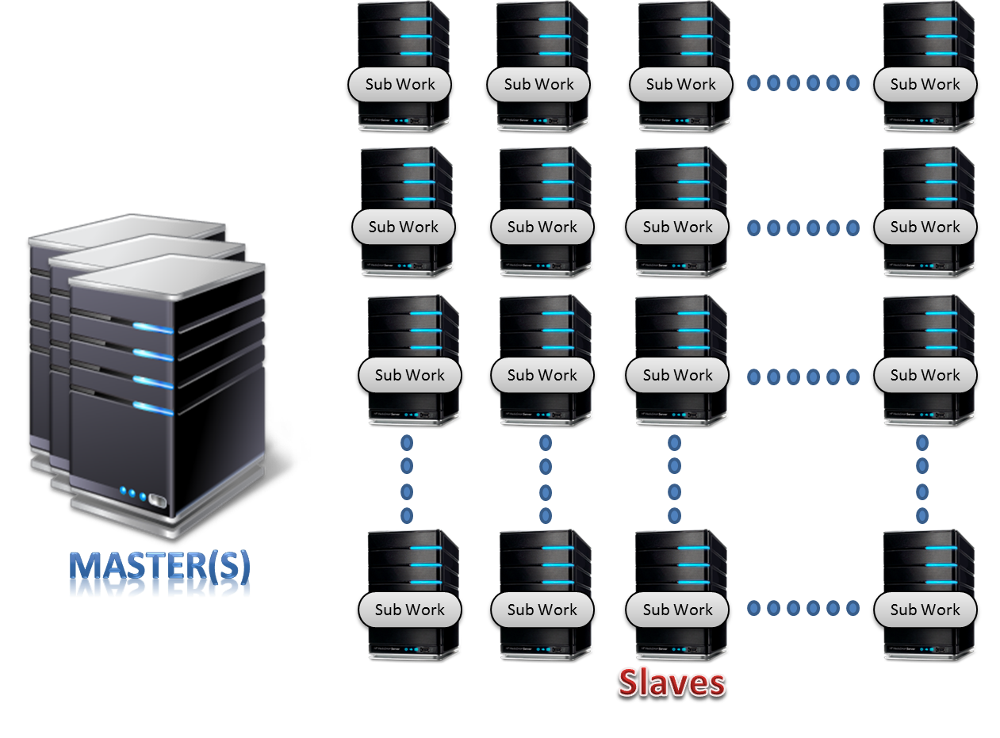
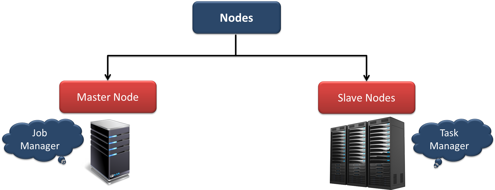

#第一部分：flink概况
##一、flink简介
 
```
1.flink和spark类似，是一个通用的，基于内存计算的，大数据处理引擎。
2.2009年是德国柏林理工大学一个研究性项目，用Java和Scala混合编写而成的。原项目名称为stratosphere
  项目地址为http://stratosphere.eu
3.2014年被Apache孵化器所接受，迅速地成为了阿帕奇顶级项目ASF(Apache Software Foundation)。
  现在有一个支撑它的母公司http://data-artisans.com
4.因其卓越的设计和良好的实现被国外誉为第4代大数据处理引擎。它很好的实现了流处理，批处理的结合，并可以应用到
  SQL-ON-BIGDATA,图计算，机器学习等领域，是非常值得认真学习的一个大数据处理框架。
```
###1.官方网站
```
https://flink.apache.org
```

###2.github地址
```
https://github.com/apache/flink
```
 

###3.flink基本架构
 
```
1.flink和Hadoop一样是一个主从式的分布式系统,有主节点（master）和从节点（worker）组成。
2.如果主节点不做HA，那么系统中有一个主节点和多个从节点组成。
3.如果主节点做了HA，那么系统中有多个主节点和多个从节点组成。
4.主节点的：负责分发计算任务，负责监控计算任务的执行情况。
5.从节点的：负责执行计算任务，负责报告计算任务的执行情况。
6.flinK使用一个client来提交计算任务。
```
 
```
1.主节点的上的进程为JobManager(JM)
2.主节点的上的进程为TaskManager(TM)
```
 
```
1.client用于向flink-cluster提交job
2.JM负责将job解析为task，并将相应的task分发给相应的taskmanager执行，监控taskmanager的运行情况。
3.TM负责执行相应的task,并将执行的进度情况实时上报给JM
```

###4.flink和hdfs结合
 
```
1.flink作为大数据生态圈的一员，它和Hadoop的hdfs是兼容的。
2.一般将namenode和jobmanager部署到一起，将datanode和taskmanager部署到一起。
3.flink也能照顾到数据的本地行，移动计算而不是移动数据。
```