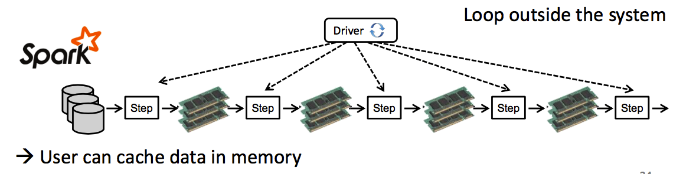
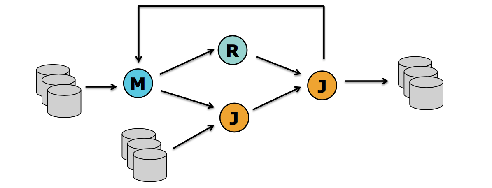

##二、流处理，批处理珠联璧合

###1.同一个运行时环境，同时支持流处理，批处理
 
```
1.flink的一套runtime环境，统一了流处理，批处理，两大业务场景
2.flink本质是一个流处理系统，同时它将批处理看出特殊的流处理，因此也能应付批处理的场景

注意：
1.这与spark相反，spark本质是一个批处理系统，它将流处理看成特殊的批处理的。
2.spark-streaming本质是mirc-batch，无论多么mirc依然是batch,因此延时较大。
3.spark的本质是批处理，它将流处理看出无边界的批处理
4.flink的本质是流处理，它将批处理看出有边界的流处理。
```

###2.实现了自己的内存管理机制
 
```
1.flinK在jvm内部实现了自己的内存管理机制，以提高内存使用效率，防止大规模GC.
2.flink将大规模的数据存放到out-heap内存，以防止在jvm的heap中创建大量对象，而引起大规模GC.

注意：
不知spark是否受到flink的启发，现如今spark也实现了自己的内存管理机制，那就是Tungsten计划。
```


###3.支持迭代和增量迭代
 
```
1.flinK支持迭代和增量迭代操作（这一特性在图计算和机器学习领域非常有用）
2.增量迭代可以根据计算的依赖关系，优化计算环境，获得最好的计算效率
```
###hadoop MR的迭代计算   
     
###spark的迭代计算   
    
###flink的迭代计算   
    
###flink在迭代计算过程中自动优化   
    
```
spark和Hadoop的迭代计算都是在driver端由用户自己实现的，flink是原生支持迭代计算。这一点上做的比较优秀。
```

###4.支持程序优化
 
```
1.flink的批处理场景下可以根据计算的依赖关系，自动的避免一些昂贵的不必要的中间操作（诸如：sort,shuffle等）
2.flink会自动缓存一些中间结果，以便后续计算的多次使用，这样能显著的提高效率。
```
