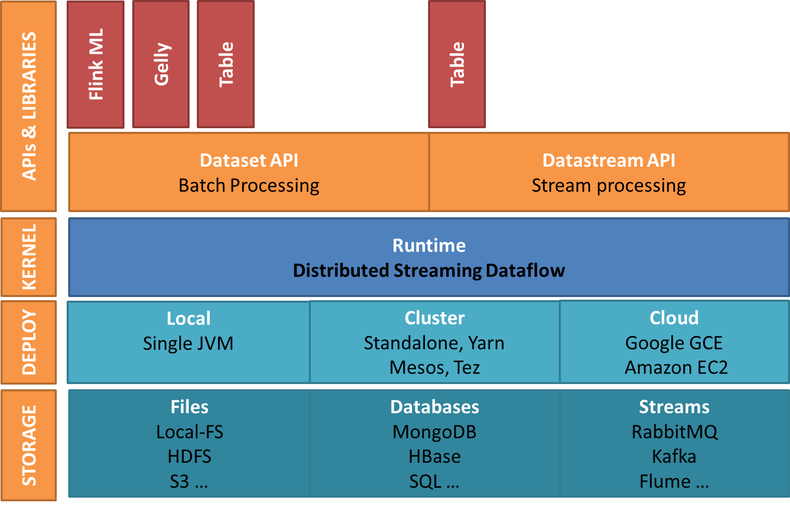

##三、类库和API

###1.流处理程序

```
flink的 DataStream API在流处理的业务场景下，支持多种数据转换，支持用户自定义状态的操作，支持灵活的窗口操作！
```

示例程序：  
```scala

//1.定义case class
case class Word(word: String, freq: Long)

//2.定义数据源
val texts: DataStream[String] = ...

//3.支持数据的流操作
val counts = text
  .flatMap { line => line.split("\\W+") }
  .map { token => Word(token, 1) }
  .keyBy("word")
  .timeWindow(Time.seconds(5), Time.seconds(1))
  .sum("freq")
```
程序说明：
```
以上程序演示了如何在一个数据流上，对源源不断流入的消息进行一个word-count操作！
```

###2.批处理程序

```
flink的 DataSet API具有以下特性：
    1.支持Java和scale开发语言
    2.支持编写类型安全的程序
    3.能够编写漂亮的易于维护的程序
    4.支持丰富的数据类型
    5.支持键值对数据类型
    6.支持丰富的算子
```

示例程序：  
```scala
//1.定义case class 
case class Page(pageId: Long, rank: Double)
case class Adjacency(id: Long, neighbors: Array[Long])

//2.执行运算
val result = initialRanks.iterate(30) { pages =>
  pages.join(adjacency).where("pageId").equalTo("id") {

    (page, adj, out: Collector[Page]) => {
      out.collect(Page(page.pageId, 0.15 / numPages))

      val nLen = adj.neighbors.length
      for (n <- adj.neighbors) {
        out.collect(Page(n, 0.85 * page.rank / nLen))
      }
    }
  }
  .groupBy("pageId").sum("rank")
}
```
程序说明：
```
以上程序演示了一个在图计算中PageRank算法的核心代码！
```


###3.类库和软件栈
###flink的软件栈  
    
```
flink deploy:
    有三种部署方式
    1.本地部署：在本地启动基于单个jvm的flink实例。
    2.集群部署：在集群中可以单独部署成standalone模式，也可以采用hadoop的YARN进行部署成yarn模式
    3.云部署：兼容Google的云服务GCE(Google Compute Engine)，也兼容amazon的云服务AWS(Amazon
      Web Services)。
flink core:
    flink的核心是一个分布式基于流的数据处理引擎,将一切处理都认为是流处理，将批处理看成流处理的一个特例。
    这与spark正好相反，spark是将一切处理都认为是批处理，将流处理看成批处理的一个特例。spark的流处理不
    是真正的流处理它是一种微型批处理（micro batch），因此spark的流处理实的时性不是很高，spark streaming
    定位是准实时流处理引擎。而flink是真正的流处理系统，它的实时性要比spark高出不少，它对标是Twitter开源的
    storm和heron,他是一个真正的大数据实时分析系统。
flink API: 
    flink的API分为两个部分
    1.流处理API，流处理主要是基于dataStream
    2.批处理API，批处理主要是基于dataSet
flink liberaries:    
    Flink还针对特定的应用领域提供了相应的软件库，方便适应特定领域的操作。主要包括
    1.flink table：主要用于处理关系型的结构化数据，对结构化数据进行查询操作，将结构化数据抽象成关系表，
       并通过类SQL的DSL对关系表进行各种查询操作。提供SQL on bigdata的功能,flink table既可以在流处
       理中使用SQL,也可以在批处理中使用SQL,对应sparkSQL.
    2.flink gelly：主要用于图计算领域，提供相关的图计算API和图计算算法的实现,对应spark graph。
    3.flink ML（machine leaning）：主要用于机器学习领域，提供了机器学习Pipelines APIh和多种机器学
      习算法的实现,对应sparkML
    4.flink CEP（Complex event processing）：主要用于复杂事件处理领域。
总结：
    flinK为支持各种计算场景提供了相应的高层api
    1.提供DataSet API来支持批处理场景
    2.提供DataSream API来支持批流理场景
    3.提供CEP API来支持F复杂事件处理（Complex Event Processing）的场景
    4.提供Gelly API来支持图分析场景
    5.提供Table API来支持SQL-ON-BIGDATA场景
    6.提供FlinkML API来支持机器学习场景
```

    
```
flink为了和大数据生态圈的其他技术进行融合，也在努力的扩展器存储层的支撑。
```


###spark的软件栈  
   
```
1.在高层api方面，flink和spark几乎一样都覆盖了大多数的大数据处理场景。
2.由于发展的原因spark在API方面要超出flink，这方面flink也在大力发展。
```
