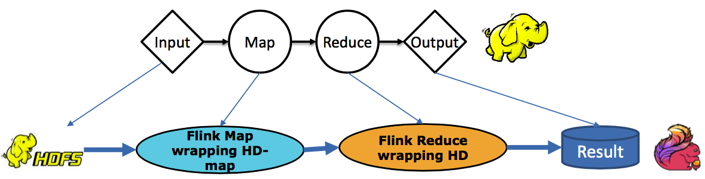
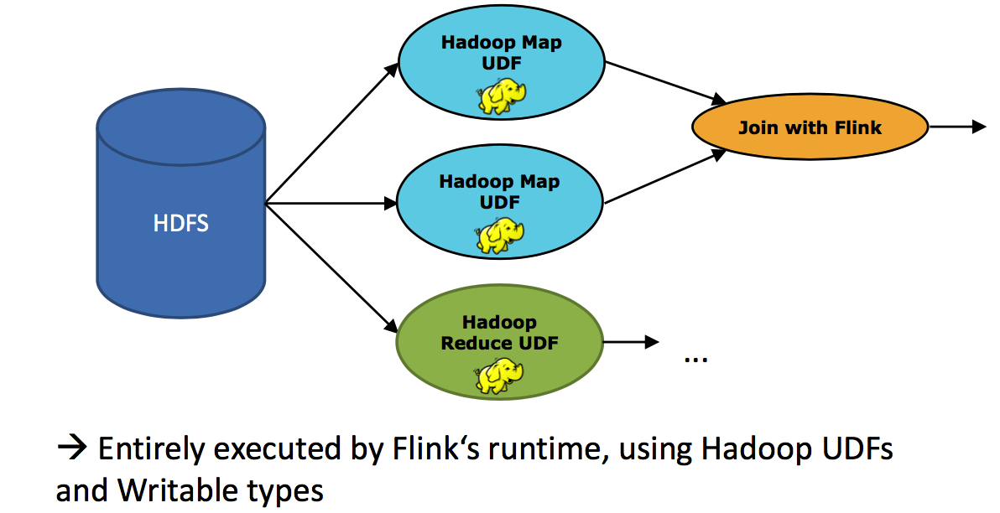

##四、flink的生态系统
 

```
flink和开源大数据处理的各种框架有很好的集成,这样它就能和其他框架密切合作形成大数据的统一的解决方案。
flink支持YARN,HDFS,Kafka,hbase,alluxio等其他大数据系统的集成。
```

###flink生态系统  
   
###spark生态系统  
 

```
flink和spark都在努力的打造以自己为中心的大数据生态系统。在现阶段spark是具有一定优势
，但是flink凭借着其优秀的架构，先进的设计，良好的势头，在大数据领域中也能占据一席之地。
```

##五、flink能与Hadoop系统高度兼容
###1.与Hadoop系统高度兼容
   
```
1.flink支持Hadoop的Writeable类型
2.flink支持Hadoop Input/Output格式
3.flink支持Hadoop Map and Reduce UDF（用户自定义函数）
4.flink支持把现有Hadoop的代码无缝运行到flink上。
```
###2.支持Hadoop UDF的代码迁移
   
