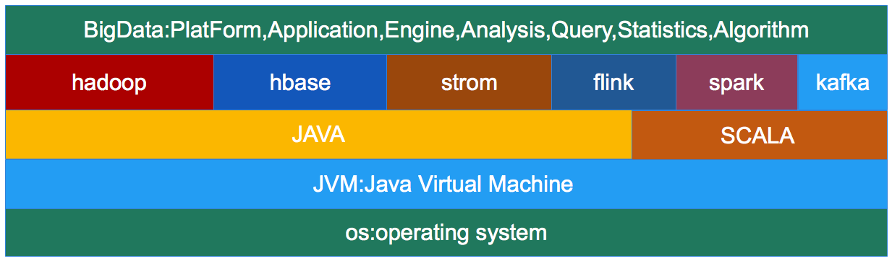
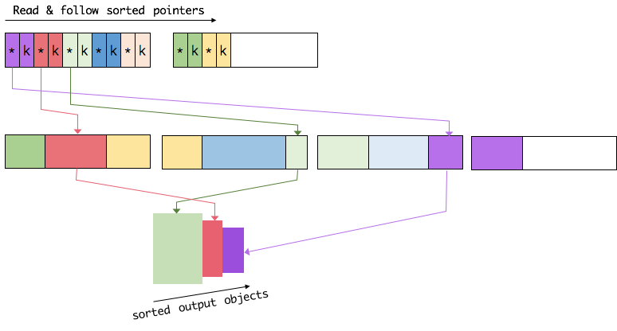
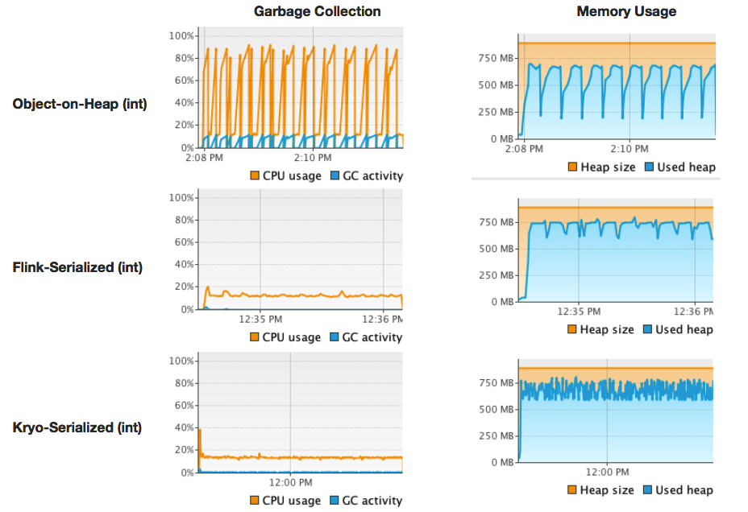

##一、基于JVM的大数据生态圈
###1.bigdata on jvm
 
```
1.现在大多数开源大数据处理框架都是基于jvm的，像 Apache Hadoop,Apache Spark,Apache Hbase,
  Apache Kafka,Apache Flink等。
2.JVM上的程序一方面享受着它带来的好处，也要承受着JVM带来的弊端。
```
###2.jvm的弊端
 
```
1.JVM的OOM问题
利用JVM平台开发的程序都会受到OutOfMemoryError的困扰，特别是大数据领域分布式计算框架，他们需要大量的内存，
不得不经常面临这个头疼的问题，当JVM中所有对象大小超过分配给JVM的内存大小时，就会发生OutOfMemoryError错误，
导致JVM崩溃，所有在JVM上工作的程序都将无一幸免的受到影响。

2.Full GC 
JVM的GC机制一直都是让人又爱又恨的东西。一方面，JVM自己管理内存，减轻开发者的负担，提高开发效率，保障内存安全。
另一方面，不受开发者控制的GC想一颗定时炸弹一样，一旦JVM进行大规模的垃圾回收，所有基于jvm的程序都不再工作，这将
极大的影响实时应用的可靠交付。特别是大数据领域，在处理大量数据的时候，不可避免的的创建了大量的临时对象，一旦对象
使用完毕后，JVM就不定期的进行大规模的垃圾回收工作，这对大数据应用影响很大。

3.Java对象存储密度低
例一：一个只包含boolean属性的对象占用了16个字节内存：对象头占了8个，boolean 属性占了1个，对齐填充占了7个。
而实际上只需要一个bit（1/8字节）就够了。
例二：“abcd”这样简单的字符串在UTF-8编码中需要4个字节存储，但Java采用UTF-16编码存储字符串，需要8个字节存储
“abcd”，同时Java对象还对象header等其他额外信息，一个4字节字符串对象，在Java中需要48字节的空间来存储。
对于大部分的大数据应用，内存都是稀缺资源，更有效率的内存存储，则意味着CPU数据访问吞吐量更高，及更少的磁盘落地。
```

注意：
```
现在很多大数据处理引擎，开始自动动手管理内存。比如 Apache Drill,Apache Ignite,Apache Geode,Apache Spark等。 
```
##二、flink的内存管理机制
###1.flink使用堆外内存
 
```
1.为了解决大量对象在JVM的heap上创建会带来OOM和GC的问题，flink将大量使用的内存存放到堆外.
2.flink在堆外有一块预分配的固定大小的内存块MemorySegment，flink会将对象高效的序列化到这块内存中。
  MemorySegment由许多小的内存cell组成，每个cell大小32kb，这也是flink分配内存的最小单位。你可以把 
  MemorySegment想象成是为Flink 定制的 java.nio.ByteBuffer。它的底层可以是一个普通的 Java 字节数组
 （byte[]），也可以是一个申请在堆外的 ByteBuffer。每条记录都会以序列化的形式存储在一个或多个MemorySegment中。
3.如果MemorySegment中依然放不小所有的数据，flink会将数据写入磁盘，需要的时候再冲磁盘读出来。
```
```
使用堆外内存获得的好处：
1.有效防止OOM
由于MemorySegment大小固定，操作高效。如果MemorySegment不足写出到磁盘，内存中的数据不多，一般不会发生OOM.

2.大幅度减轻GC压力
少量长期使用的数据以二进制形式存储在内存，大量临时使用的对象被序列化到磁盘。对象数量就会大量减少，GC压力减轻。

3.节省内存空间
Java对象的存储密度叫低，现在大量数据都是二进制的表示形式，存储密度提高了，内存利用率提高了！

4.二进制操作更高效,缓存操作更友好
二进制数据以定义好的格式存储，可以高效地比较与操作。另外，该二进制形式可以把相关的值，以及hash值，键值和指针等相邻
地放进内存中。这使得数据结构可以对高速缓存更友好，可以从 L1/L2/L3 缓存获得性能的提升
```

###2.flink量身打造序列化方案   
假设有一个Tuple3<Integer, Double, Person> 类型POJO
```

//1.Person类型
public class Person {
    public int id;
    public String name;
}
//Tuple3<age:Integer, height:Double, Person>对象
(25,175.5,Person(1,"zhangsan"))
```
它将被序列化为下面的形式:  
 
```
可见这种序列化方式存储密度是相当紧凑的。其中int占4字节，double占8字节，POJO多个一个字节的header，
PojoSerializer只负责将header序列化进去，并委托每个字段对应的serializer对字段进行序列化。
```

```
1.Java生态圈提供了许多序列化框架诸如Java serialization, Kryo, Apache Avro等等。
2.flink中处理的数据流通常是同一类型,对象的类型是固定，可以对整个数据流只保存一份对象Schema信息，这将大大节省存储空间
3.由于类型固定，当我们需要访问某个对象成员变量的时候，可以通过偏移量直接存取，并不需要反序列化整个Java对象。
4.Flink序列化框架支持任意的Java或是Scala类型，并且不需要像Hadoop那样必须实现org.apache.hadoop.io.Writable接口。
5.Flink序列化框架支持数据类型自动识别。
  如果是Java程序，通过Java Reflection分析UDF (User Define Function)的返回值类型确定数据类型。
  如果是Scala程序，通过Scala Compiler分析UDF (User Define Function)的返回值类型确定数据类型。
```
类型信息由 TypeInformation 类表示，TypeInformation 支持以下几种类型：
```
BasicTypeInfo: 任意Java基本类型(装箱的)或String类型。
BasicArrayTypeInfo: 任意Java基本类型数组(装箱的)或String类型。
WritableTypeInfo: 任意Hadoop Writable接口的实现类。
TupleTypeInfo: 任意的Flink Tuple 类型(支持Tuple1到Tuple25)。Flink tuples是固定长度固定类型的Java Tuple
CaseClassTypeInfo: 任意的 Scala CaseClass(包括 Scala tuples)。
PojoTypeInfo: 任意的POJO(Java或Scala)Java对象的所有成员变量，或public修饰符定义，或有getter/setter方法。
GenericTypeInfo: 任意无法匹配之前几种类型的类。

注意：
1.前六种类型数据集，Flink皆可以自动生成对应的TypeSerializer，能非常高效地对数据集进行序列化和反序列化。
2.最后一种数据类型，Flink会使用Kryo进行序列化和反序列化。
3.对于 Tuple、CaseClass、POJO 等组合类型，其TypeSerializer和TypeComparator也是组合的，
  序列化和比较时会委托给对应的serializers和comparators
```


###3.flink采用数据和引用分开存储的方式操作数据

```
1.flink提供大量的api,有些sql-api或sort，group，join等操作牵涉到大量的数据，使用大量内存。
2.这些操作都是基于flink的数据内存和引用内存分开存储的方式进行操作的。
```
以sort为例：  
 

```
1.Flink从MemoryManager申请一批MemorySegment，作为sort-buffer，用来存放排序的数据。
2.sort-buffer分成两块
  一块用来存放所有对象完整的二进制数据。
  一块用来存放指向完整二进制数据的引用。
  引用由指针(pointer)定长的序列化后的键（key）组成，ref=point+key
      将key和point分开存储的动机是：
      a.ref.point指向真实数据块，
      b.ref.key用来做基于key的诸如compare等操作，
      c.ref.key是连续存储的，这样能提高cpu的缓存命中率，加快CPU访问数据。
3.当一个对象要加到 sort-buffer时，它的binary-data会被加到第一个区域，ref=(piont+key)会被加到第二个区域。
4.执行比较时，如果有binary-key直接通过偏移量操作binary-key.如果没有binary-key那只能序列化整个对象再进行比较。
5.执行交互时，只需交互ref,不需要交互binary-data.

```
 
```
6.访问数据时，只需沿着排好序的ref区域顺序访问，通过ref.pointer找到对应的真实数据.
```

##三、测试flink内存管理的表现
```
国外有人做了一个测试，比较flink,kryo,java三种序列化方式的表现。
详情见：http://flink.apache.org/news/2015/05/11/Juggling-with-Bits-and-Bytes.html
```
###处理效率对比
 
###GC和内存使用率对比
 
```
不难看出，flink的内存管理机制，在整个测试中所表现优势还是非常明显的！
```


##四、堆外内存的发展方向


