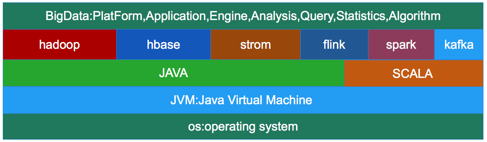

##一、基于JVM的大数据生态圈
###1.bigdata on jvm
 
```
1.现在大多数开源大数据处理框架都是基于jvm的，像 Apache Hadoop,Apache Spark,Apache Hbase,
  Apache Kafka,Apache Flink等。
2.JVM上的程序一方面享受着它带来的好处，也要承受着JVM带来的弊端。
```
###2.jvm的弊端
```
1.Java对象存储密度低
例一：一个只包含boolean属性的对象占用了16个字节内存：对象头占了8个，boolean 属性占了1个，对齐填充占了7个。
而实际上只需要一个bit（1/8字节）就够了。
例二：“abcd”这样简单的字符串在UTF-8编码中需要4个字节存储，但Java采用UTF-16编码存储字符串，需要8个字节存储
“abcd”，同时Java对象还对象header等其他额外信息，一个4字节字符串对象，在Java中需要48字节的空间来存储。
对于大部分的大数据应用，内存都是稀缺资源，更有效率的内存存储，则意味着CPU数据访问吞吐量更高，及更少的磁盘落地。

2.JVM的OOM问题
利用JVM平台开发的程序都会受到OutOfMemoryError的困扰，特别是大数据领域分布式计算框架，他们需要大量的内存，
不得不经常面临这个头疼的问题，当JVM中所有对象大小超过分配给JVM的内存大小时，就会发生OutOfMemoryError错误，
导致JVM崩溃，所有在JVM上工作的程序都将无一幸免的受到影响。

3.Full GC 
JVM的GC机制一直都是让人又爱又恨的东西。一方面，JVM自己管理内存，减轻开发者的负担，提高开发效率，保障内存安全。
另一方面，不受开发者控制的GC想一颗定时炸弹一样，一旦JVM进行大规模的垃圾回收，所有基于jvm的程序都不再工作，这将
极大的影响实时应用的可靠交付。特别是大数据领域，在处理大量数据的时候，不可避免的的创建了大量的临时对象，一旦对象
使用完毕后，JVM就不定期的进行大规模的垃圾回收工作，这对大数据应用影响很大。
```

注意：
```
现在很多大数据处理引擎，开始自动动手管理内存。比如 Apache Drill,Apache Ignite,Apache Geode,Apache Spark等。 
```

###3.flink的解决方案一：使用堆外内存
 
```
1.为了解决大量对象在JVM的heap上创建会带来OOM和GC的问题，flink将大量使用的内存存放到堆外.
2.flink在堆外有一块预分配的固定大小的内存块MemorySegment，flink会将对象高效的序列化到这块内存中。
  MemorySegment由许多小的内存cell组成，每个cell大小32kb，这也是flink分配内存的最小单位。你可以把 
  MemorySegment想象成是为Flink 定制的 java.nio.ByteBuffer。它的底层可以是一个普通的 Java 字节数组
 （byte[]），也可以是一个申请在堆外的 ByteBuffer。每条记录都会以序列化的形式存储在一个或多个MemorySegment中。
3.如果MemorySegment中依然放不小所有的数据，flink会将数据写入磁盘，需要的时候再冲磁盘读出来。
```
```
使用堆外内存获得的好处：
1.有效防止OOM
由于MemorySegment大小固定，操作高效。如果MemorySegment不足写出到磁盘，内存中的数据不多，一般不会发生OOM.

2.大幅度减轻GC压力
少量长期使用的数据以二进制形式存储在内存，大量临时使用的对象被序列化到磁盘。对象数量就会大量减少，GC压力减轻。

3.节省内存空间
Java对象的存储密度叫低，现在大量数据都是二进制的表示形式，存储密度提高了，内存利用率提高了！

4.二进制操作更高效,缓存操作更友好
二进制数据以定义好的格式存储，可以高效地比较与操作。另外，该二进制形式可以把相关的值，以及hash值，键值和指针等相邻
地放进内存中。这使得数据结构可以对高速缓存更友好，可以从 L1/L2/L3 缓存获得性能的提升
```


参考链接
```
http://flink.apache.org/news/2015/05/11/Juggling-with-Bits-and-Bytes.html
http://flink.apache.org/news/2015/09/16/off-heap-memory.html
http://wuchong.me/blog/2016/04/29/flink-internals-memory-manage/
https://zhuanlan.zhihu.com/p/20228397?columnSlug=hadoop
```

