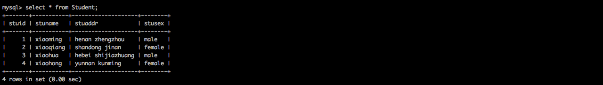
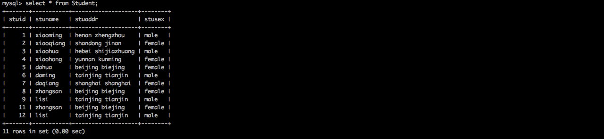

##一、在MySQL中准备测试数据
###1.执行命令
```
1.查询数据库
SHOW DATABASES;

2.创建数据库
CREATE DATABASE flinktest;

3.使用数据库
USE flinktest;

4.创建表格
CREATE TABLE Student
(
    stuid INT(11) PRIMARY KEY NOT NULL AUTO_INCREMENT,
    stuname VARCHAR(10) NOT NULL,
    stuaddr VARCHAR(40) NOT NULL,
    stusex VARCHAR(10) NOT NULL
);

5.插入数据
INSERT INTO Student(stuid,stuname,stuaddr,stusex)VALUES(1,"xiaoming","henan zhengzhou",	"male")
INSERT INTO Student(stuid,stuname,stuaddr,stusex)VALUES(2,"xiaoqiang","shandong jinan",	"female")
INSERT INTO Student(stuid,stuname,stuaddr,stusex)VALUES(3,"xiaohua","hebei shijiazhuang",	"male")
INSERT INTO Student(stuid,stuname,stuaddr,stusex)VALUES(4,"xiaohong","yunnan kunming",	"female")

6.查询数据
SELECT * FROM Student ;
```
###2.执行效果
 

##二、测试JDBC连接
###1.在pom.xml中添加驱动依赖
```
<dependency>
    <groupId>mysql</groupId>
    <artifactId>mysql-connector-java</artifactId>
    <version>5.1.35</version>
</dependency>
```
###2.定义Student实体类，用于封装数据
```java
package code.book.stream.customsinkandsource.jdbc.java;

/**
 * 用于存储数据库中的数据，作为bean使用
 */
public class Student {
    int stuid;
    String stuname;
    String stuaddr;
    String stusex;

    public Student(int stuid, String stuname, String stuaddr, String stusex) {
        this.stuid = stuid;
        this.stuname = stuname;
        this.stuaddr = stuaddr;
        this.stusex = stusex;
    }

    public int getStuid() {
        return stuid;
    }

    public void setStuid(int stuid) {
        this.stuid = stuid;
    }

    public String getStuname() {
        return stuname;
    }

    public void setStuname(String stuname) {
        this.stuname = stuname;
    }

    public String getStuaddr() {
        return stuaddr;
    }

    public void setStuaddr(String stuaddr) {
        this.stuaddr = stuaddr;
    }

    public String getStusex() {
        return stusex;
    }

    public void setStusex(String stusex) {
        this.stusex = stusex;
    }

    @Override
    public String toString() {
        return "Student{" +
                "stuid=" + stuid +
                ", stuname='" + stuname + '\'' +
                ", stuaddr='" + stuaddr + '\'' +
                ", stusex='" + stusex + '\'' +
                '}';
    }
}
```

###2.执行JDBC测试程序
```java
package code.book.stream.customsinkandsource.jdbc.java;

import java.sql.Connection;
import java.sql.DriverManager;
import java.sql.ResultSet;
import java.sql.Statement;

/**
 * 本类主要用于检测jdbc连接是否成功
 */
public class JdbcTest {
    public static void main(String[] args) throws Exception {
        String driver = "com.mysql.jdbc.Driver";
        String url = "jdbc:mysql://qingcheng11:3306/flinktest";
        String username = "root";
        String password = "qingcheng";
        Connection connection = null;
        Statement statement = null;
        try {
            //1.加载驱动
            Class.forName(driver);
            //2.创建连接
            connection = DriverManager.getConnection(url, username, password);
            //3.获得执行语句
            statement = connection.createStatement();
            //4.执行查询，获得结果集
            ResultSet resultSet = statement.executeQuery("select stuid,stuname,stuaddr,stusex from Student");
            //5.处理结果集
            while (resultSet.next()) {
                Student student = new Student(resultSet.getInt("stuid"), resultSet.getString("stuname").trim(), resultSet.getString("stuaddr").trim(), resultSet.getString("stusex").trim());
                System.out.println(student);
            }
        } catch (Exception e) {
            e.printStackTrace();
        } finally {
            //6.关闭连接，释放资源
            if (connection != null) {
                connection.close();
            }
            if (statement != null) {
                statement.close();
            }
        }
    }
}
```
###2.JDBC测试程序成功输出
```
Student{stuid=1, stuname='xiaoming', stuaddr='henan zhengzhou', stusex='male'}
Student{stuid=2, stuname='xiaoqiang', stuaddr='shandong jinan', stusex='female'}
Student{stuid=3, stuname='xiaohua', stuaddr='hebei shijiazhuang', stusex='male'}
Student{stuid=4, stuname='xiaohong', stuaddr='yunnan kunming', stusex='female'}
```

##三、自定义source
###1.自定义source
```java
package code.book.stream.customsinkandsource.jdbc.java;

import org.apache.flink.configuration.Configuration;
import org.apache.flink.streaming.api.functions.source.RichSourceFunction;

import java.sql.Connection;
import java.sql.DriverManager;
import java.sql.PreparedStatement;
import java.sql.ResultSet;


public class StudentSourceFromMysql extends RichSourceFunction<Student> {
    PreparedStatement ps;
    private Connection connection;

    /**
     * 一、open()方法中建立连接，这样不用每次invoke的时候都要建立连接和释放连接。
     */
    @Override
    public void open(Configuration parameters) throws Exception {
        super.open(parameters);
        String driver = "com.mysql.jdbc.Driver";
        String url = "jdbc:mysql://qingcheng11:3306/flinktest";
        String username = "root";
        String password = "qingcheng";
        //1.加载驱动
        Class.forName(driver);
        //2.创建连接
        connection = DriverManager.getConnection(url, username, password);
        //3.获得执行语句
        String sql = "select stuid,stuname,stuaddr,stusex from Student;";
        ps = connection.prepareStatement(sql);
    }

    /**
     * 二、DataStream调用一次run()方法用来获取数据
     */
    @Override
    public void run(SourceContext<Student> sourceContext) throws Exception {
        try {
            //4.执行查询，封装数据
            ResultSet resultSet = ps.executeQuery();
            while (resultSet.next()) {
                Student student = new Student(resultSet.getInt("stuid"), resultSet.getString("stuname").trim(), resultSet.getString("stuaddr").trim(), resultSet.getString("stusex").trim());
                sourceContext.collect(student);
            }
        } catch (Exception e) {
            e.printStackTrace();
        }
    }

    @Override
    public void cancel() {

    }

    /**
     * 三、 程序执行完毕就可以进行，关闭连接和释放资源的动作了
     */
    @Override
    public void close() throws Exception {
        //5.关闭连接和释放资源
        super.close();
        if (connection != null) {
            connection.close();
        }
        if (ps != null) {
            ps.close();
        }
    }
}
```

###2.source测试程序
```java
package code.book.stream.customsinkandsource.jdbc.java;

import org.apache.flink.streaming.api.datastream.DataStream;
import org.apache.flink.streaming.api.environment.StreamExecutionEnvironment;
public class StudentSourceFromMysqlTest {
    public static void main(String[] args) throws Exception {
        //1.创建流执行环境
        StreamExecutionEnvironment env = StreamExecutionEnvironment.getExecutionEnvironment();

        //2.从自定义source中读取数据
        DataStream<Student> students=env.addSource(new StudentSourceFromMysql());

        //3.显示结果
        students.print();

        //4.触发流执行
        env.execute();
    }
}
```
###3.source测试效果
```
能够正确查询出mysql中的数据。
```

##四、自定义sink

###1.自定义sink
```java
package code.book.stream.customsinkandsource.jdbc.java;

import org.apache.flink.configuration.Configuration;
import org.apache.flink.streaming.api.functions.sink.RichSinkFunction;
import java.sql.Connection;
import java.sql.DriverManager;
import java.sql.PreparedStatement;
public class StudentSinkToMysql extends RichSinkFunction<Student> {
    private Connection connection = null;
    private PreparedStatement ps = null;

    /**
     * 一、open()方法中建立连接，这样不用每次invoke的时候都要建立连接和释放连接。
     */
    @Override
    public void open(Configuration parameters) throws Exception {
        super.open(parameters);
        String driver = "com.mysql.jdbc.Driver";
        String url = "jdbc:mysql://qingcheng11:3306/flinktest";
        String username = "root";
        String password = "qingcheng";
        //1.加载驱动
        Class.forName(driver);
        //2.创建连接
        connection = DriverManager.getConnection(url, username, password);
        String sql = "insert into Student(stuid,stuname,stuaddr,stusex)values(?,?,?,?);";
        //3.获得执行语句
        ps = connection.prepareStatement(sql);
    }


    /**
     * 二、每个元素的插入都要调用一次invoke()方法，这里主要进行插入操作
     */
    @Override
    public void invoke(Student student) throws Exception {
        try {
            //4.组装数据，执行插入操作
            ps.setInt(1, student.getStuid());
            ps.setString(2, student.getStuname());
            ps.setString(3, student.getStuaddr());
            ps.setString(4, student.getStusex());
            ps.executeUpdate();
        } catch (Exception e) {
            e.printStackTrace();
        }
    }

    @Override
    public void close() throws Exception {
        super.close();
        //5.关闭连接和释放资源
        if (connection != null) {
            connection.close();
        }
        if (ps != null) {
            ps.close();
        }
    }
}
```

###2.sink测试程序
```java
package code.book.stream.customsinkandsource.jdbc.java;

import org.apache.flink.streaming.api.datastream.DataStream;
import org.apache.flink.streaming.api.environment.StreamExecutionEnvironment;

public class StudentSinkToMysqlTest {
    public static void main(String[] args) throws Exception {
        //1.创建流执行环境
        StreamExecutionEnvironment env = StreamExecutionEnvironment.getExecutionEnvironment();

        //2.准备数据
        DataStream<Student> students = env.fromElements(
                new Student(11, "zhangsan", "beijing biejing", "female"),
                new Student(12, "lisi", "tainjing tianjin", "male ")
        );

        //3.将数据写入到自定义的sink中（这里是mysql）
        students.addSink(new StudentSinkToMysql());

        //4.触发流执行
        env.execute();
    }
}
```

###3.sink测试效果
```
在mysql中能够查询到，flink写入的数据。
```
 


