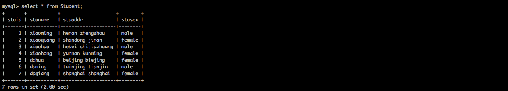

##一、在MySQL中准备测试数据
###1.执行命令
```
1.查询数据库
SHOW DATABASES;

2.创建数据库
CREATE DATABASE flinktest;

3.使用数据库
USE flinktest;

4.创建表格
CREATE TABLE Student
(
    stuid INT(11) PRIMARY KEY NOT NULL AUTO_INCREMENT,
    stuname VARCHAR(10) NOT NULL,
    stuaddr VARCHAR(40) NOT NULL,
    stusex VARCHAR(10) NOT NULL
);

5.插入数据
INSERT INTO Student(stuid,stuname,stuaddr,stusex)VALUES(1,"xiaoming","henan zhengzhou",	"male")
INSERT INTO Student(stuid,stuname,stuaddr,stusex)VALUES(2,"xiaoqiang","shandong jinan",	"female")
INSERT INTO Student(stuid,stuname,stuaddr,stusex)VALUES(3,"xiaohua","hebei shijiazhuang",	"male")
INSERT INTO Student(stuid,stuname,stuaddr,stusex)VALUES(4,"xiaohong","yunnan kunming",	"female")

6.查询数据
SELECT * FROM Student ;
```
###2.执行效果
 

##二、测试JDBC连接
###1.在pom.xml中添加驱动依赖
```
<dependency>
    <groupId>mysql</groupId>
    <artifactId>mysql-connector-java</artifactId>
    <version>5.1.35</version>
</dependency>
```
###2.定义Student实体类，用于封装数据
```
package code.book.stream.customsinkandsource.jdbc.scala
/**
  * 用于存储数据库中的数据，作为bean使用
  */
case class Student(stuid: Int, stuname: String, stuaddr: String, stusex: String)
```

###2.执行JDBC测试程序
```scala
package code.book.stream.customsinkandsource.jdbc.scala

import java.sql.{Connection, DriverManager, Statement}

/**
  * 本类主要用于检测jdbc连接是否成功
  */
object JdbcTest {
  def main(args: Array[String]) {
    val driver = "com.mysql.jdbc.Driver"
    val url = "jdbc:mysql://qingcheng11:3306/flinktest"
    val username = "root"
    val password = "qingcheng"
    var connection: Connection = null
    var statement: Statement = null
    try {
      //1.加载驱动
      Class.forName(driver)
      //2.创建连接
      connection = DriverManager.getConnection(url, username, password)
      //3.获得执行语句
      statement = connection.createStatement()
      //4.执行查询，获得结果集
      val resultSet = statement.executeQuery("select stuid,stuname,stuaddr,stusex from Student")
      //5.处理结果集
      while (resultSet.next()) {
        val student = Student(resultSet.getInt("stuid"), resultSet.getString("stuname").trim, resultSet.getString("stuaddr").trim, resultSet.getString("stusex").trim)
        println(student)
      }
    } catch {
      case e:Throwable => e.printStackTrace
    } finally {
      //6.关闭连接，释放资源
      if (connection != null) {
        connection.close()
      }
      if (statement != null) {
        statement.close()
      }
    }
    connection.close()
  }
}
```
###2.JDBC测试程序成功输出
```
Student(1,xiaoming,henan zhengzhou,male)
Student(2,xiaoqiang,shandong jinan,female)
Student(3,xiaohua,hebei shijiazhuang,male)
Student(4,xiaohong,yunnan kunming,female)
```

##三、自定义source
###1.source主程序
```scala
package code.book.stream.customsinkandsource.jdbc.scala

import java.sql.{Connection, DriverManager, PreparedStatement}

import org.apache.flink.configuration.Configuration
import org.apache.flink.streaming.api.functions.source.RichSourceFunction
import org.apache.flink.streaming.api.functions.source.SourceFunction.SourceContext

class StudentSourceFromMysql extends RichSourceFunction[Student] {
  private var connection: Connection = null
  private var ps: PreparedStatement = null
  /**
    * 一、open()方法中建立连接，这样不用每次invoke的时候都要建立连接和释放连接。
    */
  override def open(parameters: Configuration): Unit = {
    super.open(parameters)
    val driver = "com.mysql.jdbc.Driver"
    val url = "jdbc:mysql://qingcheng11:3306/flinktest"
    val username = "root"
    val password = "qingcheng"
    //1.加载驱动
    Class.forName(driver)
    //2.创建连接
    connection = DriverManager.getConnection(url, username, password)
    //3.获得执行语句
    val sql = "select stuid,stuname,stuaddr,stusex from Student;"
    ps = connection.prepareStatement(sql)
  }
  /**
    * 二、DataStream调用一次run()方法用来获取数据
    */
  override def run(sourceContext: SourceContext[Student]): Unit = {
    try {
      //4.执行查询，封装数据
      val resultSet = ps.executeQuery()
      while (resultSet.next()) {
        val student = Student(resultSet.getInt("stuid"), resultSet.getString("stuname").trim, resultSet.getString("stuaddr").trim, resultSet.getString("stusex").trim)
        sourceContext.collect(student)
      }
    } catch {
      case e: Exception => println(e.getMessage)
    }
  }

  override def cancel(): Unit = {
  }

  /**
    * 三、 程序执行完毕就可以进行，关闭连接和释放资源的动作了
    */
  override def close(): Unit = {
    //5.关闭连接和释放资源
    super.close()
    if (connection != null) {
      connection.close()
    }
    if (ps != null) {
      ps.close()
    }
  }
}
```

###2.source测试程序
```scala
package code.book.stream.customsinkandsource.jdbc.scala

import org.apache.flink.streaming.api.scala.{StreamExecutionEnvironment, _}
object StudentSourceFromMysqlTest {
  def main(args: Array[String]): Unit = {
    //1.创建流执行环境
    val env = StreamExecutionEnvironment.getExecutionEnvironment

    //2.从自定义source中读取数据
    val dataStream: DataStream[Student] = env.addSource(new StudentSourceFromMysql)

    //3.显示结果
    dataStream.print()

    //4.触发流执行
    env.execute()
  }
}
```
###3.source测试效果
```
能够正确查询出mysql中的数据。
```

##四、自定义sink

###1.自定义sink
```scala
package code.book.stream.customsinkandsource.jdbc.scala

import java.sql.{Connection, DriverManager, PreparedStatement}

import org.apache.flink.configuration.Configuration
import org.apache.flink.streaming.api.functions.sink.RichSinkFunction

class StudentSinkToMysql extends RichSinkFunction[Student] {
  private var connection: Connection = null
  private var ps: PreparedStatement = null

  /**
    * 一、open()方法中建立连接，这样不用每次invoke的时候都要建立连接和释放连接。
    */
  override def open(parameters: Configuration): Unit = {
    super.open(parameters)
    val driver = "com.mysql.jdbc.Driver"
    val url = "jdbc:mysql://qingcheng11:3306/flinktest"
    val username = "root"
    val password = "qingcheng"
    //1.加载驱动
    Class.forName(driver)
    //2.创建连接
    connection = DriverManager.getConnection(url, username, password)
    val sql = "insert into Student(stuid,stuname,stuaddr,stusex)values(?,?,?,?);"
    //3.获得执行语句
    ps = connection.prepareStatement(sql)
  }

  /**
    * 二、每个元素的插入都要调用一次invoke()方法，这里主要进行插入操作
    */
  override def invoke(stu: Student): Unit = {
    try {
      //4.组装数据，执行插入操作
      ps.setInt(1, stu.stuid)
      ps.setString(2, stu.stuname)
      ps.setString(3, stu.stuaddr)
      ps.setString(4, stu.stusex)
      ps.executeUpdate()
    } catch {
      case e: Exception => println(e.getMessage)
    }
  }

  /**
    * 三、 程序执行完毕就可以进行，关闭连接和释放资源的动作了
    */
  override def close(): Unit = {
    super.close()
    //5.关闭连接和释放资源
    if (connection != null) {
      connection.close()
    }
    if (ps != null) {
      ps.close()
    }
  }
}
```

###2.sink测试程序
```
package code.book.stream.customsinkandsource.jdbc.scala

import org.apache.flink.streaming.api.scala.{StreamExecutionEnvironment, _}

object StudentSinkToMysqlTest {
  def main(args: Array[String]): Unit = {

    //1.创建流执行环境
    val env = StreamExecutionEnvironment.getExecutionEnvironment

    //2.准备数据
    val dataStream:DataStream[Student] = env.fromElements(
      Student(5, "dahua", "beijing biejing", "female"),
      Student(6, "daming", "tainjing tianjin", "male "),
      Student(7, "daqiang ", "shanghai shanghai", "female")
    )

    //3.将数据写入到自定义的sink中（这里是mysql）
    dataStream.addSink(new StudentSinkToMysql)

    //4.触发流执行
    env.execute()
  }
}
```

###3.sink测试效果
```
在mysql中能够查询到，flink写入的数据。
```
 


