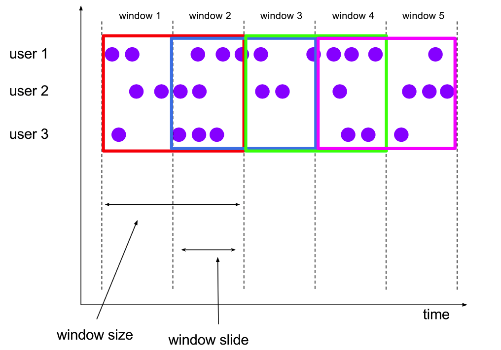

##一、流处理的基本概念
###1.全局窗口（Global Windows）
####1.1全局窗口概念
 
```
1.用户上京东购物，会进行一系列的操作，比如（点击、浏览、搜索、购买、付款等），用户的操作可以被记录为用户操作数据流。
2.京东上的用户会同时有多个，每个用户的操作都是独立的，随机的，因此用户之间的行为没有必然联系，没有统一规律。
3.该窗口仅在有一个自定义trigger时才有用。否则由于global window没有触发条件，永远不会发生计算任务。
```
####1.2全局窗口定义
```
//global windows
val input: DataStream[T] = ...
input.keyBy(<key selector>)
.window(GlobalWindows.create())
```

###2.翻滚窗口(Tumbling Windows)
####2.1翻滚窗口概念
 
```
1.如果我们用原来的tumbling-window对stream进行窗口划分，也就是用统一的时间去划分window，
    你会发现，用户的连续行为划分的不自然。因为有多个用户，你只用一共时间去划分，这种划分方法会
    造成本来一连串的操作被划分到不同的window中去了
2.如果你定义window size为5分钟，window function每次调用都会得到5分钟的统计信息。
```
####2.2翻滚窗口概念定义
```
// tumbling event-time windows
val input: DataStream[T] = ...
input.keyBy(<key selector>)
.window(TumblingEventTimeWindows.of(Time.seconds(5)))
.<windowed transformation>(<window function>)

// tumbling processing-time windows
val input: DataStream[T] = ...
input.keyBy(<key selector>)
.window(TumblingProcessingTimeWindows.of(Time.seconds(5)))
.<windowed transformation>(<window function>)

```
###3.滑动窗口（Sliding Windows）
####3.1滑动窗口概念
 
```
滑动窗口的数据是有重叠的
```
####3.2滑动窗口定义
```
// sliding event-time windows
val input: DataStream[T] = ...
input.keyBy(<key selector>)
.window(SlidingEventTimeWindows.of(Time.seconds(10), Time.seconds(5)))
.<windowed transformation>(<window function>)
    
// sliding processing-time windows
val input: DataStream[T] = ...
input.keyBy(<key selector>)
.window(SlidingProcessingTimeWindows.of(Time.seconds(10), Time.seconds(5)))
.<windowed transformation>(<window function>)
```

###4.会话窗口（Session Windows）
####4.1会话窗口概念
 
```
1.用户的行为有时是一连串的，形成的数据流也是一连串的
2.我们把每一串称为一个session，不同的用户的session划分结果是不一样的。
3.我们把这种window称作SessionWindow
```
####4.2会话窗口定义
```  
// event-time session windows
val input: DataStream[T] = ...
input.keyBy(<key selector>)
.window(EventTimeSessionWindows.withGap(Time.minutes(10)))
.<windowed transformation>(<window function>)

// processing-time session windows
val input: DataStream[T] = ...
input.keyBy(<key selector>)
.window(ProcessingTimeSessionWindows.withGap(Time.minutes(10)))
.<windowed transformation>(<window function>)
```

http:http://data-artisans.com/session-windowing-in-flink/