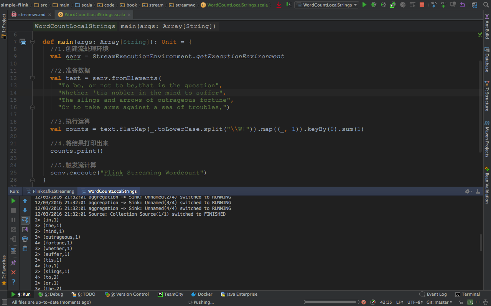
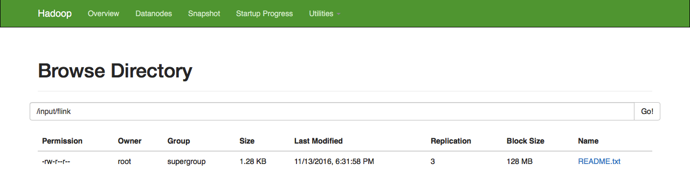
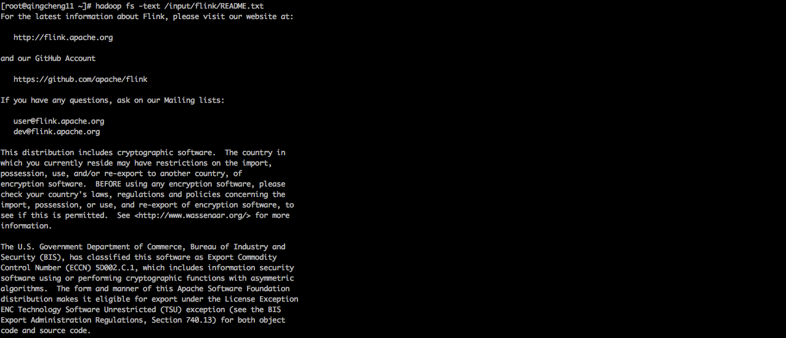
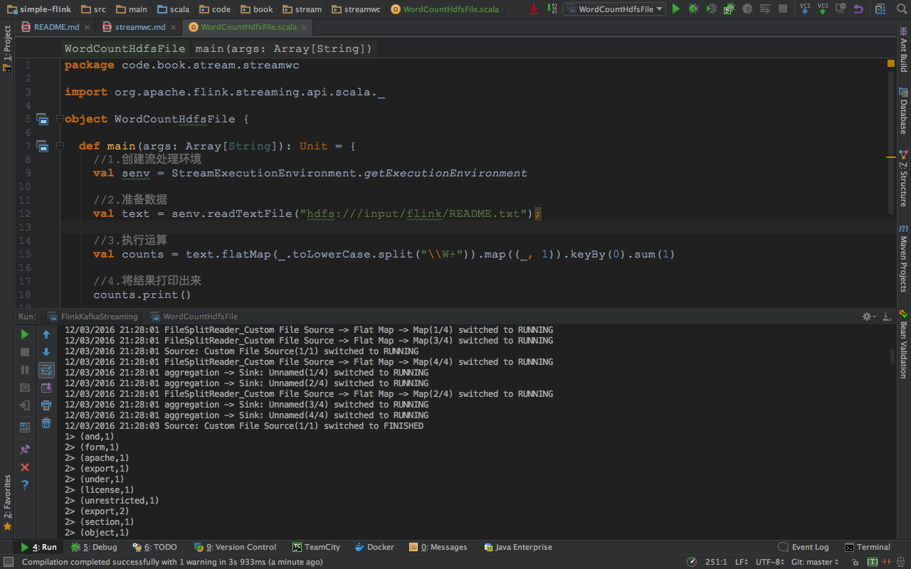
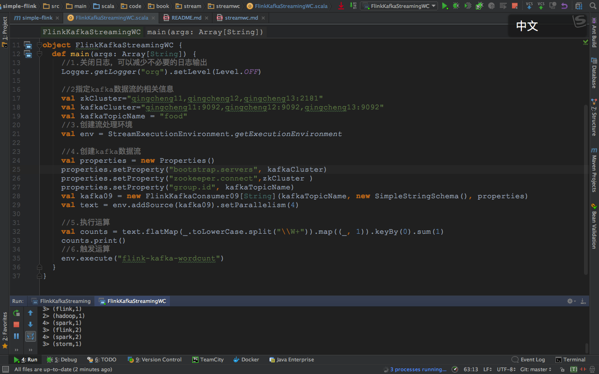

##一、基于本地字符串的wordcount

####1.执行程序
```scala
package code.book.stream.streamwc

import org.apache.flink.streaming.api.scala.{StreamExecutionEnvironment, _}

object WordCountLocalStrings {

  def main(args: Array[String]): Unit = {
    //1.创建流处理环境
    val senv = StreamExecutionEnvironment.getExecutionEnvironment

    //2.准备数据
    val text = senv.fromElements(
      "To be, or not to be,that is the question",
      "Whether 'tis nobler in the mind to suffer",
      "The slings and arrows of outrageous fortune",
      "Or to take arms against a sea of troubles,")

    //3.执行运算
    val counts = text.flatMap(_.toLowerCase.split("\\W+")).map((_, 1)).keyBy(0).sum(1)

    //4.将结果打印出来
    counts.print()

    //5.触发流计算
    senv.execute("Flink Streaming Wordcount")
  }
}
```

####2.执行效果
 


##二、基于hdfs文件的wordcount
###1.准备数据
####1.1上传数据
```
hadoop fs -put $FLINK_HOME/README.txt /input/flink/README.txt
```
 

2.查看数据
```
hadoop fs -text /input/flink/README.txt
```
 
###2.处理数据

####2.1执行程序
```scala
package code.book.stream.streamwc

import org.apache.flink.streaming.api.scala._

object WordCountHdfsFile {

  def main(args: Array[String]): Unit = {
    //1.创建流处理环境
    val senv = StreamExecutionEnvironment.getExecutionEnvironment

    //2.准备数据
    val text = senv.readTextFile("hdfs:///input/flink/README.txt");

    //3.执行运算
    val counts = text.flatMap(_.toLowerCase.split("\\W+")).map((_, 1)).keyBy(0).sum(1)

    //4.将结果打印出来
    counts.print()

    //5.触发流计算
    senv.execute("Flink Streaming Wordcount")
  }
}
```

####2.2执行效果
 


##三、基于socket的wordcount
###1.发送数据
```
1.发送数据命令
    nc -lk 9999 
2.发送数据内容
    good good study
    day day up
```
 
###2.处理数据

####2.1执行程序
```

package code.book.stream.socketwc

//0.引用必要的元素
import org.apache.flink.streaming.api.scala._
import org.apache.flink.streaming.api.windowing.time.Time

object SocketWC {
  def main(args: Array[String]): Unit = {
    //1.创建运行环境
    val env = StreamExecutionEnvironment.getExecutionEnvironment

    //2.定义数据流来源
    val text = env.socketTextStream("qingcheng11", 9999)
    //3.进行wordcount计算
    val counts = text.flatMap(_.toLowerCase.split("\\W+") filter (_.nonEmpty))
      .map((_, 1))
      .keyBy(0)
      .timeWindow(Time.seconds(5))
      .sum(1)

    //4.打印结果
    counts.print

    //触发计算
    env.execute("Window Stream WordCount")
  }
}
```
####2.2执行效果
 


##四、基于kafka的wordcount

###1.准备数据
####1.1启动kafka集群
```
ssh root@qingcheng11 "${KAFKA_HOME}/bin/kafka-server-start.sh 
${KAFKA_HOME}/config/server.properties  > /dev/null 2>&1 &"

ssh root@qingcheng12 "${KAFKA_HOME}/bin/kafka-server-start.sh 
${KAFKA_HOME}/config/server.properties  > /dev/null 2>&1 &"

ssh root@qingcheng13 "${KAFKA_HOME}/bin/kafka-server-start.sh 
${KAFKA_HOME}/config/server.properties  > /dev/null 2>&1 &"
```


####1.2发送数据
```
1.发送数据的命令
${KAFKA_HOME}/bin/kafka-console-producer.sh
--topic food 
--broker-list qingcheng11:9092,qingcheng12:9092,qingcheng13:9092

2.发送数据的内容
spark hadoop flink
flink spark storm
```

###2.处理数据
####2.1添加maven依赖
```
<dependency>
    <groupId>org.apache.flink</groupId>
    <artifactId>flink-connector-kafka-0.9_2.10</artifactId>
    <version>1.1.3</version>
</dependency>
```
####2.2执行程序
```scala
package code.book.stream.streamwc

import java.util.Properties

import org.apache.flink.streaming.api.scala._
import org.apache.flink.streaming.connectors.kafka.FlinkKafkaConsumer09
import org.apache.flink.streaming.util.serialization.SimpleStringSchema
import org.apache.log4j.{Level, Logger}


object FlinkKafkaStreamingWC {
  def main(args: Array[String]) {
    //1.关闭日志，可以减少不必要的日志输出
    Logger.getLogger("org").setLevel(Level.OFF)

    //2指定kafka数据流的相关信息
    val zkCluster="qingcheng11,qingcheng12,qingcheng13:2181"
    val kafkaCluster="qingcheng11:9092,qingcheng12:9092,qingcheng13:9092"
    val kafkaTopicName = "food"
    //3.创建流处理环境
    val env = StreamExecutionEnvironment.getExecutionEnvironment

    //4.创建kafka数据流
    val properties = new Properties()
    properties.setProperty("bootstrap.servers", kafkaCluster)
    properties.setProperty("zookeeper.connect",zkCluster )
    properties.setProperty("group.id", kafkaTopicName)
    val kafka09 = new FlinkKafkaConsumer09[String](kafkaTopicName, new SimpleStringSchema(), properties)
    val text = env.addSource(kafka09).setParallelism(4)

    //5.执行运算
    val counts = text.flatMap(_.toLowerCase.split("\\W+")).map((_, 1)).keyBy(0).sum(1)
    counts.print()
    //6.触发运算
    env.execute("flink-kafka-wordcunt")
  }
}
```

####2.3执行效果
 
