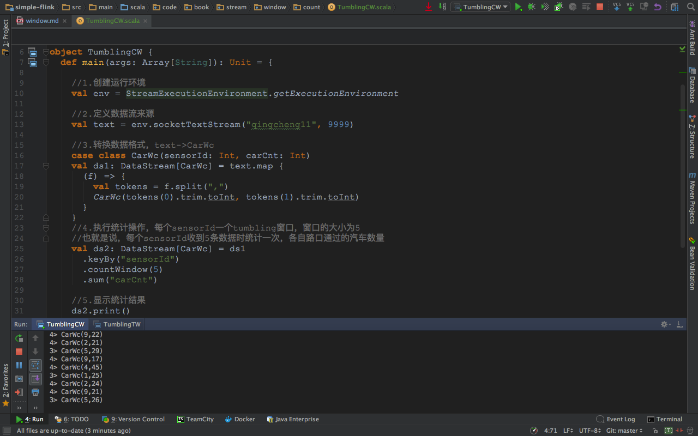
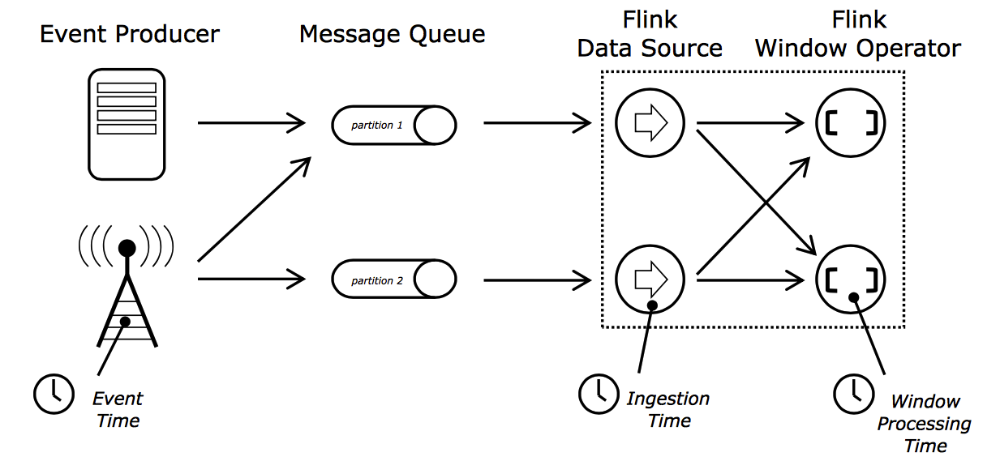
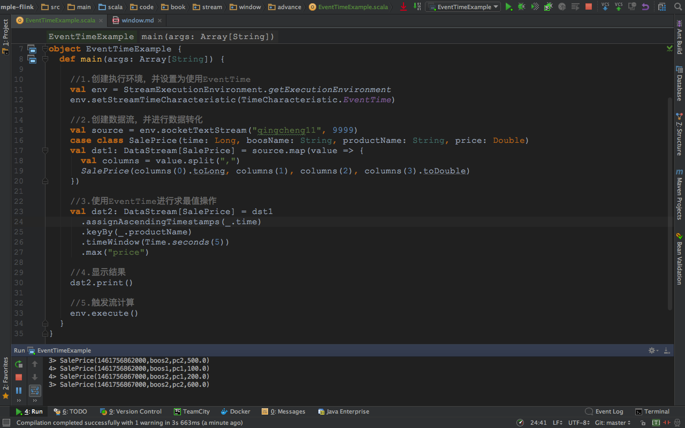
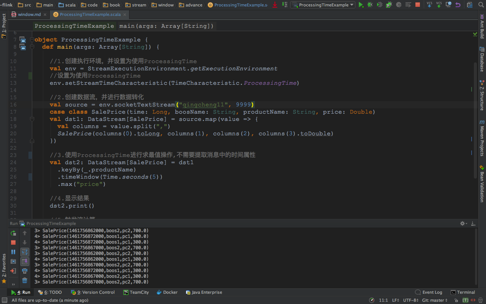

##一、流处理的基本概念
###1.stream和window
 
```
1.源源不断的数据流是无法进行统计工作的，因为数据流没有边界，就无法统计到底有多少数据经过了这个流。
  也无法统计数据流中的最大值，最小值，平均值，累加值等信息。
2.如果在数据流上，截取固定大小的一部分，这部分是可以进行统计的。 截取方式主要有两种，
  1.根据时间进行截取(time-driven-window)，比如每1分钟统计一次或每10分钟统计一次。
  2.根据数据进行截取(data-driven-window)，比如每5个数据统计一次或每50个数据统计一次。
3.图中上面是time-window,下面是count-window。
```
###2.time
 
```
1.事件时间（Event Time）:事件在它的生产设备上发生的时间 
2.提取时间是（Ingestion time）:事件进入Flink的时间
3.处理时间（Processing Time）:执行对应Operation设备的系统时间
```


##二、time-window理论
###1.车流通过红绿灯的场景
 
```
1.红绿灯路口会有汽车通过，一共会有多少汽车通过，无法计算。因为车流源源不断，计算没有边界。
2.统计每15秒钟通过红路灯的汽车数量，第一个15秒为2辆，第二个15秒为3辆，第三个15秒为1辆。。。
```
###2.车流通过红绿灯的计算
 
```
1.每15秒统计一次，一共有多少汽车通过红路灯。新数据和原来数据一起统计。
2.第一个15秒为2辆，第二个15秒为2+3=5辆，第三个15秒为2+3+1=6辆。。。
```
###3.其中的tumbling-window (无重叠数据)
 
```
1.每分钟统计一次，这一分钟内一共有多少汽车通过红绿灯。
2.第一分钟的为8辆，第二分钟为22辆，第三分钟为27辆。。。这样，1个小时内会有60个tumbling window。
```
###4.其中的sliding-window (有重叠数据)
 
```
1.每30秒统计一次,1分钟内通过汽车数量。（30秒窗口滑动时间，1分钟窗口大小时间）
2.第一个1分钟通过8辆，第二个1分钟通过15辆，第三个1分钟通过22辆。。。
3.window出现了重合。这样，1个小时内会有120个window。
4.如果窗口的滑动时间和窗口的大小时间相等，那么sliding-window就变成了tumbling-window
  也就是说将每30秒统计一次,统计1分钟通过汽车数量，改成.每1分钟统计一次,1分钟内通过汽车数量。
```
###5.现实的交通场景中的多time-window
 
```
1.城市当中有多个红绿灯路口，每个红绿灯路口处都能形成车流。
2.flink可以用多个时间窗口去统计多条车流信息。
3.图中有3条车流信息，用3个窗口去统计，形成了 (sensorId, carCnt)的数据信息。
```
##三、交通场景下time-window实战
###1.tumbling-time-window (无重叠数据)实战
####1.0实战目的
```
每5秒钟统计一次，在这过去的5秒钟内，各个路口通过红绿灯汽车的数量。
```

####1.1发送数据
```
1.发送命令
nc -lk 9999

2.发送内容
9,3
9,2
9,7
4,9
2,6
1,5
2,3
5,7
5,4
```
####1.2处理数据
#####执行程序
```scala
package code.book.stream.window.time

//0.引入必要的编程元素
import org.apache.flink.streaming.api.scala.{StreamExecutionEnvironment, _}
import org.apache.flink.streaming.api.windowing.time.Time

object TumblingTW {
  def main(args: Array[String]): Unit = {
    //1.创建运行环境
    val env = StreamExecutionEnvironment.getExecutionEnvironment
  
    //2.定义数据流来源
    val text = env.socketTextStream("qingcheng11", 9999)

    //3.转换数据格式，text->CarWc
    case class CarWc(sensorId: Int, carCnt: Int)
    val ds1: DataStream[CarWc] = text.map {
      (f) => {
        val tokens = f.split(",")
        CarWc(tokens(0).trim.toInt, tokens(1).trim.toInt)
      }
    }
   
    //4.执行统计操作，每个sensorId一个tumbling窗口，窗口的大小为5秒
    //也就是说，每5秒钟统计一次，在这过去的5秒钟内，各个路口通过红绿灯汽车的数量。
    val ds2: DataStream[CarWc] = ds1
      .keyBy("sensorId")
      .timeWindow(Time.seconds(5))
      .sum("carCnt")
   
    //5.显示统计结果
    ds2.print()

    //6.触发流计算
    env.execute(this.getClass.getName)
  }
}
```
#####执行效果
 


###2.sliding-time-window  (有重叠数据)实战
####2.0实战目的
```
每5秒钟统计一次，在这过去的10秒钟内，各个路口通过红绿灯汽车的数量。
```

####2.1发送数据
```
1.发送命令
nc -lk 9999

2.发送内容
9,3
9,2
9,7
4,9
2,6
1,5
2,3
5,7
5,4
```
####2.2处理数据
#####执行程序
```scala
package code.book.stream.window.time

//0.引入必要的编程元素
import org.apache.flink.streaming.api.scala.{StreamExecutionEnvironment, _}
import org.apache.flink.streaming.api.windowing.time.Time

object SlidingTW {
  def main(args: Array[String]): Unit = {

    //1.创建运行环境
    val env = StreamExecutionEnvironment.getExecutionEnvironment

    //2.定义数据流来源
    val text = env.socketTextStream("qingcheng11", 9999)

    //3.转换数据格式，text->CarWc
    case class CarWc(sensorId: Int, carCnt: Int)
    val ds1: DataStream[CarWc] = text.map {
      (f) => {
        val tokens = f.split(",")
        CarWc(tokens(0).trim.toInt, tokens(1).trim.toInt)
      }
    }
    //4.执行统计操作，每个sensorId一个sliding窗口，窗口时间10秒,滑动时间5秒
    //也就是说，每5秒钟统计一次，在这过去的10秒钟内，各个路口通过红绿灯汽车的数量。
    val ds2: DataStream[CarWc] = ds1
      .keyBy("sensorId")
      .timeWindow(Time.seconds(10), Time.seconds(5))
      .sum("carCnt")

    //5.显示统计结果
    ds2.print()

    //6.触发流计算
    env.execute(this.getClass.getName)
  }
}
```
#####执行效果
 


##四、交通场景下的count-window实战
###1.tumbling-count-window (无重叠数据)实战
####1.0实战目的
```
每个路口分别统计，收到关于它的5条消息时统计在最近5条消息中，各自路口通过的汽车数量
```

####1.1发送数据
```
1.发送命令
nc -lk 9999

2.发送内容
9,3
9,2
9,7
4,9
2,6
1,5
2,3
5,7
5,4
```
####1.2处理数据
#####执行程序
```scala
package code.book.stream.window.count

//0.引入必要的编程元素
import org.apache.flink.streaming.api.scala.{StreamExecutionEnvironment, _}

object TumblingCW {
  def main(args: Array[String]): Unit = {

    //1.创建运行环境
    val env = StreamExecutionEnvironment.getExecutionEnvironment

    //2.定义数据流来源
    val text = env.socketTextStream("qingcheng11", 9999)

    //3.转换数据格式，text->CarWc
    case class CarWc(sensorId: Int, carCnt: Int)
    val ds1: DataStream[CarWc] = text.map {
      (f) => {
        val tokens = f.split(",")
        CarWc(tokens(0).trim.toInt, tokens(1).trim.toInt)
      }
    }
    //4.执行统计操作，每个sensorId一个tumbling窗口，窗口的大小为5
    //也就是说，每个路口分别统计，收到关于它的5条消息时统计在最近5条消息中，各自路口通过的汽车数量
    val ds2: DataStream[CarWc] = ds1
      .keyBy("sensorId")
      .countWindow(5)
      .sum("carCnt")

    //5.显示统计结果
    ds2.print()

    //6.触发流计算
    env.execute(this.getClass.getName)
  }
}
```
#####执行效果
 

###2.sliding-count-window  (有重叠数据)实战
####2.0实战目的
```
每个路口分别统计，收到关于它的3条消息时统计在最近5条消息中，各自路口通过的汽车数量
```


####2.1发送数据
```
1.发送命令
nc -lk 9999

2.发送内容
9,3
9,2
9,7
4,9
2,6
1,5
2,3
5,7
5,4
```
####2.2处理数据
#####执行程序
```scala
package code.book.stream.window.count

//0.引入必要的编程元素
import org.apache.flink.streaming.api.scala.{StreamExecutionEnvironment, _}

object SlidingCW {
  def main(args: Array[String]): Unit = {

    //1.创建运行环境
    val env = StreamExecutionEnvironment.getExecutionEnvironment

    //2.定义数据流来源
    val text = env.socketTextStream("qingcheng11", 9999)

    //3.转换数据格式，text->CarWc
    case class CarWc(sensorId: Int, carCnt: Int)
    val ds1: DataStream[CarWc] = text.map {
      (f) => {
        val tokens = f.split(",")
        CarWc(tokens(0).trim.toInt, tokens(1).trim.toInt)
      }
    }
    //4.执行统计操作，每个sensorId一个sliding窗口，窗口大小3条数据,窗口滑动为3条数据
    //也就是说，每个路口分别统计，收到关于它的3条消息时统计在最近5条消息中，各自路口通过的汽车数量
    val ds2: DataStream[CarWc] = ds1
      .keyBy("sensorId")
      .countWindow(5, 3)
      .sum("carCnt")

    //5.显示统计结果
    ds2.print()

    //6.触发流计算
    env.execute(this.getClass.getName)
  }
}
```
#####执行效果
 


##五、window总结
```
1.flink支持两种划分窗口的方式（time和count）
    如果根据时间划分窗口，那么它就是一个time-window
    如果根据数据划分窗口，那么它就是一个count-window
2.flink支持窗口的两个重要属性（size和interval）
    如果size=interval,那么就会形成tumbling-window(无重叠数据)
    如果size>interval,那么就会形成sliding-window(有重叠数据)
    如果size<interval,那么这种窗口将会丢失数据。比如每5秒钟，统计过去3秒的通过路口汽车的数据，将会漏掉2秒钟的数据。
3.通过组合可以得出四种基本窗口
    time-tumbling-window 无重叠数据的时间窗口，设置方式举例：timeWindow(Time.seconds(5))
    time-sliding-window  有重叠数据的时间窗口，设置方式举例：timeWindow(Time.seconds(5), Time.seconds(3))
    count-tumbling-window无重叠数据的数量窗口，设置方式举例：countWindow(5)
    count-sliding-window 有重叠数据的数量窗口，设置方式举例：countWindow(5,3)
4.flink支持在stream上的通过key去区分多个窗口
```


##六、time-windwo的高级用法
 
```
1.现实世界中的时间是不一致的，在flink中被划分为事件时间，提取时间，处理时间三种。
2.如果以EventTime为基准来定义时间窗口那将形成EventTimeWindow,要求消息本身就应该携带EventTime
2.如果以IngesingtTime为基准来定义时间窗口那将形成IngestingTimeWindow,以source的systemTime为准。
2.如果以ProcessingTime基准来定义时间窗口那将形成ProcessingTimeWindow，以operator的systemTime为准。

```

###1.使用EventTime用法示例
```
1.要求消息本身就应该携带EventTime

2.时间对应关系如下
2016-04-27 11:34:22  1461756862000
2016-04-27 11:34:27  1461756867000
2016-04-27 11:34:32  1461756872000
```

####1.1实验目的
```
以EventTime划分窗口，计算5秒钟内出价最高的信息
```

####1.2输入数据
```
1461756862000,boos1,pc1,100.0
1461756867000,boos2,pc1,200.0
1461756872000,boos1,pc1,300.0
1461756862000,boos2,pc2,500.0
1461756867000,boos2,pc2,600.0
1461756872000,boos2,pc2,700.0
```

####1.3执行代码
```scala 
package code.book.stream.window.advance

import org.apache.flink.streaming.api.TimeCharacteristic
import org.apache.flink.streaming.api.scala._
import org.apache.flink.streaming.api.windowing.time.Time

object EventTimeExample {
  def main(args: Array[String]) {

    //1.创建执行环境，并设置为使用EventTime
    val env = StreamExecutionEnvironment.getExecutionEnvironment
    //置为使用EventTime
    env.setStreamTimeCharacteristic(TimeCharacteristic.EventTime)

    //2.创建数据流，并进行数据转化
    val source = env.socketTextStream("qingcheng11", 9999)
    case class SalePrice(time: Long, boosName: String, productName: String, price: Double)
    val dst1: DataStream[SalePrice] = source.map(value => {
      val columns = value.split(",")
      SalePrice(columns(0).toLong, columns(1), columns(2), columns(3).toDouble)
    })

    //3.使用EventTime进行求最值操作
    val dst2: DataStream[SalePrice] = dst1
      //提取消息中的时间戳属性
      .assignAscendingTimestamps(_.time)
      .keyBy(_.productName)
      //.timeWindow(Time.seconds(5))//设置window方法一
      .window(TumblingEventTimeWindows.of(Time.seconds(5)))//设置window方法二
      .max("price")

    //4.显示结果
    dst2.print()

    //5.触发流计算
    env.execute()
  }
}
```
####1.4执行效果
 
###2.使用ProcessingTime用法示例
####2.1实验目的
```
1.以operator的系统时间为准划分窗口，计算5秒钟内出价最高的信息。
2.因为是以实际的operator的systemTime为标准，那么消息中可以没有睡觉属性。
3.flink默认的就是这种时间窗口，以前我们就是使用的这种窗口。
```
####2.2测试数据(消息中的时间属性不必须，有也不会使用)
```
1461756862000,boos1,pc1,100.0
1461756867000,boos2,pc1,200.0
1461756872000,boos1,pc1,300.0
1461756862000,boos2,pc2,500.0
1461756867000,boos2,pc2,600.0
1461756872000,boos2,pc2,700.0
```
####2.3执行程序
```scala
package code.book.stream.window.advance

import org.apache.flink.streaming.api.TimeCharacteristic
import org.apache.flink.streaming.api.scala._
import org.apache.flink.streaming.api.windowing.time.Time

object ProcessingTimeExample {
  def main(args: Array[String]) {

    //1.创建执行环境，并设置为使用ProcessingTime
    val env = StreamExecutionEnvironment.getExecutionEnvironment
    //设置为使用ProcessingTime
    env.setStreamTimeCharacteristic(TimeCharacteristic.ProcessingTime)

    //2.创建数据流，并进行数据转化
    val source = env.socketTextStream("qingcheng11", 9999)
    case class SalePrice(time: Long, boosName: String, productName: String, price: Double)
    val dst1: DataStream[SalePrice] = source.map(value => {
      val columns = value.split(",")
      SalePrice(columns(0).toLong, columns(1), columns(2), columns(3).toDouble)
    })

    //3.使用ProcessingTime进行求最值操作,不需要提取消息中的时间属性
    val dst2: DataStream[SalePrice] = dst1
      .keyBy(_.productName)
      //.timeWindow(Time.seconds(5))//设置window方法一
      .window(TumblingEventTimeWindows.of(Time.seconds(5)))//设置window方法二
      .max("price")

    //4.显示结果
    dst2.print()

    //5.触发流计算
    env.execute()
  }
}
```
####2.4执行效果
 

```
stream
window
watermark
checkpoint
```


http://www.cnblogs.com/lanyun0520/p/5745259.html
http://blog.csdn.net/lmalds/article/details/51604501
http://wuchong.me/blog/2016/05/25/flink-internals-window-mechanism/
http://flink.apache.org/news/2015/12/04/Introducing-windows.html
https://ci.apache.org/projects/flink/flink-docs-release-1.1/concepts/concepts.html#time
https://ci.apache.org/projects/flink/flink-docs-release-1.1/apis/streaming/event_time.html
https://ci.apache.org/projects/flink/flink-docs-release-1.2/dev/windows.html


https://www.oreilly.com/ideas/the-world-beyond-batch-streaming-101
https://www.oreilly.com/ideas/the-world-beyond-batch-streaming-102