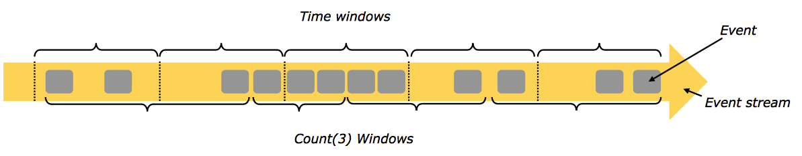
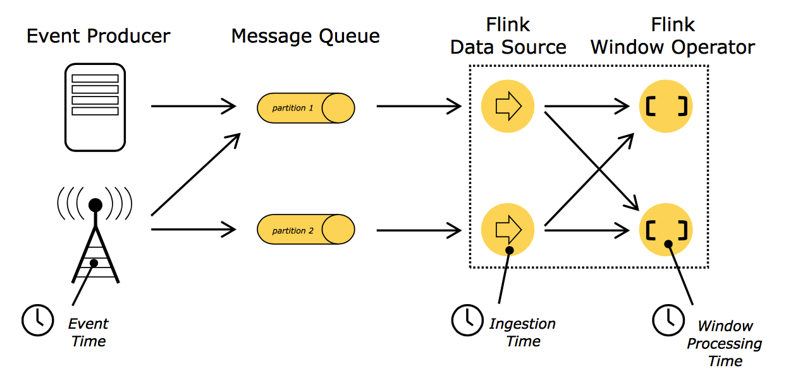
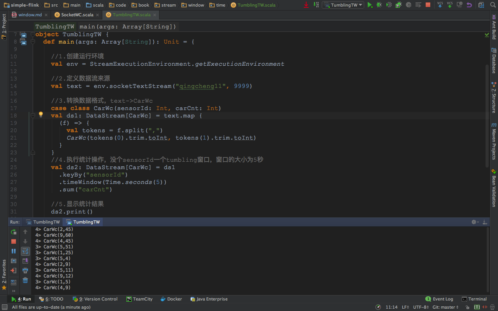
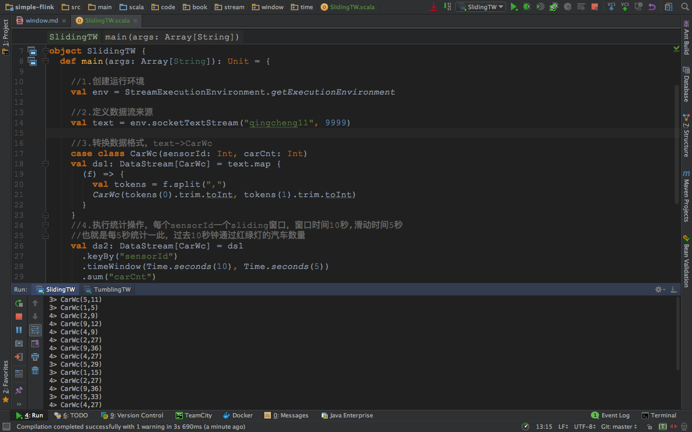

##一、stream和window
 
```
1.源源不断的数据流是无法进行统计工作的，因为数据流没有边界，就无法统计到底有多少数据经过了这个流。
  也无法统计数据流中的最大值，最小值，平均值，累加值等信息。
2.如果在数据流上，截取固定大小的一部分，这部分是可以进行统计的。 截取方式主要有两种，
  1.根据时间进行截取(time-driven-window)，比如每1分钟统计一次或每10分钟统计一次。
  2.根据数据进行截取(data-driven-window)，比如每5个数据统计一次或每50个数据统计一次。
3.图中上面是time-window,下面是count-window。
```


##一、time和time-window理论
###1.time
 
```
1.事件时间（Event Time）:事件在它的生产设备上发生的时间 
2.提取时间是（Ingestion time）:事件进入Flink的时间
3.处理时间（Processing Time）:执行对应Operation设备的系统时间
```
###2.stream
 
```
1.红绿灯路口会有汽车通过，一共会有多少汽车通过，无法计算。因为车流源源不断，计算没有边界。
2.统计每15秒钟通过红路灯的汽车数量，第一个15秒为2辆，第二个15秒为3辆，第三个15秒为1辆。。。
```
###2.count
 
```
1.每15秒统计一次，一共有多少汽车通过红路灯。新数据和原来数据一起统计。
2.第一个15秒为2辆，第二个15秒为2+3=5辆，第三个15秒为2+3+1=6辆。。。
```
###3.tumbling-window (无重叠数据)
 
```
1.每分钟统计一次，这一分钟内一共有多少汽车通过红绿灯。
2.第一分钟的为8辆，第二分钟为22辆，第三分钟为27辆。。。这样，1个小时内会有60个tumbling window。
```
###4.sliding-window (有重叠数据)
 
```
1.每30秒统计一次,1分钟内通过汽车数量。（30秒窗口滑动时间，1分钟窗口大小时间）
2.第一个1分钟通过8辆，第二个1分钟通过15辆，第三个1分钟通过22辆。。。
3.window出现了重合。这样，1个小时内会有120个window。
4.如果窗口的滑动时间和窗口的大小时间相等，那么sliding-window就变成了tumbling-window
  也就是说将每30秒统计一次,统计1分钟通过汽车数量，改成.每1分钟统计一次,1分钟内通过汽车数量。
```
###5.time-window总结
```
1.时间窗口有两个重要的时间属性，一个是窗口滑动时间(interval-time)，另一个是窗口大小时间(size-time)
2.如果窗口滑动时间=窗口大小时间就会形成tumbling-window (无重叠数据)
3.如果窗口滑动时间<窗口大小时间就会形成sliding-window (有重叠数据)
```

###6.多time-window
 
```
1.城市当中有多个红绿灯路口，每个红绿灯路口处都能形成车流。
2.flink可以用多个时间窗口去统计多条车流信息。
3.图中有3条车流信息，用3个窗口去统计，形成了 (sensorId, carCnt)的数据信息。
```
##一、time和time-window实战
###1.tumbling-window (无重叠数据)实战
####1.1发送数据
```
1.发送命令
nc -lk 9999
2.发送内容
9,3
9,2
9,7
4,9
2,6
1,5
2,3
5,7
5,4
```
####1.2处理数据
```
package code.book.stream.window.time

//0.引入必要的编程元素
import org.apache.flink.streaming.api.scala.{StreamExecutionEnvironment, _}
import org.apache.flink.streaming.api.windowing.time.Time

object TumblingTW {
  def main(args: Array[String]): Unit = {
    //1.创建运行环境
    val env = StreamExecutionEnvironment.getExecutionEnvironment
  
    //2.定义数据流来源
    val text = env.socketTextStream("qingcheng11", 9999)

    //3.转换数据格式，text->CarWc
    case class CarWc(sensorId: Int, carCnt: Int)
    val ds1: DataStream[CarWc] = text.map {
      (f) => {
        val tokens = f.split(",")
        CarWc(tokens(0).trim.toInt, tokens(1).trim.toInt)
      }
    }
   
    //4.执行统计操作，每个sensorId一个tumbling窗口，窗口的大小为5秒
    val ds2: DataStream[CarWc] = ds1
      .keyBy("sensorId")
      .timeWindow(Time.seconds(5))
      .sum("carCnt")
   
    //5.显示统计结果
    ds2.print()

    //6.触发流计算
    env.execute(this.getClass.getName)
  }
}
```
 


###2.sliding-window  (有重叠数据)实战
####2.1发送数据
```
1.发送命令
nc -lk 9999
2.发送内容
9,3
9,2
9,7
4,9
2,6
1,5
2,3
5,7
5,4
```
####2.2处理数据
```
package code.book.stream.window.time

//0.引入必要的编程元素
import org.apache.flink.streaming.api.scala.{StreamExecutionEnvironment, _}
import org.apache.flink.streaming.api.windowing.time.Time

object SlidingTW {
  def main(args: Array[String]): Unit = {

    //1.创建运行环境
    val env = StreamExecutionEnvironment.getExecutionEnvironment

    //2.定义数据流来源
    val text = env.socketTextStream("qingcheng11", 9999)

    //3.转换数据格式，text->CarWc
    case class CarWc(sensorId: Int, carCnt: Int)
    val ds1: DataStream[CarWc] = text.map {
      (f) => {
        val tokens = f.split(",")
        CarWc(tokens(0).trim.toInt, tokens(1).trim.toInt)
      }
    }
    //4.执行统计操作，每个sensorId一个sliding窗口，窗口时间10秒,滑动时间5秒
    //也就是每5秒统计一此，过去10秒钟通过红绿灯的汽车数量
    val ds2: DataStream[CarWc] = ds1
      .keyBy("sensorId")
      .timeWindow(Time.seconds(10), Time.seconds(5))
      .sum("carCnt")

    //5.显示统计结果
    ds2.print()

    //6.触发流计算
    env.execute(this.getClass.getName)
  }
}
```
 


Window就是用来对一个无限的流设置一个有限的集合，在有界的数据集上进行操作的一种机制。window又可以分为基于时间（Time-based）的window以及基于数量（Count-based）的window。


总结
```
1.划分窗口的方式，确定了窗口的驱动方式。
  如果根据时间划分窗口，那么它就是一个time-window
  如果根据数据划分窗口，那么它就是一个count-window
2.移动窗口的方式，确定了窗口是否有重叠数据。
  如果无重叠数据，那么它是一个tumbling-windows
  如果有重叠数据，那么它是一个sliding-windows 

```


http://www.cnblogs.com/lanyun0520/p/5745259.html
http://blog.csdn.net/lmalds/article/details/51604501
http://wuchong.me/blog/2016/05/25/flink-internals-window-mechanism/
http://flink.apache.org/news/2015/12/04/Introducing-windows.html
https://ci.apache.org/projects/flink/flink-docs-release-1.1/concepts/concepts.html#time
https://ci.apache.org/projects/flink/flink-docs-release-1.1/apis/streaming/event_time.html
https://ci.apache.org/projects/flink/flink-docs-release-1.2/dev/windows.html