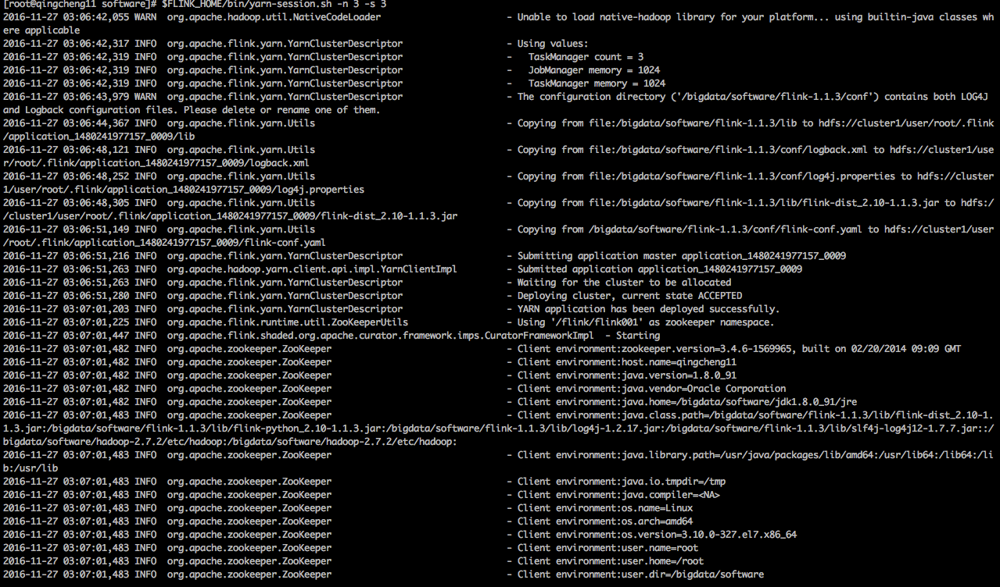
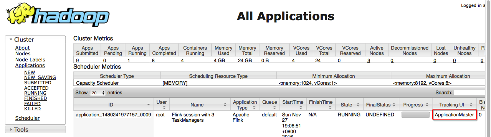
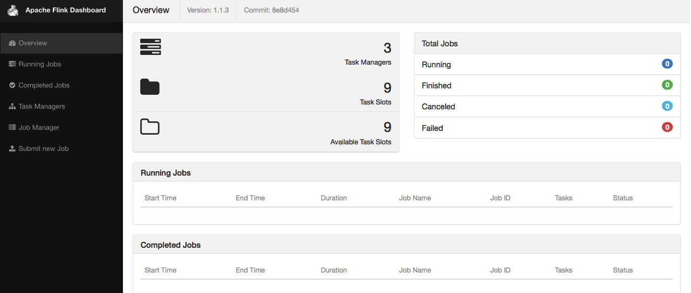
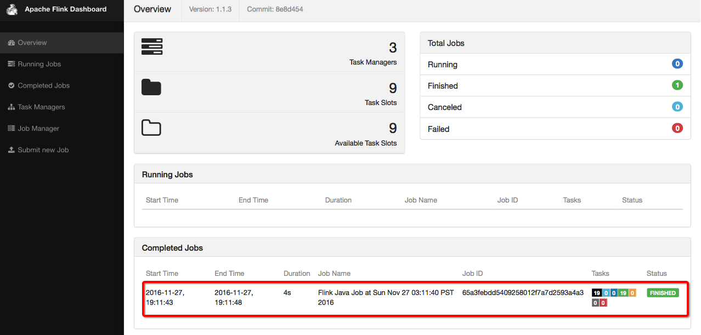
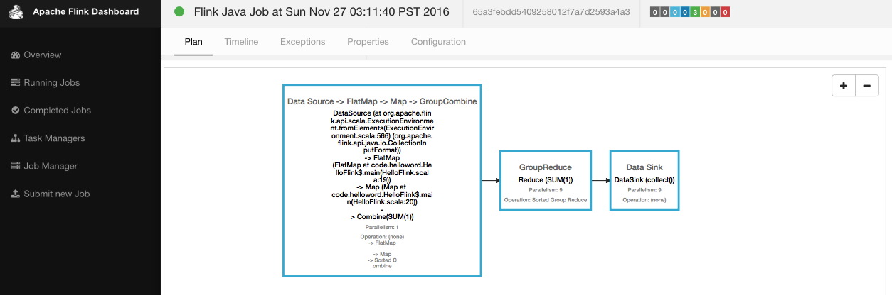
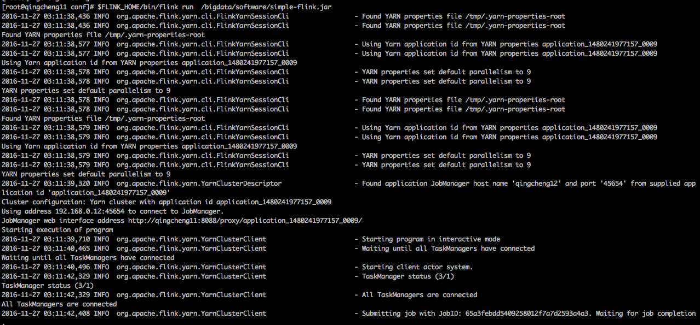
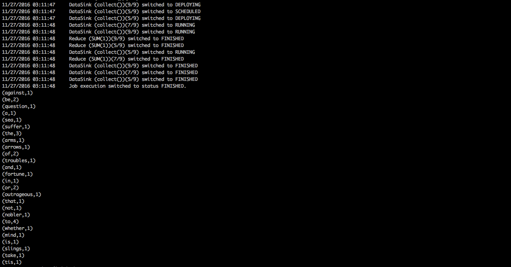
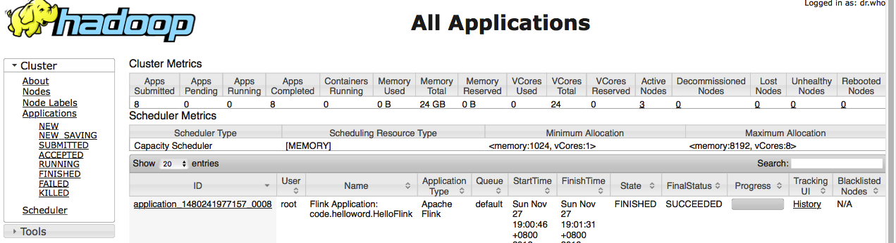
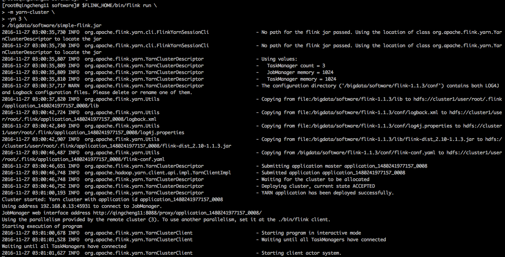

##一、配置yarn
###1.编辑yarn-site.xml
```
1.编辑命令
vim ${HADOOP_HOME}/etc/hadoop/yarn-site.xml

2.配置内容
<property>  
    <name>yarn.nodemanager.vmem-pmem-ratio</name>  
    <value>4</value>  
</property> 
<property>  
    <name>yarn.nodemanager.vmem-check-enabled</name>  
    <value>false</value>  
</property> 

3.配置说明
yarn.nodemanager.vmem-pmem-ratio是yarn内存与虚拟内存的比率默认2.1，适当调大。
yarn.nodemanager.vmem-check-enabled是yarn在启动程序不检查它申请的虚拟内存。
```

###2.分发yarn的配置文件
```
scp  -r ${HADOOP_HOME}/etc/hadoop/yarn-site.xml  qingcheng12:${HADOOP_HOME}/etc/hadoop/
scp  -r ${HADOOP_HOME}/etc/hadoop/yarn-site.xml  qingcheng13:${HADOOP_HOME}/etc/hadoop/
```
###3.重启yarn
```
${HADOOP_HOME}/sbin/stop-yarn.sh
${HADOOP_HOME}/sbin/start-yarn.sh
```

##二、关闭flink-Standalone集群
###1.关闭flink-Standalone集群
```
${FLINK_HOME}/bin/stop-cluster.sh
```
###2.原因说明
```
1.因为yarn可以自动启动受yanr管理flink集群，所以应当将standalone集群关闭掉。
2.standalone集群都关闭掉了，因此再运行flink作业，就不能使用standalone集群的web界面进行监控了。
3.应当使用yarn的监控界面，在yarn中可以进入受yarn管理的flink-cluster-webUI进行监控。
```

##三、使用yarn-session创建flink集群
###1.说明
```
1.首先yarn-session会启动受yarn管理的flink集群。
2.这个flink集群可以运行一个又一个的程序。
3.程序运行结束后集群不结束，只用yarn-session关闭了，集群才会关闭。
```
###2.启动yarn-session
####2.1启动命令
```
1.前台启动
$FLINK_HOME/bin/yarn-session.sh -n 3 -s 3

2.后台启动
$FLINK_HOME/bin/yarn-session.sh -n 3 -s 3 -d
```
####2.2参数说明
```
1.查看命令
$FLINK_HOME/bin/yarn-session.sh 

2.参数说明
Usage:
Required
-n,--container <arg>   Number of YARN container to allocate (=Number of Task Managers)
Optional
-D <arg>                        Dynamic properties
-d,--detached                   Start detached
-id,--applicationId <arg>       Attach to running YARN session
-j,--jar <arg>                  Path to Flink jar file
-jm,--jobManagerMemory <arg>    Memory for JobManager Container [in MB]
-n,--container <arg>            Number of YARN container to allocate (=Number of Task Managers)
-nm,--name <arg>                Set a custom name for the application on YARN
-q,--query                      Display available YARN resources (memory, cores)
-qu,--queue <arg>               Specify YARN queue.
-s,--slots <arg>                Number of slots per TaskManager
-st,--streaming                 Start Flink in streaming mode
-t,--ship <arg>                 Ship files in the specified directory (t for transfer)
-tm,--taskManagerMemory <arg>   Memory per TaskManager Container [in MB]
-z,--zookeeperNamespace <arg>   Namespace to create the Zookeeper sub-paths for high availability mode
```
####2.3验证启动
```
1.查看命令
jps

2.可见进程
FlinkYarnSessionCli
YarnApplicationMasterRunner
```

###3.yarn-session在terminal下的启动效果
 
###4.yarn-session在yarn-web下的启动效果
 
###5.yarn-session代理出来的flink监控界面
 
###6.运行flink程序
```
$FLINK_HOME/bin/flink run /bigdata/software/simple-flink.jar
```
###7.程序运行后flink监控界面的效果
 
 
###8.程序运行后terminal的运行效果
 
 

##四、使用flink-job创建flink集群
###1.说明
```
1.首先flink-client将一个job提交到yarn。
2.yarn为这个application启动一个临时flink集群
3.application运行结束后后,yarn关闭临时flink集群
```

###2.运行程序

####2.1启动命令
```
$FLINK_HOME/bin/flink run -m yarn-cluster -yn 3
/bigdata/software/simple-flink.jar
```
####2.2参数说明
```
1.查看参数
$FLINK_HOME/bin/flink run -h

2.参数说明
Action "run" compiles and runs a program.
Syntax: run [OPTIONS] <jar-file> <arguments>
"run" action options:
 -c,--class <classname>                         Class with the program entry
                                                point ("main" method or
                                                "getPlan()" method. Only
                                                needed if the JAR file does
                                                not specify the class in its
                                                manifest.
 -C,--classpath <url>                           Adds a URL to each user code
                                                classloader  on all nodes in
                                                the cluster. The paths must
                                                specify a protocol (e.g.
                                                file://) and be accessible
                                                on all nodes (e.g. by means
                                                of a NFS share). You can use
                                                this option multiple times
                                                for specifying more than one
                                                URL. The protocol must be
                                                supported by the {@link
                                                java.net.URLClassLoader}.
 -d,--detached                                  If present, runs the job in
                                                detached mode
 -m,--jobmanager <host:port>                    Address of the JobManager
                                                (master) to which to
                                                connect. Use this flag to
                                                connect to a different
                                                JobManager than the one
                                                specified in the
                                                configuration.
 -p,--parallelism <parallelism>                 The parallelism with which
                                                to run the program. Optional
                                                flag to override the default
                                                value specified in the
                                                configuration.
 -q,--sysoutLogging                             If present, suppress logging
                                                output to standard out.
 -s,--fromSavepoint <savepointPath>             Path to a savepoint to reset
                                                the job back to (for example
                                                file:///flink/savepoint-1537
                                                ).
 -z,--zookeeperNamespace <zookeeperNamespace>   Namespace to create the
                                                Zookeeper sub-paths for high
                                                availability mode
Options for yarn-cluster mode:
 -yD <arg>                            Dynamic properties
 -yd,--yarndetached                   Start detached
 -yid,--yarnapplicationId <arg>       Attach to running YARN session
 -yj,--yarnjar <arg>                  Path to Flink jar file
 -yjm,--yarnjobManagerMemory <arg>    Memory for JobManager Container [in
                                      MB]
 -yn,--yarncontainer <arg>            Number of YARN container to allocate
                                      (=Number of Task Managers)
 -ynm,--yarnname <arg>                Set a custom name for the application
                                      on YARN
 -yq,--yarnquery                      Display available YARN resources
                                      (memory, cores)
 -yqu,--yarnqueue <arg>               Specify YARN queue.
 -ys,--yarnslots <arg>                Number of slots per TaskManager
 -yst,--yarnstreaming                 Start Flink in streaming mode
 -yt,--yarnship <arg>                 Ship files in the specified directory
                                      (t for transfer)
 -ytm,--yarntaskManagerMemory <arg>   Memory per TaskManager Container [in
                                      MB]
 -yz,--yarnzookeeperNamespace <arg>   Namespace to create the Zookeeper
                                      sub-paths for high availability mode
```

###3.yarn-web下的运行效果
 
###4.terminal下的运行效果
 
 


